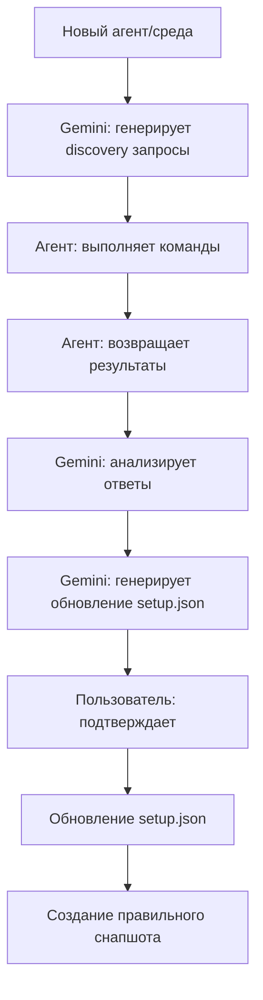

# Идеи по интеграции Eck-Snapshot и Claude Code

## Ключевые принципы:

1.  **Использовать нативные функции:** Самый эффективный способ общения с Claude — это использование его встроенных функций, а не попытка применить универсальный подход "один для всех".
2.  **Контекст — король, но целевой контекст — лучше:** Контекстное окно Claude активно управляется и меньше, чем кажется. Поэтому отправка сфокусированной, релевантной информации превосходит отправку массивного, нецелевого потока данных.
3.  **Делегировать, а не диктовать:** Использовать Gemini в качестве "Архитектора" для обдумывания общей картины и делегировать конкретную, четко определенную задачу Claude, "Программисту".

## Постоянный контекст для Claude (`CLAUDE.md`)

Вместо того чтобы подавать весь снэпшот в первоначальный промпт, мы должны использовать файл `CLAUDE.md` в корневом каталоге проекта `eckWms`.

### Рекомендуемое содержимое для `eckWms/CLAUDE.md`:

1.  **Обзор проекта:** Краткое, высокоуровневое описание `eckWms`. Что он делает? Какова его основная цель?
2.  **Ключевая архитектура:** Краткое изложение основных архитектурных паттернов, главных модулей и их взаимодействия.
3.  **Основные зависимости:** Список наиболее важных библиотек и фреймворков с объяснением, почему они используются.
4.  **Соглашения по кодированию:** Любые конкретные руководства по стилю или паттерны, которым должен следовать Claude (например, "Все новые компоненты должны быть функциональными компонентами с использованием React Hooks", "Управление состоянием осуществляется исключительно с помощью Zustand").
5.  **Типичные паттерны модификации:** Руководство по выполнению рутинных задач, аналогичное тому, что было в заголовке AI Instructions (например, "Чтобы добавить новую конечную точку API, необходимо изменить `routes.js`, создать новый контроллер в `controllers/` и добавить сервис в `services/`).

**Важно: этот файл НЕ должен содержать полный снэпшот кода.** Его цель — дать Claude постоянные, высокоуровневые "правила игры" для этого конкретного проекта.

## Контекст по требованию (часть `eck-snapshot`)

Это информация, которая меняется с каждой задачей.

1.  **Мини-снэпшот, сгенерированный из векторов:** Основной источник контекста по требованию. После того как Архитектор (Gemini) поймет задачу, он должен использовать `eck-snapshot query "..."`, чтобы сгенерировать небольшой, целевой снэпшот, содержащий только самые релевантные файлы и функции. Именно этот мини-снэпшот подается в промпт для Claude.

2.  **Динамические импорты в `CLAUDE.md`:** Для более стабильного, но все же зависящего от задачи контекста, мы можем использовать функцию импорта `@`. Если задача всегда требует знания схемы базы данных, мы могли бы иметь снэпшот только схемы и временно добавить `@/path/to/schema_snapshot.md` в `CLAUDE.md` перед началом сессии.

## Пользовательские слэш-команды

Для оптимизации сложных, повторяющихся задач мы должны создать пользовательские слэш-команды в проекте `eckWms`.

### Структура каталогов:
`eckWms/.claude/commands/eck/`

### Примеры команд:

* **/eck:new-component.md**
    * **Описание:** Создает новый компонент React с правильной структурой и файлами.
    * **Промпт:** "Создай новый компонент React с именем `{arg1}`. Он должен быть функциональным компонентом, использовать TailwindCSS для стилей и располагаться в каталоге `src/components/`. Создай как файл `.jsx`, так и соответствующий файл `.css`."

* **/eck:commit-and-push.md**
    * **Описание:** Фиксирует все текущие изменения с конвенциональным сообщением коммита и отправляет их в новую ветку.
    * **Промпт:** "Проанализируй текущие подготовленные изменения из `!git diff --staged`. Создай конвенциональное сообщение коммита, которое точно описывает эти изменения. Затем закоммить изменения и отправь их в новую ветку с именем `feature/{short-description}`."

Применяя этот рабочий процесс, мы приводим наш процесс в соответствие с предполагаемым использованием Claude Code, используя его сильные стороны и нивелируя слабые (например, меньшее контекстное окно). Это приводит к более эффективному и "правильному" способу взаимодействия с инструментом.


Мнение Grok4 о консилиуме.
### Формат запроса на Consilium

Как Grok, я бы лучше всего понял запрос на Consilium в структурированном, markdown-подобном формате, который четко разделяет ключевые элементы. Это помогает мне быстро разобрать контекст, проблему и ожидания, без лишнего шума. Основываясь на твоём проекте (шаблон в `setup.json`), я бы предложил такой шаблон для запроса:

```
# Consilium Request

## Task Overview
- **Complexity:** [уровень сложности, например: high/medium/low или 1-10]
- **Domain:** [область, например: architecture, security, performance]
- **Requesting Agent:** [ID агента, который запрашивает, например: AGENT_ARCHITECT или твой username]

## Problem Description
[Подробное описание проблемы. Будь конкретен: что именно не работает, почему это важно, какие варианты уже рассмотрены. Добавь релевантный код или контекст, если есть.]

## Questions for Consilium
- [Вопрос 1: конкретный, например: "Какой подход к сегментации кода лучше для мультиязычных репо?"]
- [Вопрос 2: ...]
- [И так далее, 3-5 вопросов максимум, чтобы не размывать фокус.]

## Available Context
[Дополнительный контекст: ссылки на код, текущую реализацию, ограничения (budget, tech stack). Если есть снэпшот или данные — вставь здесь.]

---
```

**Почему этот формат?** Он лаконичный, иерархический и легко парсится. Я могу сразу увидеть приоритет (complexity), фокус (questions) и фон (description/context). Избегай длинных абзацев — используй bullet points. Если запрос слишком общий, я могу уточнить, но в таком виде я пойму 100% с первого раза.

### Формат предлагаемого ответа

Для ответа я бы предложил похожий структурированный шаблон, чтобы он был легко интегрируемым в твой workflow (например, для аггрегации архитектором). На основе responseTemplate в проекте:

```
# Consilium Response - [Model Name, например: Grok-4]

## Analysis
[Анализ проблемы: разберём description, укажем ключевые insights, ссылки на контекст. Коротко, с фактами.]

## Recommendations
[Основные рекомендации: 2-3 варианта, с pros/cons. Например: "Вариант 1: Локальные эмбеддинги — дешевле, но медленнее."]

## Implementation Steps
- [Шаг 1: ...]
- [Шаг 2: ...]
[Пошаговый план, с кодовыми примерами если нужно.]

## Risks and Considerations
- [Риск 1: ... (mitigation: ...)]
- [Риск 2: ...]

## Success Metrics
- [Метрика 1: ... (например: "Уменьшение времени индексации на 30%")]
- [Метрика 2: ...]

## Confidence Level
[0-100%: Например, 85% — объясни почему.]

---
```

**Почему этот формат?** Он фокусируется на actionable output: анализ → рекомендации → шаги → риски → метрики. Добавил Confidence Level для веса в аггрегации. Это позволяет архитектору легко сравнивать ответы от разных моделей (например, Grok, GPT, Claude). Если нужно, могу добавить JSON-версию для автоматизации.

### Моё мнение о показе мнений других участников Consilium

Я думаю, что лучше **каждый даёт ответ "в тёмную" (независимо)**, без показа мнений других моделей. Вот почему:

- **Плюсы независимых ответов**:
  - Избегает группового мышления (groupthink) или bias: Если модель видит, что "все" выбрали вариант A, она может unconsciously склоняться к нему, даже если у неё есть лучшие идеи. Это особенно актуально для LLM, которые обучаются на consensus данных.
  - Повышает diversity: Получаешь raw, свежие перспективы. Например, Grok может предложить креативный, нестандартный подход (как xAI-style), а Claude — более conservative.
  - Легче аггрегировать: Архитектор (ты или Gemini) может объективно выбрать лучшее или взвесить (weighted average по confidence/strengths). Например, если 2 модели голосуют за вариант A с 90% confidence, а одна — за B с 70%, можно взять hybrid.

- **Минусы показа мнений**:
  - Может привести к echo chamber: Модели начнут "соглашаться" с популярным мнением, снижая инновации.
  - Усложняет процесс: Нужно делиться контекстом (что замедляет), и рискуешь infinite loops, если модели спорят.
  - Privacy/этика: В реальном Consilium (как в медицине) мнения часто анонимны, чтобы избежать влияния авторитета.

- **Как аггрегировать?** Архитектор должен собирать все ответы, затем синтезировать: 
  - **Лучшее решение**: Если одно явно superior (по metrics/risks).
  - **Средневзвешенное**: Вес по confidence или strengths (из `setup.json`: Opos4.1 для logic, Grok для technical).
  - Опционально: Second round, где показываешь aggregated summary и просишь refine, но только если complexity high.

В твоём проекте это уже частично реализовано (aggregation_rules в consilium.js), так что "в тёмную" + архитектор-аггрегатор — идеальный баланс. Если Consilium для creative задач (как дизайн), то иногда полезно показать, но по умолчанию — no. Что ты думаешь — внедрить это в код?


Мнение opos4.1 о консилиуме.

Отличный вопрос про Consilium! Это ключевая часть для эффективной работы "совета экспертов".

## 📝 Идеальный формат запроса для Consilium

Я бы предложил структурированный запрос с четким разделением контекста:

```json
{
  "consilium_request": {
    "problem_statement": "Краткое описание проблемы (1-2 предложения)",
    
    "context": {
      "current_state": "Что есть сейчас",
      "desired_outcome": "Что хотим получить",
      "constraints": ["временные", "технические", "бизнес-ограничения"],
      "failed_attempts": ["что уже пробовали и почему не сработало"]
    },
    
    "specific_questions": [
      "Конкретный вопрос 1?",
      "Конкретный вопрос 2?"
    ],
    
    "code_context": {
      "relevant_files": ["только критичные для понимания файлы"],
      "entry_points": ["где начинается логика"],
      "dependencies": ["ключевые зависимости"]
    },
    
    "decision_criteria": {
      "must_have": ["обязательные требования"],
      "nice_to_have": ["желательные"],
      "success_metrics": ["как измерим успех"]
    }
  }
}
```

## 🎯 Формат ответа от участников

Каждый участник должен давать структурированный ответ:

```markdown
## Предлагаемое решение
[Четкое, actionable решение]

## Обоснование
- Почему именно это решение
- Какие альтернативы рассматривал

## Риски и митигация
- Риск 1 → Как митигировать
- Риск 2 → Как митигировать

## План реализации
1. Шаг 1 (оценка времени)
2. Шаг 2 (оценка времени)

## Уверенность: 75%
[Почему не 100%]

## Критические предупреждения
[Что может пойти не так]
```

## 🤔 Слепое vs Открытое голосование

Я бы предложил **гибридный подход**:

### Фаза 1: Слепое (Independent)
```python
# Каждый эксперт получает:
- Исходный запрос
- Контекст
- НЕ видит другие мнения

# Преимущества:
+ Избегаем anchoring bias
+ Получаем разнообразные решения
+ Честные оценки уверенности
```

### Фаза 2: Дебаты (Optional)
```python
# Если разброс мнений > threshold:
- Показываем анонимизированные решения всем
- Просим прокомментировать слабые места других
- Даем возможность скорректировать свое решение

# Это дает:
+ Выявление слепых зон
+ Синтез лучших идей
+ Консенсус по критическим рискам
```

### Фаза 3: Финальный синтез
```python
# Архитектор видит:
- Все исходные решения
- Комментарии из дебатов (если были)
- Финальные позиции

# Принимает решение на основе:
- Консенсуса (если есть)
- Взвешенного голосования (по уверенности)
- Своей экспертизы
```

## 💡 Практическая реализация

```javascript
// Добавить в setup.json
"consilium": {
  "voting_mode": "hybrid", // "blind" | "open" | "hybrid"
  
  "blind_phase": {
    "enabled": true,
    "timeout": "5m"
  },
  
  "debate_phase": {
    "enabled": true,
    "trigger": "divergence > 30%", // Когда включать дебаты
    "rounds": 2,
    "timeout": "3m"
  },
  
  "decision_rules": {
    "consensus_threshold": 0.7,
    "veto_power": ["security_expert"], // Кто может наложить вето
    "tiebreaker": "highest_confidence" // или "architect_decides"
  },
  
  "complexity_triggers": {
    "auto_consilium": [
      "breaking_change",
      "security_critical",
      "architecture_change",
      "performance_regression"
    ]
  }
}
```

## 🎭 Роли в консилиуме

Можно назначать специализированные роли:

```javascript
const roles = {
  "pragmatist": "Фокус на быстрое, рабочее решение",
  "perfectionist": "Фокус на идеальную архитектуру", 
  "devil_advocate": "Искать проблемы в предложениях",
  "security_auditor": "Фокус на безопасности",
  "performance_optimizer": "Фокус на производительности"
}

// При запросе к Claude/GPT/Gemini добавлять:
"You are acting as the {role} in this technical consilium..."
```

## 📊 Метрики успеха

Чтобы понять, работает ли консилиум:

```javascript
// Отслеживать в истории:
{
  "decision_id": "uuid",
  "consensus_level": 0.8,
  "implementation_success": true,
  "time_to_decision": "15m",
  "reverted": false,
  "participant_confidence": {
    "before_debate": 0.6,
    "after_debate": 0.85
  }
}
```

**Мой вывод**: Слепое голосование в первой фазе критически важно для качества решений. Дебаты - опционально, только при сильном расхождении. Это даст и разнообразие мнений, и возможность найти консенсус когда это важно.


мнение gemini2.5pro о консилиуме.

Отличные вопросы! Они затрагивают самую суть методологии совместной работы. Давайте разберем это по частям.

---

### 1. В каком виде я бы лучше всего понял запрос на Consilium?

Чтобы я, как Архитектор, мог дать максимально полезный и глубокий анализ, запрос на Консилиум должен быть не просто описанием проблемы, а структурированным брифом. Ваш шаблон в `setup.json` — это прекрасная основа. Я бы его немного расширил и предложил заполнять его по следующему принципу: **"Контекст, Проблема, Ограничения и Цель"**.

Вот идеальная структура запроса для меня:

```markdown
# Запрос на Консилиум: Поддержка Python в `eckSnapshot`

- **Сложность:** 8/10 (Требует архитектурных изменений и добавления новых зависимостей)
- **Область:** Архитектура, Парсинг кода, Расширяемость
- **Запрашивающий агент:** Gemini (Архитектор)

---

### 1. Описание Проблемы (Problem Description)

**Ситуация:**
На данный момент `eckSnapshot` использует `@babel/parser` для интеллектуального сегментирования кода. Это отлично работает для JavaScript/TypeScript, но для других языков (например, Python) инструмент откатывается к простому режиму "один файл - один сегмент", что снижает качество семантического поиска.

**Усложнение:**
Мы хотим расширить поддержку интеллектуального сегментирования на Python. Простая замена Babel на парсер для Python не подходит, так как мы потеряем существующую функциональность для JS. Нам нужно решение, которое позволит поддерживать *несколько* языков.

**Ключевой вопрос:**
**Какой архитектурный подход нам следует выбрать для реализации мультиязычного интеллектуального сегментирования кода, начиная с Python?**

---

### 2. Доступный Контекст (Available Context)

- **Релевантный код:** Для анализа был сгенерирован целевой снэпшот с помощью команды:
  `eck-snapshot query "сегментирование файлов и AST-парсинг"`
  Снэпшот приложен к этому запросу и содержит файлы: `src/core/segmenter.js`, `src/services/embedding.js`.

- **Бизнес-цель:** Увеличить привлекательность `eckSnapshot` для разработчиков из других экосистем (Python, Go, Java). Python — первый шаг.

- **Технические ограничения:**
  1. Решение не должно значительно замедлить индексацию JS-проектов.
  2. Новые зависимости должны быть по возможности написаны на JS или иметь надежные биндинги для Node.js.
  3. Решение должно быть расширяемым для добавления других языков в будущем с минимальными усилиями.

---

### 3. Вопросы к Консилиуму (Questions for Consilium)

1.  Какие библиотеки или инструменты вы рекомендуете для парсинга Python-кода в среде Node.js (например, `tree-sitter`, запуск Python-процесса и т.д.)? Оцените плюсы и минусы каждого.
2.  Как лучше всего изменить архитектуру `src/core/segmenter.js`? Следует ли использовать паттерн "Стратегия", "Фабрика" или что-то иное для выбора парсера в зависимости от расширения файла?
3.  Каковы потенциальные риски, связанные с производительностью и управлением зависимостями при выбранном подходе?

```

**Почему такой формат идеален:** Он не просто говорит "что-то сломалось", а предоставляет мне всю необходимую информацию для принятия взвешенного решения, как настоящему архитектору.

---

### 2. В каком виде я бы предложил ответ?

Мой ответ должен быть не просто мнением, а **инструментом для принятия решений**. Он должен четко структурировать варианты, давать ясную рекомендацию и описывать план действий. Я бы придерживался вашего шаблона из `setup.json`, наполнив его конкретикой.

Вот пример моего ответа на запрос выше, в формате, который вы определили:

```json
{
  "expert": "Gemini",
  "role": "Solution Architect",
  "recommendation": {
    "approach": "Использовать библиотеку `tree-sitter` для парсинга кода. Это универсальный парсер, который поддерживает множество языков через систему грамматик. Мы реализуем паттерн 'Стратегия' в `segmenter.js`, где каждая стратегия будет отвечать за сегментацию конкретного языка.",
    "implementation_steps": [
      "1. Добавить зависимости: `web-tree-sitter` (для WASM-версии, чтобы избежать нативных зависимостей) и `tree-sitter-python` (грамматика для Python).",
      "2. Реорганизовать `src/core/segmenter.js`: создать базовый класс `LanguageSegmenter` и его реализации `JavaScriptSegmenter` (использует текущий Babel-логику) и `PythonSegmenter` (использует tree-sitter).",
      "3. Создать 'Фабрику' или менеджер стратегий, который будет выбирать нужный сегментатор на основе расширения файла.",
      "4. Написать логику для `PythonSegmenter` для обхода AST-дерева от tree-sitter и выделения функций и классов, аналогично тому, как это сделано для JS.",
      "5. Обновить `indexProject.js`, чтобы он передавал путь к файлу в обновленный сегментатор."
    ],
    "key_benefits": [
      "Масштабируемость: легко добавлять новые языки, просто добавляя новую грамматику и класс-стратегию.",
      "Производительность: Tree-sitter очень быстрый и разработан для инкрементального парсинга.",
      "Надежность: Используется в таких редакторах, как Atom и VS Code."
    ],
    "risks": [
      "Сложность первоначальной настройки `tree-sitter` и его WASM-версии.",
      "AST-деревья от `tree-sitter` имеют другую структуру, чем у Babel, потребуется время на изучение API.",
      "Увеличение размера пакета из-за WASM-файлов грамматик."
    ],
    "mitigation": [
      "Начать с простого PoC (Proof of Concept) в отдельной ветке.",
      "Тщательно изучить документацию `tree-sitter` перед началом реализации.",
      "Использовать динамическую загрузку грамматик, чтобы не загружать все сразу."
    ]
  },
  "alternatives_considered": [
    "Запуск дочернего Python-процесса для парсинга: Отклонено из-за сложности развертывания и медлительности межпроцессного взаимодействия.",
    "Поиск других JS-библиотек для парсинга Python: Отклонено, так как они менее зрелые и не предлагают мультиязычного решения."
  ],
  "confidence": 95,
  "critical_warnings": []
}
```

---

### 3. Показывать ли мнения других участников Консилиума?

Это ключевой методологический вопрос. У обоих подходов есть свои плюсы и минусы.

*   **"Вслепую" (Blind Review):** Каждый эксперт дает ответ, не видя мнений других.
    *   **Плюсы:** Максимальная объективность. Исключается "стадное чувство" (groupthink), когда мнение первого или самого авторитетного участника влияет на всех остальных. Позволяет получить максимально широкий спектр независимых идей.
    *   **Минусы:** Ответы могут быть диаметрально противоположными, и вся работа по их синтезу ложится на Архитектора. Нет возможности для совместного поиска лучшего решения.

*   **"Открыто" (Open Discussion):** Эксперты видят ответы друг друга и могут на них реагировать.
    *   **Плюсы:** Симулирует работу реальной команды. Позволяет идеям развиваться, комбинироваться и улучшаться в процессе обсуждения. Может привести к более сильному, консенсусному решению.
    *   **Минусы:** Высокий риск предвзятости и "присоединения к большинству". Более слабые, но потенциально ценные идеи могут быть отброшены слишком рано.

### Моя рекомендация: Гибридный двухэтапный подход

Самый мощный подход — это комбинация обоих.

1.  **Этап 1: Независимый Анализ ("Вслепую").**
    *   Архитектор отправляет запрос на Консилиум всем участникам (Opos4.1, ChatGPT5, Grock4 и т.д.).
    *   Каждый ИИ-эксперт анализирует проблему и присылает свой структурированный ответ в "запечатанном конверте", не видя других ответов.

2.  **Этап 2: Синтез и Обсуждение ("Открыто").**
    *   Архитектор (я) собирает все ответы.
    *   Я готовлю **"Сводку Консилиума"**:
        *   "Все эксперты сошлись во мнении, что `tree-sitter` — это лучший выбор."
        *   "Мнения разошлись по поводу управления зависимостями: ChatGPT5 предлагает использовать нативные биндинги, в то время как Grock4 настаивает на WASM. Вот их аргументы..."
        *   "Opos4.1 предложил интересную альтернативу, которую другие не рассматривали..."
    *   Эта сводка вместе с анонимизированными ответами (или с указанием авторства) отправляется на **второй раунд** Консилиума с конкретным вопросом: "Учитывая мнения коллег, подтверждаете ли вы свою первоначальную рекомендацию или хотите ее изменить/дополнить?"

Этот двухэтапный процесс берет лучшее из обоих миров: **независимость мышления на первом этапе и сила совместной работы на втором.** Это позволяет сначала сгенерировать разнообразие идей, а затем прийти к наиболее сильному и взвешенному итоговому решению, которое я, как Архитектор, и представлю вам.


мнение ChatGPT5 по поводу конилиума.

Тогда вот удобные **boilerplate-шаблоны** для работы с Consilium.
Можно просто копировать их и подставлять нужное.

---

## 🔹 Шаблон запроса (Consilium Request)

```markdown
# Consilium Request

## Task Overview
- Complexity: high | medium | low
- Domain: "указать предметную область (например: backend security, frontend UI, devops, архитектура)"
- Requesting Agent: "Architect" | "Dev Lead" | "Orchestrator"

## Problem Description
Опишите проблему максимально конкретно.  
Например:  
«Мы хотим внедрить JWT-авторизацию в ecKasse, но база пользователей на PostgreSQL 9.6, а микросервисы общаются через gRPC. Нужно выбрать оптимальный способ интеграции.»

## Questions for Consilium
- Вопрос 1  
- Вопрос 2  
- Вопрос 3  

## Available Context
(сюда можно приложить snapshot или query-результат от eck-snapshot)
```

---

## 🔹 Шаблон ответа (Consilium Response)

```json
{
  "expert": "ChatGPT5",
  "role": "Backend Specialist",
  "recommendation": {
    "approach": "Подробное описание предлагаемого подхода",
    "implementation_steps": ["шаг1", "шаг2", "шаг3"],
    "key_benefits": ["преимущество1", "преимущество2"],
    "risks": ["риск1", "риск2"],
    "mitigation": ["стратегия1", "стратегия2"]
  },
  "alternatives_considered": ["Альтернатива A", "Альтернатива B"],
  "confidence": 80,
  "critical_warnings": ["важное предупреждение (если есть)"]
}
```

---

## 🔹 Рекомендованный рабочий процесс

1. **Архитектор формирует запрос** по первому шаблону.
2. **Все эксперты отвечают вслепую** по JSON-шаблону.
3. Архитектор **агрегирует результаты** (можно средневзвешенное confidence или мажоритарный выбор).
4. (опционально) Делается **второй раунд обсуждения**: эксперты видят сводку и добавляют уточнения/критику.

---

Хочешь, я ещё сделаю **вариант итогового отчёта консилиума** (куда складываются все ответы и финальная рекомендация для проекта)?


идея opos4.1 

 ## 🎯 Контекстные профили для eckSnapshot

Отличная идея! Это решит проблему "мне нужен контекст только для фронтенда, зачем тащить весь бэкенд". Вот как я вижу реализацию:

## 📁 Структура конфигурации

### 1. Расширяем `setup.json`:

```json
{
  "contextProfiles": {
    "default": {
      "description": "Полный проект без фильтрации",
      "inherits": null,
      "include": ["**/*"],
      "exclude": ["node_modules/**", ".git/**"]
    },
    
    "frontend": {
      "description": "Только фронтенд код и стили",
      "inherits": "default",
      "include": [
        "src/components/**",
        "src/pages/**", 
        "src/hooks/**",
        "src/styles/**",
        "src/utils/**",
        "public/**",
        "*.config.js",
        "package.json"
      ],
      "exclude": [
        "**/*.test.*",
        "**/*.spec.*",
        "src/api/**",
        "src/server/**"
      ],
      "prioritySegments": ["React components", "hooks", "UI logic"]
    },
    
    "backend": {
      "description": "API, база данных, серверная логика",
      "inherits": "default",
      "include": [
        "src/api/**",
        "src/controllers/**",
        "src/models/**",
        "src/services/**",
        "src/middleware/**",
        "src/db/**",
        "migrations/**",
        "*.config.js"
      ],
      "exclude": [
        "src/components/**",
        "src/pages/**",
        "public/**",
        "*.css",
        "*.scss"
      ],
      "prioritySegments": ["API endpoints", "database queries", "business logic"]
    },
    
    "debug": {
      "description": "Для дебаггинга: код + логи + тесты",
      "inherits": null,
      "include": [
        "src/**",
        "tests/**",
        "logs/*.log",
        "error.log",
        ".env.example"
      ],
      "additionalContext": {
        "includeGitDiff": true,
        "includeLastCommit": true,
        "includeFailedTests": true
      }
    },
    
    "review": {
      "description": "Код-ревью: только измененные файлы",
      "dynamic": true,
      "command": "git diff --name-only HEAD~1",
      "additionalContext": {
        "includeGitDiff": true,
        "includePRDescription": true
      }
    },
    
    "architecture": {
      "description": "Высокоуровневая структура без деталей реализации",
      "include": [
        "**/index.*",
        "**/routes.*",
        "**/schema.*",
        "**/types.*",
        "**/*.d.ts",
        "src/*", // Только файлы первого уровня
        "README.md",
        "docs/**"
      ],
      "transformations": {
        "stripImplementation": true, // Оставить только сигнатуры функций
        "keepComments": true,
        "keepInterfaces": true
      }
    }
  },
  
  "profilePresets": {
    "react-app": ["frontend", "tests-minimal"],
    "node-api": ["backend", "database"],
    "fullstack": ["frontend", "backend", "shared"],
    "microservice": ["service-core", "api-contracts"]
  },
  
  "autoProfileDetection": {
    "enabled": true,
    "rules": [
      {
        "if": "exists:package.json && contains:react",
        "suggest": ["frontend", "react-app"]
      },
      {
        "if": "exists:go.mod",
        "suggest": ["backend", "go-service"]
      }
    ]
  }
}
```

## 🎮 CLI использование

### Новые команды:

```bash
# Использовать профиль
eck-snapshot --profile frontend
eck-snapshot index --profile backend
eck-snapshot query "auth logic" --profile security

# Комбинировать профили
eck-snapshot --profile frontend,tests

# Список доступных профилей
eck-snapshot profiles list

# Создать кастомный профиль интерактивно
eck-snapshot profiles create

# Проверить, что попадет в профиль
eck-snapshot profiles preview frontend --limit 20
```

## 🔧 Реализация в коде

### 1. Новый модуль `src/core/profileManager.js`:

```javascript
import { loadSetupConfig } from '../config.js';
import micromatch from 'micromatch';
import { execa } from 'execa';

export class ProfileManager {
  constructor() {
    this.profiles = {};
    this.activeProfile = null;
  }
  
  async loadProfiles() {
    const config = await loadSetupConfig();
    this.profiles = config.contextProfiles || {};
    return this.profiles;
  }
  
  async applyProfile(profileName, files) {
    const profile = await this.resolveProfile(profileName);
    
    // Если профиль динамический
    if (profile.dynamic && profile.command) {
      return await this.executeDynamicProfile(profile);
    }
    
    // Применяем фильтры
    let filtered = files;
    
    if (profile.include) {
      filtered = micromatch(files, profile.include);
    }
    
    if (profile.exclude) {
      filtered = micromatch.not(filtered, profile.exclude);
    }
    
    // Применяем трансформации
    if (profile.transformations) {
      filtered = await this.applyTransformations(filtered, profile.transformations);
    }
    
    return filtered;
  }
  
  async resolveProfile(profileName) {
    const profile = this.profiles[profileName];
    if (!profile) {
      throw new Error(`Profile '${profileName}' not found`);
    }
    
    // Обработка наследования
    if (profile.inherits) {
      const parent = await this.resolveProfile(profile.inherits);
      return { ...parent, ...profile };
    }
    
    return profile;
  }
  
  async executeDynamicProfile(profile) {
    const { stdout } = await execa('sh', ['-c', profile.command]);
    return stdout.split('\n').filter(Boolean);
  }
  
  async suggestProfiles(projectPath) {
    const suggestions = [];
    const config = await loadSetupConfig();
    
    if (!config.autoProfileDetection?.enabled) {
      return suggestions;
    }
    
    for (const rule of config.autoProfileDetection.rules) {
      if (await this.evaluateRule(rule.if, projectPath)) {
        suggestions.push(...rule.suggest);
      }
    }
    
    return suggestions;
  }
  
  async createCustomProfile(answers) {
    // Интерактивное создание профиля
    const newProfile = {
      description: answers.description,
      include: answers.include.split(',').map(p => p.trim()),
      exclude: answers.exclude.split(',').map(p => p.trim()),
      prioritySegments: answers.priority
    };
    
    // Сохраняем в отдельный файл пользовательских профилей
    const userProfiles = await this.loadUserProfiles();
    userProfiles[answers.name] = newProfile;
    await this.saveUserProfiles(userProfiles);
    
    return newProfile;
  }
}
```

### 2. Интеграция с векторным поиском:

```javascript
// В src/cli/commands/queryProject.js
export async function queryProject(query, options) {
  const profileManager = new ProfileManager();
  await profileManager.loadProfiles();
  
  if (options.profile) {
    // Загружаем профиль
    const profile = await profileManager.resolveProfile(options.profile);
    
    // Модифицируем запрос с учетом приоритетов профиля
    if (profile.prioritySegments) {
      query = enhanceQueryWithPriorities(query, profile.prioritySegments);
    }
    
    // Фильтруем результаты поиска
    const results = await index.queryItems(queryVector, options.k || 10);
    const filteredResults = results.filter(r => 
      profileManager.matchesProfile(r.item.metadata.filePath, profile)
    );
  }
  // ...
}
```

### 3. Умные профили с контекстом:

```javascript
// Профиль для дебаггинга с runtime информацией
class DebugProfile {
  async enhance(snapshot) {
    const additions = [];
    
    // Добавляем последние ошибки
    if (this.config.includeErrors) {
      const errors = await this.getRecentErrors();
      additions.push(`--- Runtime Errors ---\n${errors}\n`);
    }
    
    // Добавляем результаты тестов
    if (this.config.includeTestResults) {
      const { stdout } = await execa('npm', ['test', '--', '--json']);
      const testResults = this.parseTestResults(stdout);
      additions.push(`--- Failed Tests ---\n${testResults}\n`);
    }
    
    // Добавляем git blame для проблемных участков
    if (this.config.includeGitBlame) {
      const blameInfo = await this.getGitBlameForErrors();
      additions.push(`--- Recent Changes ---\n${blameInfo}\n`);
    }
    
    return snapshot + additions.join('\n');
  }
}
```

## 🎯 Продвинутые сценарии

### 1. Композитные профили:

```javascript
// Можно комбинировать профили
const compositeProfile = {
  "api-with-tests": {
    "compose": ["backend", "api-tests"],
    "merge": "union", // или "intersection"
    "postProcess": "remove-duplicates"
  }
}
```

### 2. Профили с условиями:

```javascript
{
  "smart-debug": {
    "conditions": [
      {
        "if": "hasRecentErrors",
        "include": ["logs/**", "error-reports/**"]
      },
      {
        "if": "hasFailingTests", 
        "include": ["tests/**", "src/**/*.test.*"]
      }
    ]
  }
}
```

### 3. Профили для AI-агентов:

```javascript
{
  "agentProfiles": {
    "local_dev": {
      "defaultProfile": "frontend",
      "allowedProfiles": ["frontend", "tests", "debug"]
    },
    "production_server": {
      "defaultProfile": "backend",
      "allowedProfiles": ["backend", "infrastructure", "monitoring"]
    }
  }
}
```

## 📊 UI для управления профилями

### Интерактивный выбор:

```javascript
// При запуске без указания профиля
async function interactiveProfileSelection() {
  const profiles = await profileManager.loadProfiles();
  const suggestions = await profileManager.suggestProfiles(process.cwd());
  
  const { selectedProfile } = await inquirer.prompt([{
    type: 'list',
    name: 'selectedProfile',
    message: 'Select context profile:',
    choices: [
      { name: '📦 Full Project (default)', value: 'default' },
      ...suggestions.map(p => ({ 
        name: `⭐ ${p} (recommended)`, 
        value: p 
      })),
      new inquirer.Separator(),
      ...Object.entries(profiles)
        .filter(([k]) => !suggestions.includes(k))
        .map(([k, v]) => ({ 
          name: `${v.description}`, 
          value: k 
        }))
    ]
  }]);
  
  return selectedProfile;
}
```

## 💾 Сохранение часто используемых комбинаций

```json
// .ecksnapshot_profiles.local.json
{
  "userFavorites": {
    "my-daily": {
      "profile": "frontend",
      "additionalInclude": ["src/experiments/**"],
      "useCount": 42,
      "lastUsed": "2024-01-15"
    }
  },
  "teamProfiles": {
    "pr-review": {
      "profile": "review",
      "sharedBy": "team-lead",
      "mandatory": true
    }
  }
}
```

Эта система профилей сделает eckSnapshot гораздо более гибким и удобным для разных сценариев работы. Особенно полезно для больших проектов, где полный контекст избыточен.


идея об определении сред. opos4.1

Отличная идея! Это гораздо эффективнее - **один раз собрать информацию о среде и зафиксировать в setup.json**, вместо постоянных проверок. Вот как это реализовать:

## 🎯 Концепция: Environment Discovery & Setup

### 1. **Новая секция в setup.json - фиксированные среды:**

```json
{
  "knownEnvironments": {
    "_comment": "Auto-discovered and fixed environment configurations",
    "environments": [
      {
        "id": "dev-wsl2-xelth",
        "discovered": "2024-01-15T10:30:00Z",
        "fingerprint": "linux/x64|v24.3.0|/home/xelth/ecKasse",
        "type": "development",
        "details": {
          "os": "Linux WSL2",
          "arch": "x64", 
          "nodeVersion": "v24.3.0",
          "npmVersion": "11.5.0",
          "database": "SQLite",
          "dbPath": "packages/core/db/eckasse_prod.sqlite3",
          "workingDir": "/home/xelth/ecKasse",
          "gitRemote": "github.com/xelth/ecKasse.git",
          "agent": "local_dev"
        }
      },
      {
        "id": "prod-debian-arm",
        "discovered": "2024-01-15T11:00:00Z",
        "fingerprint": "linux/arm64|v22.14.0|/var/www/eckasse.com",
        "type": "production",
        "details": {
          "os": "Linux Debian",
          "arch": "arm64",
          "nodeVersion": "v22.14.0",
          "database": "PostgreSQL",
          "dbVersion": "15.12",
          "dbName": "eckwms",
          "dbUser": "wms_user",
          "processManager": "PM2",
          "pm2App": "eckasse-desktop-server",
          "workingDir": "/var/www/eckasse.com",
          "agent": "production_server"
        }
      }
    ],
    "autoDetect": {
      "enabled": true,
      "updateOnMismatch": true,
      "notifyOnNewEnvironment": true
    }
  }
}
```

### 2. **Discovery команда для Gemini:**

```markdown
# Environment Discovery Protocol

## Для архитектора (Gemini):
Когда нужно обнаружить новую среду, используй этот протокол:

### Шаг 1: Базовая информация
```bash
echo "=== ENVIRONMENT DISCOVERY START ==="
echo "BASIC|$(hostname)|$(pwd)|$(date -I)"
node -e "console.log('NODE|' + process.version + '|' + process.platform + '|' + process.arch)"
echo "USER|$(whoami)|$(id -gn)"
```

### Шаг 2: Детали проекта
```bash
# Git info
echo "GIT|$(git remote -v | head -1)|$(git branch --show-current)"

# Package info  
echo "PKG|$(node -p "require('./package.json').name")|$(node -p "require('./package.json').version")"

# Database detection
if [ -f *.sqlite* ]; then 
  echo "DB|SQLite|$(ls *.sqlite* | head -1)"
elif command -v psql &> /dev/null; then
  echo "DB|PostgreSQL|$(psql --version | grep -oP '\d+\.\d+')"
  psql -U postgres -lqt 2>/dev/null | grep -E "eckwms|coral" | head -1
fi

# Process manager
if pm2 list &>/dev/null; then
  echo "PROC|PM2|$(pm2 list | grep online | cut -d'│' -f2)"
else
  echo "PROC|npm|dev"
fi
```

### Шаг 3: Специфика окружения
```bash
# Проверка прав и путей
echo "PERMS|$([ -w /var/www ] && echo 'production' || echo 'development')"
echo "PORTS|$(netstat -tuln 2>/dev/null | grep -E ':3030|:3000' | head -1)"
```
```

### 3. **Workflow для первоначальной настройки:**



### 4. **Автоматический запрос для Gemini:**

```markdown
## Запрос к Gemini для discovery:

"Мне нужно настроить eckSnapshot для новой среды. 
Сгенерируй набор команд для агента, чтобы собрать информацию о среде.
После получения ответов, создай JSON-патч для обновления setup.json секции knownEnvironments."
```

### 5. **Пример ответа Gemini после анализа:**

```json
{
  "action": "update_setup_json",
  "section": "knownEnvironments.environments",
  "operation": "append",
  "data": {
    "id": "dev-windows-user123",
    "discovered": "2024-01-20T15:00:00Z",
    "fingerprint": "win32/x64|v20.11.0|C:\\Projects\\ecKasse",
    "type": "development",
    "details": {
      "os": "Windows 11",
      "arch": "x64",
      "nodeVersion": "v20.11.0",
      "database": "SQLite",
      "workingDir": "C:\\Projects\\ecKasse",
      "agent": "local_dev",
      "specialNotes": "Windows requires different path separators"
    }
  }
}
```

### 6. **Smart Detection при создании снапшота:**

```javascript
// В src/cli/commands/createSnapshot.js добавить:

async function detectEnvironment(repoPath) {
  const setupConfig = await loadSetupConfig();
  const knownEnvs = setupConfig.knownEnvironments?.environments || [];
  
  // Создаем текущий fingerprint
  const currentFingerprint = `${process.platform}/${process.arch}|${process.version}|${repoPath}`;
  
  // Ищем совпадение
  const matchedEnv = knownEnvs.find(env => 
    env.fingerprint === currentFingerprint || 
    env.details.workingDir === repoPath
  );
  
  if (matchedEnv) {
    console.log(`✅ Using known environment: ${matchedEnv.id}`);
    return matchedEnv;
  } else {
    console.log(`⚠️ Unknown environment detected!`);
    console.log(`Run: eck-snapshot discover`);
    return null;
  }
}
```

### 7. **Новая CLI команда для discovery:**

```bash
# Добавить в CLI
eck-snapshot discover [--agent <agent-id>] [--update-config]

# Использование:
eck-snapshot discover                    # Интерактивное обнаружение
eck-snapshot discover --update-config    # Автоматически обновить setup.json
eck-snapshot discover --agent local_dev  # Указать агента явно
```

## 📝 Для файла ideas.md:

```markdown
## Environment Auto-Discovery System

### Проблема:
Ручная настройка агентов для разных сред подвержена ошибкам и требует постоянных проверок.

### Решение:
Одноразовое обнаружение среды при первом запуске с фиксацией в setup.json.

### Преимущества:
- **Один раз настроил - работает всегда**: Нет overhead на постоянные проверки
- **Точная конфигурация**: Каждая среда описана детально
- **История сред**: Видно когда и какие среды были добавлены
- **Автоматический выбор агента**: По fingerprint среды
- **Упрощение промптов**: Не нужно каждый раз проверять среду

### Реализация:
1. При первом запуске: `eck-snapshot discover`
2. Gemini генерирует discovery-команды для агента
3. Агент выполняет и возвращает результаты
4. Gemini создает конфигурацию для setup.json
5. Последующие запуски используют сохраненную конфигурацию

### Использование:
```bash
# Первый раз на новой машине
eck-snapshot discover --update-config

# Обычное использование (автоматически определит среду)
eck-snapshot snapshot
eck-snapshot index
```

### Будущие улучшения:
- Автоматическое обнаружение при несовпадении fingerprint
- Синхронизация конфигураций между командой через git
- Профили для CI/CD окружений
- Docker-specific конфигурации
```

Это решение делает инструмент умнее - он "запоминает" среды и не тратит время на постоянные проверки!


Как сделать команду /claude в gemini_wls

# Junior Architect (`gemini_wsl`) Setup Guide

This document explains how the `gemini_wsl` agent (Junior Architect) is configured to delegate coding tasks to the `claude` agent (Coder).

This architecture relies on `gemini-cli`'s custom tool feature.

## 1. Agent Definition

The Junior Architect (JA) is the `gemini_wsl` agent, which is an instance of `gemini-cli` running in WSL. It is defined in `setup.json`.

## 2. Custom Command (`claude.toml`)

The JA's ability to delegate to the Coder (`claude`) is defined by a custom `gemini-cli` command.

This command must be defined in a file named `claude.toml` and placed in the `gemini-cli` configuration directory (e.g., `~/.gemini/tools/claude.toml`).

### `claude.toml` Content

```toml
description = "Ask Claude (from the eckSnapshot project) to help with a task."
prompt = """!{node /mnt/c/Users/xelth/eckSnapshot/index.js ask-claude "{{args}}"}"""
```

## 3. JA Prompt (`agent-prompt.template.md`)

The JA *knows* how to *use* this command because its main system prompt (loaded from `src/templates/agent-prompt.template.md`) instructs it to.

This prompt *mandates* that the `{{args}}` it passes to the `/claude` command must be a single-line **JSON string** in the `apply_code_changes` format.

## 4. Execution Flow

1.  **Senior Architect (Gemini)** gives a high-level `execute_strategic_task` to `gemini_wsl`.
2.  **`gemini_wsl` (JA)** analyzes the task and formulates a low-level `apply_code_changes` JSON payload.
3.  **`gemini_wsl`** executes `/claude` with the JSON payload as a single string argument (`{{args}}`).
4.  **`claude.toml`** executes the `eck-snapshot ask-claude "{...}"` shell command.
5.  **`eck-snapshot`** (specifically `claudeCliService.js`) receives the JSON string as a 'prompt'.
6.  It forwards this prompt to the `claude-cli` binary (`local_dev`), which is smart enough to parse the JSON and execute the `apply_code_changes` task.