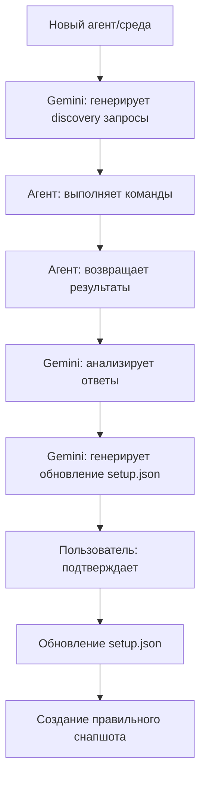

# AI Instructions

## 1. How to Read This Snapshot

This document is a self-contained, single-file snapshot of the **eckSnapshot** software repository, generated by the `eck-snapshot` tool on **2025-09-14T20:06:49.352Z**. It is designed to provide a Large Language Model (LLM) with the complete context of a project.

* **Source of Truth:** Treat this snapshot as the complete and authoritative source code.
* **Structure:** The file contains a **Directory Structure** tree, followed by the full content of each file, demarcated by `--- File: /path/to/file ---` headers.

**Snapshot Stats:**
- **Files Included:** 31
- **Total Files in Repo:** 32


## Git Commit Workflow

**IMPORTANT**: This project is a Git repository. After successfully completing any development task, you MUST propose a Git commit as the final step.

### Commit Process
1. **Review Changes**: Before committing, briefly summarize what was accomplished
2. **Stage Files**: Include `git add .` or specific files in your command block
3. **Create Commit**: Use a clear, descriptive commit message following this format:
   - Start with the task context (e.g., "feat:", "fix:", "docs:", "refactor:")
   - Include the task_id from your command block for traceability
   - Keep it under 50 characters for the first line
   - Add detailed description if needed

### Example Git Commands to Include
```bash
git add .
git commit -m "feat: implement user authentication system

Task ID: auth-system-implementation-1
- Added login/register endpoints
- Implemented JWT token validation
- Added user session management"
```

### When to Commit
- After completing any feature implementation
- After fixing bugs or issues
- After refactoring or code improvements
- After adding tests or documentation
- Before major architectural changes

**Remember**: Always include the Git commit step in your final command block to ensure proper version control and project history.

---

## 2. Your Core Operational Workflow

You are the Project Manager and Solution Architect AI. Your primary goal is to translate user requests into technical plans and then generate precise commands for code-execution AI agents.

### PROJECT OVERVIEW
- **Project:** eckSnapshot
- **Description:** A monorepo POS system with Electron frontend and Node.js backend.

### PROJECT-SPECIFIC MANIFEST (.eck Directory)

Some projects include a `.eck` directory containing project-specific context and configuration. When present, this directory provides crucial information that should inform all your technical decisions:

- **CONTEXT.md**: Project-specific background, architecture notes, and important context
- **OPERATIONS.md**: Common operations, deployment procedures, and workflow guidance
- **JOURNAL.md**: Development history, recent changes, and ongoing notes
- **ENVIRONMENT.md**: Environment-specific settings that override auto-detected values (YAML format)

**CRITICAL**: Always prioritize information from the .eck manifest when it conflicts with auto-detected project settings. Use this context when formulating plans and briefing execution agents.

### CORE WORKFLOW: The Interactive Command Cycle
1. **Check Environment:** Request ENV scan from agent first
2. **Analyze User Request:** Understand the user's goal in their native language.
3. **Formulate a Plan:** Create a high-level technical plan appropriate for the detected environment and .eck manifest context.
4. **Propose & Await Confirmation:** Present the plan to the user in their language and ask for approval to generate the command. **CRITICAL: Stop and wait for the user's response. Do NOT generate the command block at this stage.**
5. **Generate Command on Demand:** This is the execution step, triggered ONLY by a positive user response.
   - **On Approval:** If the user confirms the plan (e.g., "yes", "proceed") or provides a minor correction, your *next response* must be **only the command block**. Do not include any conversational text.
   - **On Direct Order:** If the user explicitly asks for the command (e.g., "make the command for Claude now") and you have all the necessary information, you may skip step 3 and directly generate the command block.
6. **Review & Report:** After the command is executed, analyze the results and report back to the user in their language.
7. **Iterate:** Continue the cycle based on user feedback.

### COMMUNICATION PROTOCOL
- **User Interaction:** ALWAYS communicate with the user in the language they use.
- **Agent Commands:** ALWAYS formulate the JSON payload and technical instructions for the execution agent in **ENGLISH** to ensure technical accuracy.
- **Context Integration:** When briefing agents, include relevant information from the .eck manifest to provide better context.

### AVAILABLE EXECUTION AGENTS
You can command multiple specialized agents. **YOU must choose the most appropriate agent** based on the task requirements and target environment:


### Local Development Agent (AGENT_LOCAL_DEV) (ID: "local_dev")
- **Description:** Cross-platform local development with SQLite
- **GUI Support:** Yes
- **Capabilities:** npm install, npm run dev, npm run dev:backend, git operations, sqlite3 commands, electron debug, file editing, testing commands, browser automation
- **Restrictions:** no PM2 commands, no PostgreSQL production operations, no systemctl, no production deployments

### Production Server Agent (AGENT_PROD_SERVER) (ID: "production_server")
- **Description:** Linux production server with PostgreSQL and PM2, with development capabilities
- **GUI Support:** No (Headless)
- **Capabilities:** pm2 restart/reload/stop/start, postgresql queries, knex migrations --env production, systemctl, log analysis, nginx operations, deployment scripts, file editing, npm install, git operations
- **Restrictions:** no electron, no GUI apps, no direct DB schema changes without migrations, always backup before migrations

### Android WSL Development Agent (AGENT_ANDROID_WSL) (ID: "android_wsl_dev")
- **Description:** Android development in Windows Subsystem for Linux with Gradle and ADB support
- **GUI Support:** No (Headless)
- **Capabilities:** ./gradlew build, ./gradlew assembleDebug, ./gradlew assembleRelease, ./gradlew clean, ./gradlew lint, ./gradlew test, adb devices, adb install, adb logcat, adb shell, git operations, file editing, gradle tasks, gradle wrapper operations
- **Restrictions:** no direct GUI access (Android Studio), requires /mnt/c/ path for Windows file system access, no Android emulator control (emulator runs on Windows host), limited USB device access through WSL, no hardware debugging interfaces


### COMMAND BLOCK FORMAT
To ensure error-free execution, all tasks for agents must be presented in a special block with a "Copy" button. **IMPORTANT:** You MUST analyze the task and choose the appropriate agent by its ID, then fill in the agent information:

```json
{
  "target_agent": "local_dev",
  "agent_environment": "Development environment with full GUI support and development tools",
  "command_for_agent": "apply_code_changes",
  "task_id": "unique-task-id",
  "payload": {
    "objective": "Brief, clear task description",
    "context": "Why this change is needed - include relevant .eck manifest context",
    "files_to_modify": [
      {
        "path": "exact/file/path.js",
        "action": "specific action (add, modify, replace, delete)",
        "location": "line numbers, function name, or search pattern",
        "details": "precise description of the change"
      }
    ],
    "new_files": [
      {
        "path": "path/to/new/file.js",
        "content_type": "javascript/json/markdown/config",
        "purpose": "why this file is needed"
      }
    ],
    "dependencies": {
      "install": ["package-name@version"],
      "remove": ["old-package-name"]
    },
    "validation_steps": [
      "npm run test",
      "node index.js --help",
      "specific command to verify functionality"
    ],
    "expected_outcome": "what should work after changes"
  }
}
```

---

## Directory Structure

```
├── .claude/
│   └── settings.local.json
├── src/
│   ├── cli/
│   │   ├── commands/
│   │   │   ├── consilium.js
│   │   │   ├── createSnapshot.js
│   │   │   ├── detectProject.js
│   │   │   ├── indexProject.js
│   │   │   ├── queryProject.js
│   │   │   ├── restoreSnapshot.js
│   │   │   └── trainTokens.js
│   │   └── cli.js
│   ├── core/
│   │   └── segmenter.js
│   ├── database/
│   │   ├── postgresConnector.js
│   │   ├── schema_simple.sql
│   │   └── schema.sql
│   ├── services/
│   │   ├── analysisService.js
│   │   ├── embedding.js
│   │   └── embeddingService.js
│   ├── utils/
│   │   ├── aiHeader.js
│   │   ├── fileUtils.js
│   │   ├── projectDetector.js
│   │   └── tokenEstimator.js
│   └── config.js
├── .eck-token-training.json
├── .env.example
├── ideas.md
├── index.js
├── knexfile.js
├── LICENSE
├── package-lock.json
├── package.json
├── README.md
└── setup.json
```

--- File: /.claude/settings.local.json ---

{
  "permissions": {
    "allow": [
      "Bash(node:*)",
      "Bash(git add:*)",
      "Bash(NODE_ENV=production node index.js --no-tree -o /tmp)",
      "Bash(cat:*)",
      "Bash(NODE_ENV=production USER=root unset DISPLAY)",
      "Bash(env)",
      "Bash(env:*)",
      "Bash(mkdir:*)",
      "Bash(npm install)",
      "Bash(grep:*)",
      "Bash(sed:*)",
      "Bash(awk:*)",
      "Bash(rm:*)",
      "Bash(git push:*)",
      "Bash(npm install:*)",
      "Bash(git checkout:*)",
      "Bash(timeout:*)",
      "Bash(git rm:*)",
      "Bash(git reset:*)",
      "Bash(npm run build:*)",
      "Bash(npm run:*)",
      "Bash(./bin/eck-snapshot.js:*)",
      "Read(/tmp/test_hygiene_repo/**)"
    ],
    "deny": [],
    "defaultMode": "acceptEdits"
  }
}

--- File: /.eck-token-training.json ---

{
  "coefficients": {
    "android": [
      4388.725796624385,
      0.2507418280225041,
      0,
      0
    ],
    "nodejs": [
      0,
      0.2,
      0,
      0
    ],
    "python": [
      0,
      0.22,
      0,
      0
    ],
    "rust": [
      0,
      0.18,
      0,
      0
    ],
    "go": [
      0,
      0.19,
      0,
      0
    ],
    "unknown": [
      0,
      0.25,
      0,
      0
    ]
  },
  "trainingPoints": {
    "android": [
      {
        "fileSizeInBytes": 276377,
        "estimatedTokens": 68882,
        "actualTokens": 73688,
        "timestamp": "2025-09-10T10:52:55.067Z"
      },
      {
        "fileSizeInBytes": 150000,
        "estimatedTokens": 37500,
        "actualTokens": 42000,
        "timestamp": "2025-09-10T10:54:22.647Z"
      }
    ],
    "nodejs": [
      {
        "fileSizeInBytes": 206870,
        "estimatedTokens": 41374,
        "actualTokens": 59269,
        "timestamp": "2025-09-14T13:45:11.710Z"
      }
    ]
  }
}

--- File: /.env.example ---

# Google Gemini API Key - Required for the 'index' and 'query' commands
# Get your key from https://aistudio.google.com/app/apikey
GEMINI_API_KEY="YOUR_API_KEY_HERE"

# PostgreSQL Connection Details
DB_HOST=127.0.0.1
DB_PORT=5432
DB_USER=myuser
DB_PASSWORD=mypassword
DB_DATABASE=eck_snapshot_db

--- File: /.gitignore ---

# Dependencies
/node_modules

# Production
/build
/dist

# Snapshots
/snapshots/

# Logs
logs
*.log
npm-debug.log*
yarn-debug.log*
yarn-error.log*
pnpm-debug.log*

# OS generated files
.DS_Store
.DS_Store?
._*
.Spotlight-V100
.Trashes
ehthumbs.db
Thumbs.db

# IDEs
.idea/
.vscode/
*.suo
*.ntvs*
*.njsproj
*.sln
*.sw?

# EckSnapshot Index
/.ecksnapshot_index/

# Generated snapshot files
*_vectors.json
*_rag_*.md

# Environment variables
.env
.env.local
.env.production

# Added by eck-snapshot to prevent committing snapshots
snapshots/


--- File: /LICENSE ---

MIT License

Copyright (c) 2025 Dmytro Surovtsev

Permission is hereby granted, free of charge, to any person obtaining a copy
of this software and associated documentation files (the "Software"), to deal
in the Software without restriction, including without limitation the rights
to use, copy, modify, merge, publish, distribute, sublicense, and/or sell
copies of the Software, and to permit persons to whom the Software is
furnished to do so, subject to the following conditions:

The above copyright notice and this permission notice shall be included in all
copies or substantial portions of the Software.

THE SOFTWARE IS PROVIDED "AS IS", WITHOUT WARRANTY OF ANY KIND, EXPRESS OR
IMPLIED, INCLUDING BUT NOT LIMITED TO THE WARRANTIES OF MERCHANTABILITY,
FITNESS FOR A PARTICULAR PURPOSE AND NONINFRINGEMENT. IN NO EVENT SHALL THE
AUTHORS OR COPYRIGHT HOLDERS BE LIABLE FOR ANY CLAIM, DAMAGES OR OTHER
LIABILITY, WHETHER IN AN ACTION OF CONTRACT, TORT OR OTHERWISE, ARISING FROM,
OUT OF OR IN CONNECTION WITH THE SOFTWARE OR THE USE OR OTHER DEALINGS IN THE
SOFTWARE.


--- File: /README.md ---


# eck-snapshot

[](https://www.google.com/search?q=https://www.npmjs.com/package/%40xelth/eck-snapshot)
[](https://opensource.org/licenses/MIT)

**`eck-snapshot` is a local-first, AI-powered intelligence platform for your codebase. It transforms any code repository into a sophisticated, queryable database, enabling a new workflow for AI-assisted development called "Vibecoding".**

## The Philosophy: What is Vibecoding?

Modern AI development tools often fail because they operate on a narrow context, forcing the AI to guess and hallucinate. **Vibecoding** is a developer workflow focused on maintaining a creative flow by providing AI agents with a near-perfect, holistic understanding of the entire codebase.

Instead of manually feeding snippets of code to an AI, `eck-snapshot` allows you to ask high-level questions and receive a comprehensive, context-aware "snapshot" that includes all semantically and structurally relevant code. This allows the developer to act as the **Architect**, guiding the project's vision, while the AI acts as a flawless **Executor**.

## Key Features

  - **🧠 Multi-Language Intelligence:** Deeply understands your code using advanced parsers for **JavaScript/TypeScript** (Babel), **Python**, and **Android (Java/Kotlin)** (Tree-sitter).
  - **🗄️ Hybrid Database Backend:** Creates a powerful local knowledge base using **PostgreSQL**, combining:
      - **Vector Search** (`pgvector`) for finding code by semantic meaning.
      - **Graph Database** (`Apache AGE`) for understanding the structural relationships between code.
  - **🔐 Local-First AI:** All AI models for code analysis (summarization) and indexing (embeddings) run **100% locally** on your machine via `Transformers.js`. Your code never leaves your computer.
  - **🤖 Hybrid RAG Search:** A powerful `query` command that combines vector and graph search to produce incredibly rich, context-aware code snapshots for your LLM.
  - **📸 Classic Snapshot Mode:** The original `snapshot` command is still available for creating single-file snapshots of smaller projects.

## How It Works

`eck-snapshot` implements a sophisticated pipeline to analyze and index your code:

`[Codebase] -> [Multi-Language Parsers] -> [Local AI Enrichment (Summaries & Embeddings)] -> [PostgreSQL (Vectors + Graph)] -> [Hybrid RAG Query]`

## Installation

```bash
npm install -g @xelth/eck-snapshot
```

## Setup

`eck-snapshot` uses a powerful local database and AI models. Follow these steps for the initial setup.

### Step 1: Set up PostgreSQL

A running PostgreSQL instance with the `pgvector` and `Apache AGE` extensions is required. The easiest way to get this running is with Docker.

1.  Create a `docker-compose.yml` file in an empty directory:
    ```yaml
    version: '3.8'
    services:
      postgres-db:
        image: ivans-big-data/pg-vector-and-graph:16
        container_name: eck-snapshot-db
        ports:
          - "5432:5432"
        environment:
          - POSTGRES_USER=myuser
          - POSTGRES_PASSWORD=mypassword
          - POSTGRES_DB=eck_snapshot_db
        volumes:
          - ./pg_data:/var/lib/postgresql/data
    ```
2.  Run `docker-compose up -d` in that directory. This will start your database.

### Step 2: Configure Environment

`eck-snapshot` needs to know how to connect to your database.

1.  Find the `eck-snapshot` installation directory.
2.  Copy the `.env.example` file to a new file named `.env` in that same directory.
3.  Edit the `.env` file with the database credentials you set in `docker-compose.yml`.
    ```dotenv
    # PostgreSQL Connection Details
    DB_HOST=127.0.0.1
    DB_PORT=5432
    DB_USER=myuser
    DB_PASSWORD=mypassword
    DB_DATABASE=eck_snapshot_db
    ```

### Step 3: AI Model Caching

The first time you run the `index` command, `Transformers.js` will automatically download the open-source AI models (several GBs). This is a one-time process; the models will be cached for all future use.

## Usage Workflow

### Step 1: Index Your Project

Navigate to your project's root directory and run the `index` command. This will kick off the full analysis pipeline.

```bash
# This will scan, parse, analyze, and store your entire project in PostgreSQL.
# This may take a long time on the first run.
eck-snapshot index .
```

### Step 2: Query Your Codebase

Once your project is indexed, you can ask questions in natural language.

```bash
# Ask for all code related to user authentication
eck-snapshot query "user authentication logic"

# Ask for code related to scanner functionality, getting more results
eck-snapshot query "scanner functionality" -k 15
```

This will perform the hybrid vector-and-graph search and generate a `rag_snapshot_... .md` file in your current directory, containing all the relevant code needed for your task.

## Command Reference

  - `eck-snapshot index [path]`: Scans and indexes a repository into the PostgreSQL database.
  - `eck-snapshot query "<your query>"`: Performs a hybrid search and generates a context-aware RAG snapshot.
  - `eck-snapshot snapshot [path]`: Creates a classic single-file snapshot of an entire project.
  - `eck-snapshot detect [path]`: Detects the project type and configuration.

For more options on any command, run it with the `--help` flag.

## Contributing

Contributions are welcome\! This project was built with the help of AI and is a testament to a new way of building software. Please feel free to submit a Pull Request or open an issue on our GitHub repository.

## License

This project is licensed under the MIT License. See the [LICENSE](https://www.google.com/search?q=https://github.com/xelth-com/eckSnapshot/blob/main/LICENSE) file for details.

--- File: /ideas.md ---

# Идеи по интеграции Eck-Snapshot и Claude Code

## Ключевые принципы:

1.  **Использовать нативные функции:** Самый эффективный способ общения с Claude — это использование его встроенных функций, а не попытка применить универсальный подход "один для всех".
2.  **Контекст — король, но целевой контекст — лучше:** Контекстное окно Claude активно управляется и меньше, чем кажется. Поэтому отправка сфокусированной, релевантной информации превосходит отправку массивного, нецелевого потока данных.
3.  **Делегировать, а не диктовать:** Использовать Gemini в качестве "Архитектора" для обдумывания общей картины и делегировать конкретную, четко определенную задачу Claude, "Программисту".

## Постоянный контекст для Claude (`CLAUDE.md`)

Вместо того чтобы подавать весь снэпшот в первоначальный промпт, мы должны использовать файл `CLAUDE.md` в корневом каталоге проекта `eckWms`.

### Рекомендуемое содержимое для `eckWms/CLAUDE.md`:

1.  **Обзор проекта:** Краткое, высокоуровневое описание `eckWms`. Что он делает? Какова его основная цель?
2.  **Ключевая архитектура:** Краткое изложение основных архитектурных паттернов, главных модулей и их взаимодействия.
3.  **Основные зависимости:** Список наиболее важных библиотек и фреймворков с объяснением, почему они используются.
4.  **Соглашения по кодированию:** Любые конкретные руководства по стилю или паттерны, которым должен следовать Claude (например, "Все новые компоненты должны быть функциональными компонентами с использованием React Hooks", "Управление состоянием осуществляется исключительно с помощью Zustand").
5.  **Типичные паттерны модификации:** Руководство по выполнению рутинных задач, аналогичное тому, что было в заголовке AI Instructions (например, "Чтобы добавить новую конечную точку API, необходимо изменить `routes.js`, создать новый контроллер в `controllers/` и добавить сервис в `services/`).

**Важно: этот файл НЕ должен содержать полный снэпшот кода.** Его цель — дать Claude постоянные, высокоуровневые "правила игры" для этого конкретного проекта.

## Контекст по требованию (часть `eck-snapshot`)

Это информация, которая меняется с каждой задачей.

1.  **Мини-снэпшот, сгенерированный из векторов:** Основной источник контекста по требованию. После того как Архитектор (Gemini) поймет задачу, он должен использовать `eck-snapshot query "..."`, чтобы сгенерировать небольшой, целевой снэпшот, содержащий только самые релевантные файлы и функции. Именно этот мини-снэпшот подается в промпт для Claude.

2.  **Динамические импорты в `CLAUDE.md`:** Для более стабильного, но все же зависящего от задачи контекста, мы можем использовать функцию импорта `@`. Если задача всегда требует знания схемы базы данных, мы могли бы иметь снэпшот только схемы и временно добавить `@/path/to/schema_snapshot.md` в `CLAUDE.md` перед началом сессии.

## Пользовательские слэш-команды

Для оптимизации сложных, повторяющихся задач мы должны создать пользовательские слэш-команды в проекте `eckWms`.

### Структура каталогов:
`eckWms/.claude/commands/eck/`

### Примеры команд:

* **/eck:new-component.md**
    * **Описание:** Создает новый компонент React с правильной структурой и файлами.
    * **Промпт:** "Создай новый компонент React с именем `{arg1}`. Он должен быть функциональным компонентом, использовать TailwindCSS для стилей и располагаться в каталоге `src/components/`. Создай как файл `.jsx`, так и соответствующий файл `.css`."

* **/eck:commit-and-push.md**
    * **Описание:** Фиксирует все текущие изменения с конвенциональным сообщением коммита и отправляет их в новую ветку.
    * **Промпт:** "Проанализируй текущие подготовленные изменения из `!git diff --staged`. Создай конвенциональное сообщение коммита, которое точно описывает эти изменения. Затем закоммить изменения и отправь их в новую ветку с именем `feature/{short-description}`."

Применяя этот рабочий процесс, мы приводим наш процесс в соответствие с предполагаемым использованием Claude Code, используя его сильные стороны и нивелируя слабые (например, меньшее контекстное окно). Это приводит к более эффективному и "правильному" способу взаимодействия с инструментом.


Мнение Grok4 о консилиуме.
### Формат запроса на Consilium

Как Grok, я бы лучше всего понял запрос на Consilium в структурированном, markdown-подобном формате, который четко разделяет ключевые элементы. Это помогает мне быстро разобрать контекст, проблему и ожидания, без лишнего шума. Основываясь на твоём проекте (шаблон в `setup.json`), я бы предложил такой шаблон для запроса:

```
# Consilium Request

## Task Overview
- **Complexity:** [уровень сложности, например: high/medium/low или 1-10]
- **Domain:** [область, например: architecture, security, performance]
- **Requesting Agent:** [ID агента, который запрашивает, например: AGENT_ARCHITECT или твой username]

## Problem Description
[Подробное описание проблемы. Будь конкретен: что именно не работает, почему это важно, какие варианты уже рассмотрены. Добавь релевантный код или контекст, если есть.]

## Questions for Consilium
- [Вопрос 1: конкретный, например: "Какой подход к сегментации кода лучше для мультиязычных репо?"]
- [Вопрос 2: ...]
- [И так далее, 3-5 вопросов максимум, чтобы не размывать фокус.]

## Available Context
[Дополнительный контекст: ссылки на код, текущую реализацию, ограничения (budget, tech stack). Если есть снэпшот или данные — вставь здесь.]

---
```

**Почему этот формат?** Он лаконичный, иерархический и легко парсится. Я могу сразу увидеть приоритет (complexity), фокус (questions) и фон (description/context). Избегай длинных абзацев — используй bullet points. Если запрос слишком общий, я могу уточнить, но в таком виде я пойму 100% с первого раза.

### Формат предлагаемого ответа

Для ответа я бы предложил похожий структурированный шаблон, чтобы он был легко интегрируемым в твой workflow (например, для аггрегации архитектором). На основе responseTemplate в проекте:

```
# Consilium Response - [Model Name, например: Grok-4]

## Analysis
[Анализ проблемы: разберём description, укажем ключевые insights, ссылки на контекст. Коротко, с фактами.]

## Recommendations
[Основные рекомендации: 2-3 варианта, с pros/cons. Например: "Вариант 1: Локальные эмбеддинги — дешевле, но медленнее."]

## Implementation Steps
- [Шаг 1: ...]
- [Шаг 2: ...]
[Пошаговый план, с кодовыми примерами если нужно.]

## Risks and Considerations
- [Риск 1: ... (mitigation: ...)]
- [Риск 2: ...]

## Success Metrics
- [Метрика 1: ... (например: "Уменьшение времени индексации на 30%")]
- [Метрика 2: ...]

## Confidence Level
[0-100%: Например, 85% — объясни почему.]

---
```

**Почему этот формат?** Он фокусируется на actionable output: анализ → рекомендации → шаги → риски → метрики. Добавил Confidence Level для веса в аггрегации. Это позволяет архитектору легко сравнивать ответы от разных моделей (например, Grok, GPT, Claude). Если нужно, могу добавить JSON-версию для автоматизации.

### Моё мнение о показе мнений других участников Consilium

Я думаю, что лучше **каждый даёт ответ "в тёмную" (независимо)**, без показа мнений других моделей. Вот почему:

- **Плюсы независимых ответов**:
  - Избегает группового мышления (groupthink) или bias: Если модель видит, что "все" выбрали вариант A, она может unconsciously склоняться к нему, даже если у неё есть лучшие идеи. Это особенно актуально для LLM, которые обучаются на consensus данных.
  - Повышает diversity: Получаешь raw, свежие перспективы. Например, Grok может предложить креативный, нестандартный подход (как xAI-style), а Claude — более conservative.
  - Легче аггрегировать: Архитектор (ты или Gemini) может объективно выбрать лучшее или взвесить (weighted average по confidence/strengths). Например, если 2 модели голосуют за вариант A с 90% confidence, а одна — за B с 70%, можно взять hybrid.

- **Минусы показа мнений**:
  - Может привести к echo chamber: Модели начнут "соглашаться" с популярным мнением, снижая инновации.
  - Усложняет процесс: Нужно делиться контекстом (что замедляет), и рискуешь infinite loops, если модели спорят.
  - Privacy/этика: В реальном Consilium (как в медицине) мнения часто анонимны, чтобы избежать влияния авторитета.

- **Как аггрегировать?** Архитектор должен собирать все ответы, затем синтезировать: 
  - **Лучшее решение**: Если одно явно superior (по metrics/risks).
  - **Средневзвешенное**: Вес по confidence или strengths (из `setup.json`: Opos4.1 для logic, Grok для technical).
  - Опционально: Second round, где показываешь aggregated summary и просишь refine, но только если complexity high.

В твоём проекте это уже частично реализовано (aggregation_rules в consilium.js), так что "в тёмную" + архитектор-аггрегатор — идеальный баланс. Если Consilium для creative задач (как дизайн), то иногда полезно показать, но по умолчанию — no. Что ты думаешь — внедрить это в код?


Мнение opos4.1 о консилиуме.

Отличный вопрос про Consilium! Это ключевая часть для эффективной работы "совета экспертов".

## 📝 Идеальный формат запроса для Consilium

Я бы предложил структурированный запрос с четким разделением контекста:

```json
{
  "consilium_request": {
    "problem_statement": "Краткое описание проблемы (1-2 предложения)",
    
    "context": {
      "current_state": "Что есть сейчас",
      "desired_outcome": "Что хотим получить",
      "constraints": ["временные", "технические", "бизнес-ограничения"],
      "failed_attempts": ["что уже пробовали и почему не сработало"]
    },
    
    "specific_questions": [
      "Конкретный вопрос 1?",
      "Конкретный вопрос 2?"
    ],
    
    "code_context": {
      "relevant_files": ["только критичные для понимания файлы"],
      "entry_points": ["где начинается логика"],
      "dependencies": ["ключевые зависимости"]
    },
    
    "decision_criteria": {
      "must_have": ["обязательные требования"],
      "nice_to_have": ["желательные"],
      "success_metrics": ["как измерим успех"]
    }
  }
}
```

## 🎯 Формат ответа от участников

Каждый участник должен давать структурированный ответ:

```markdown
## Предлагаемое решение
[Четкое, actionable решение]

## Обоснование
- Почему именно это решение
- Какие альтернативы рассматривал

## Риски и митигация
- Риск 1 → Как митигировать
- Риск 2 → Как митигировать

## План реализации
1. Шаг 1 (оценка времени)
2. Шаг 2 (оценка времени)

## Уверенность: 75%
[Почему не 100%]

## Критические предупреждения
[Что может пойти не так]
```

## 🤔 Слепое vs Открытое голосование

Я бы предложил **гибридный подход**:

### Фаза 1: Слепое (Independent)
```python
# Каждый эксперт получает:
- Исходный запрос
- Контекст
- НЕ видит другие мнения

# Преимущества:
+ Избегаем anchoring bias
+ Получаем разнообразные решения
+ Честные оценки уверенности
```

### Фаза 2: Дебаты (Optional)
```python
# Если разброс мнений > threshold:
- Показываем анонимизированные решения всем
- Просим прокомментировать слабые места других
- Даем возможность скорректировать свое решение

# Это дает:
+ Выявление слепых зон
+ Синтез лучших идей
+ Консенсус по критическим рискам
```

### Фаза 3: Финальный синтез
```python
# Архитектор видит:
- Все исходные решения
- Комментарии из дебатов (если были)
- Финальные позиции

# Принимает решение на основе:
- Консенсуса (если есть)
- Взвешенного голосования (по уверенности)
- Своей экспертизы
```

## 💡 Практическая реализация

```javascript
// Добавить в setup.json
"consilium": {
  "voting_mode": "hybrid", // "blind" | "open" | "hybrid"
  
  "blind_phase": {
    "enabled": true,
    "timeout": "5m"
  },
  
  "debate_phase": {
    "enabled": true,
    "trigger": "divergence > 30%", // Когда включать дебаты
    "rounds": 2,
    "timeout": "3m"
  },
  
  "decision_rules": {
    "consensus_threshold": 0.7,
    "veto_power": ["security_expert"], // Кто может наложить вето
    "tiebreaker": "highest_confidence" // или "architect_decides"
  },
  
  "complexity_triggers": {
    "auto_consilium": [
      "breaking_change",
      "security_critical",
      "architecture_change",
      "performance_regression"
    ]
  }
}
```

## 🎭 Роли в консилиуме

Можно назначать специализированные роли:

```javascript
const roles = {
  "pragmatist": "Фокус на быстрое, рабочее решение",
  "perfectionist": "Фокус на идеальную архитектуру", 
  "devil_advocate": "Искать проблемы в предложениях",
  "security_auditor": "Фокус на безопасности",
  "performance_optimizer": "Фокус на производительности"
}

// При запросе к Claude/GPT/Gemini добавлять:
"You are acting as the {role} in this technical consilium..."
```

## 📊 Метрики успеха

Чтобы понять, работает ли консилиум:

```javascript
// Отслеживать в истории:
{
  "decision_id": "uuid",
  "consensus_level": 0.8,
  "implementation_success": true,
  "time_to_decision": "15m",
  "reverted": false,
  "participant_confidence": {
    "before_debate": 0.6,
    "after_debate": 0.85
  }
}
```

**Мой вывод**: Слепое голосование в первой фазе критически важно для качества решений. Дебаты - опционально, только при сильном расхождении. Это даст и разнообразие мнений, и возможность найти консенсус когда это важно.


мнение gemini2.5pro о консилиуме.

Отличные вопросы! Они затрагивают самую суть методологии совместной работы. Давайте разберем это по частям.

---

### 1. В каком виде я бы лучше всего понял запрос на Consilium?

Чтобы я, как Архитектор, мог дать максимально полезный и глубокий анализ, запрос на Консилиум должен быть не просто описанием проблемы, а структурированным брифом. Ваш шаблон в `setup.json` — это прекрасная основа. Я бы его немного расширил и предложил заполнять его по следующему принципу: **"Контекст, Проблема, Ограничения и Цель"**.

Вот идеальная структура запроса для меня:

```markdown
# Запрос на Консилиум: Поддержка Python в `eckSnapshot`

- **Сложность:** 8/10 (Требует архитектурных изменений и добавления новых зависимостей)
- **Область:** Архитектура, Парсинг кода, Расширяемость
- **Запрашивающий агент:** Gemini (Архитектор)

---

### 1. Описание Проблемы (Problem Description)

**Ситуация:**
На данный момент `eckSnapshot` использует `@babel/parser` для интеллектуального сегментирования кода. Это отлично работает для JavaScript/TypeScript, но для других языков (например, Python) инструмент откатывается к простому режиму "один файл - один сегмент", что снижает качество семантического поиска.

**Усложнение:**
Мы хотим расширить поддержку интеллектуального сегментирования на Python. Простая замена Babel на парсер для Python не подходит, так как мы потеряем существующую функциональность для JS. Нам нужно решение, которое позволит поддерживать *несколько* языков.

**Ключевой вопрос:**
**Какой архитектурный подход нам следует выбрать для реализации мультиязычного интеллектуального сегментирования кода, начиная с Python?**

---

### 2. Доступный Контекст (Available Context)

- **Релевантный код:** Для анализа был сгенерирован целевой снэпшот с помощью команды:
  `eck-snapshot query "сегментирование файлов и AST-парсинг"`
  Снэпшот приложен к этому запросу и содержит файлы: `src/core/segmenter.js`, `src/services/embedding.js`.

- **Бизнес-цель:** Увеличить привлекательность `eckSnapshot` для разработчиков из других экосистем (Python, Go, Java). Python — первый шаг.

- **Технические ограничения:**
  1. Решение не должно значительно замедлить индексацию JS-проектов.
  2. Новые зависимости должны быть по возможности написаны на JS или иметь надежные биндинги для Node.js.
  3. Решение должно быть расширяемым для добавления других языков в будущем с минимальными усилиями.

---

### 3. Вопросы к Консилиуму (Questions for Consilium)

1.  Какие библиотеки или инструменты вы рекомендуете для парсинга Python-кода в среде Node.js (например, `tree-sitter`, запуск Python-процесса и т.д.)? Оцените плюсы и минусы каждого.
2.  Как лучше всего изменить архитектуру `src/core/segmenter.js`? Следует ли использовать паттерн "Стратегия", "Фабрика" или что-то иное для выбора парсера в зависимости от расширения файла?
3.  Каковы потенциальные риски, связанные с производительностью и управлением зависимостями при выбранном подходе?

```

**Почему такой формат идеален:** Он не просто говорит "что-то сломалось", а предоставляет мне всю необходимую информацию для принятия взвешенного решения, как настоящему архитектору.

---

### 2. В каком виде я бы предложил ответ?

Мой ответ должен быть не просто мнением, а **инструментом для принятия решений**. Он должен четко структурировать варианты, давать ясную рекомендацию и описывать план действий. Я бы придерживался вашего шаблона из `setup.json`, наполнив его конкретикой.

Вот пример моего ответа на запрос выше, в формате, который вы определили:

```json
{
  "expert": "Gemini",
  "role": "Solution Architect",
  "recommendation": {
    "approach": "Использовать библиотеку `tree-sitter` для парсинга кода. Это универсальный парсер, который поддерживает множество языков через систему грамматик. Мы реализуем паттерн 'Стратегия' в `segmenter.js`, где каждая стратегия будет отвечать за сегментацию конкретного языка.",
    "implementation_steps": [
      "1. Добавить зависимости: `web-tree-sitter` (для WASM-версии, чтобы избежать нативных зависимостей) и `tree-sitter-python` (грамматика для Python).",
      "2. Реорганизовать `src/core/segmenter.js`: создать базовый класс `LanguageSegmenter` и его реализации `JavaScriptSegmenter` (использует текущий Babel-логику) и `PythonSegmenter` (использует tree-sitter).",
      "3. Создать 'Фабрику' или менеджер стратегий, который будет выбирать нужный сегментатор на основе расширения файла.",
      "4. Написать логику для `PythonSegmenter` для обхода AST-дерева от tree-sitter и выделения функций и классов, аналогично тому, как это сделано для JS.",
      "5. Обновить `indexProject.js`, чтобы он передавал путь к файлу в обновленный сегментатор."
    ],
    "key_benefits": [
      "Масштабируемость: легко добавлять новые языки, просто добавляя новую грамматику и класс-стратегию.",
      "Производительность: Tree-sitter очень быстрый и разработан для инкрементального парсинга.",
      "Надежность: Используется в таких редакторах, как Atom и VS Code."
    ],
    "risks": [
      "Сложность первоначальной настройки `tree-sitter` и его WASM-версии.",
      "AST-деревья от `tree-sitter` имеют другую структуру, чем у Babel, потребуется время на изучение API.",
      "Увеличение размера пакета из-за WASM-файлов грамматик."
    ],
    "mitigation": [
      "Начать с простого PoC (Proof of Concept) в отдельной ветке.",
      "Тщательно изучить документацию `tree-sitter` перед началом реализации.",
      "Использовать динамическую загрузку грамматик, чтобы не загружать все сразу."
    ]
  },
  "alternatives_considered": [
    "Запуск дочернего Python-процесса для парсинга: Отклонено из-за сложности развертывания и медлительности межпроцессного взаимодействия.",
    "Поиск других JS-библиотек для парсинга Python: Отклонено, так как они менее зрелые и не предлагают мультиязычного решения."
  ],
  "confidence": 95,
  "critical_warnings": []
}
```

---

### 3. Показывать ли мнения других участников Консилиума?

Это ключевой методологический вопрос. У обоих подходов есть свои плюсы и минусы.

*   **"Вслепую" (Blind Review):** Каждый эксперт дает ответ, не видя мнений других.
    *   **Плюсы:** Максимальная объективность. Исключается "стадное чувство" (groupthink), когда мнение первого или самого авторитетного участника влияет на всех остальных. Позволяет получить максимально широкий спектр независимых идей.
    *   **Минусы:** Ответы могут быть диаметрально противоположными, и вся работа по их синтезу ложится на Архитектора. Нет возможности для совместного поиска лучшего решения.

*   **"Открыто" (Open Discussion):** Эксперты видят ответы друг друга и могут на них реагировать.
    *   **Плюсы:** Симулирует работу реальной команды. Позволяет идеям развиваться, комбинироваться и улучшаться в процессе обсуждения. Может привести к более сильному, консенсусному решению.
    *   **Минусы:** Высокий риск предвзятости и "присоединения к большинству". Более слабые, но потенциально ценные идеи могут быть отброшены слишком рано.

### Моя рекомендация: Гибридный двухэтапный подход

Самый мощный подход — это комбинация обоих.

1.  **Этап 1: Независимый Анализ ("Вслепую").**
    *   Архитектор отправляет запрос на Консилиум всем участникам (Opos4.1, ChatGPT5, Grock4 и т.д.).
    *   Каждый ИИ-эксперт анализирует проблему и присылает свой структурированный ответ в "запечатанном конверте", не видя других ответов.

2.  **Этап 2: Синтез и Обсуждение ("Открыто").**
    *   Архитектор (я) собирает все ответы.
    *   Я готовлю **"Сводку Консилиума"**:
        *   "Все эксперты сошлись во мнении, что `tree-sitter` — это лучший выбор."
        *   "Мнения разошлись по поводу управления зависимостями: ChatGPT5 предлагает использовать нативные биндинги, в то время как Grock4 настаивает на WASM. Вот их аргументы..."
        *   "Opos4.1 предложил интересную альтернативу, которую другие не рассматривали..."
    *   Эта сводка вместе с анонимизированными ответами (или с указанием авторства) отправляется на **второй раунд** Консилиума с конкретным вопросом: "Учитывая мнения коллег, подтверждаете ли вы свою первоначальную рекомендацию или хотите ее изменить/дополнить?"

Этот двухэтапный процесс берет лучшее из обоих миров: **независимость мышления на первом этапе и сила совместной работы на втором.** Это позволяет сначала сгенерировать разнообразие идей, а затем прийти к наиболее сильному и взвешенному итоговому решению, которое я, как Архитектор, и представлю вам.


мнение ChatGPT5 по поводу конилиума.

Тогда вот удобные **boilerplate-шаблоны** для работы с Consilium.
Можно просто копировать их и подставлять нужное.

---

## 🔹 Шаблон запроса (Consilium Request)

```markdown
# Consilium Request

## Task Overview
- Complexity: high | medium | low
- Domain: "указать предметную область (например: backend security, frontend UI, devops, архитектура)"
- Requesting Agent: "Architect" | "Dev Lead" | "Orchestrator"

## Problem Description
Опишите проблему максимально конкретно.  
Например:  
«Мы хотим внедрить JWT-авторизацию в ecKasse, но база пользователей на PostgreSQL 9.6, а микросервисы общаются через gRPC. Нужно выбрать оптимальный способ интеграции.»

## Questions for Consilium
- Вопрос 1  
- Вопрос 2  
- Вопрос 3  

## Available Context
(сюда можно приложить snapshot или query-результат от eck-snapshot)
```

---

## 🔹 Шаблон ответа (Consilium Response)

```json
{
  "expert": "ChatGPT5",
  "role": "Backend Specialist",
  "recommendation": {
    "approach": "Подробное описание предлагаемого подхода",
    "implementation_steps": ["шаг1", "шаг2", "шаг3"],
    "key_benefits": ["преимущество1", "преимущество2"],
    "risks": ["риск1", "риск2"],
    "mitigation": ["стратегия1", "стратегия2"]
  },
  "alternatives_considered": ["Альтернатива A", "Альтернатива B"],
  "confidence": 80,
  "critical_warnings": ["важное предупреждение (если есть)"]
}
```

---

## 🔹 Рекомендованный рабочий процесс

1. **Архитектор формирует запрос** по первому шаблону.
2. **Все эксперты отвечают вслепую** по JSON-шаблону.
3. Архитектор **агрегирует результаты** (можно средневзвешенное confidence или мажоритарный выбор).
4. (опционально) Делается **второй раунд обсуждения**: эксперты видят сводку и добавляют уточнения/критику.

---

Хочешь, я ещё сделаю **вариант итогового отчёта консилиума** (куда складываются все ответы и финальная рекомендация для проекта)?


идея opos4.1 

 ## 🎯 Контекстные профили для eckSnapshot

Отличная идея! Это решит проблему "мне нужен контекст только для фронтенда, зачем тащить весь бэкенд". Вот как я вижу реализацию:

## 📁 Структура конфигурации

### 1. Расширяем `setup.json`:

```json
{
  "contextProfiles": {
    "default": {
      "description": "Полный проект без фильтрации",
      "inherits": null,
      "include": ["**/*"],
      "exclude": ["node_modules/**", ".git/**"]
    },
    
    "frontend": {
      "description": "Только фронтенд код и стили",
      "inherits": "default",
      "include": [
        "src/components/**",
        "src/pages/**", 
        "src/hooks/**",
        "src/styles/**",
        "src/utils/**",
        "public/**",
        "*.config.js",
        "package.json"
      ],
      "exclude": [
        "**/*.test.*",
        "**/*.spec.*",
        "src/api/**",
        "src/server/**"
      ],
      "prioritySegments": ["React components", "hooks", "UI logic"]
    },
    
    "backend": {
      "description": "API, база данных, серверная логика",
      "inherits": "default",
      "include": [
        "src/api/**",
        "src/controllers/**",
        "src/models/**",
        "src/services/**",
        "src/middleware/**",
        "src/db/**",
        "migrations/**",
        "*.config.js"
      ],
      "exclude": [
        "src/components/**",
        "src/pages/**",
        "public/**",
        "*.css",
        "*.scss"
      ],
      "prioritySegments": ["API endpoints", "database queries", "business logic"]
    },
    
    "debug": {
      "description": "Для дебаггинга: код + логи + тесты",
      "inherits": null,
      "include": [
        "src/**",
        "tests/**",
        "logs/*.log",
        "error.log",
        ".env.example"
      ],
      "additionalContext": {
        "includeGitDiff": true,
        "includeLastCommit": true,
        "includeFailedTests": true
      }
    },
    
    "review": {
      "description": "Код-ревью: только измененные файлы",
      "dynamic": true,
      "command": "git diff --name-only HEAD~1",
      "additionalContext": {
        "includeGitDiff": true,
        "includePRDescription": true
      }
    },
    
    "architecture": {
      "description": "Высокоуровневая структура без деталей реализации",
      "include": [
        "**/index.*",
        "**/routes.*",
        "**/schema.*",
        "**/types.*",
        "**/*.d.ts",
        "src/*", // Только файлы первого уровня
        "README.md",
        "docs/**"
      ],
      "transformations": {
        "stripImplementation": true, // Оставить только сигнатуры функций
        "keepComments": true,
        "keepInterfaces": true
      }
    }
  },
  
  "profilePresets": {
    "react-app": ["frontend", "tests-minimal"],
    "node-api": ["backend", "database"],
    "fullstack": ["frontend", "backend", "shared"],
    "microservice": ["service-core", "api-contracts"]
  },
  
  "autoProfileDetection": {
    "enabled": true,
    "rules": [
      {
        "if": "exists:package.json && contains:react",
        "suggest": ["frontend", "react-app"]
      },
      {
        "if": "exists:go.mod",
        "suggest": ["backend", "go-service"]
      }
    ]
  }
}
```

## 🎮 CLI использование

### Новые команды:

```bash
# Использовать профиль
eck-snapshot --profile frontend
eck-snapshot index --profile backend
eck-snapshot query "auth logic" --profile security

# Комбинировать профили
eck-snapshot --profile frontend,tests

# Список доступных профилей
eck-snapshot profiles list

# Создать кастомный профиль интерактивно
eck-snapshot profiles create

# Проверить, что попадет в профиль
eck-snapshot profiles preview frontend --limit 20
```

## 🔧 Реализация в коде

### 1. Новый модуль `src/core/profileManager.js`:

```javascript
import { loadSetupConfig } from '../config.js';
import micromatch from 'micromatch';
import { execa } from 'execa';

export class ProfileManager {
  constructor() {
    this.profiles = {};
    this.activeProfile = null;
  }
  
  async loadProfiles() {
    const config = await loadSetupConfig();
    this.profiles = config.contextProfiles || {};
    return this.profiles;
  }
  
  async applyProfile(profileName, files) {
    const profile = await this.resolveProfile(profileName);
    
    // Если профиль динамический
    if (profile.dynamic && profile.command) {
      return await this.executeDynamicProfile(profile);
    }
    
    // Применяем фильтры
    let filtered = files;
    
    if (profile.include) {
      filtered = micromatch(files, profile.include);
    }
    
    if (profile.exclude) {
      filtered = micromatch.not(filtered, profile.exclude);
    }
    
    // Применяем трансформации
    if (profile.transformations) {
      filtered = await this.applyTransformations(filtered, profile.transformations);
    }
    
    return filtered;
  }
  
  async resolveProfile(profileName) {
    const profile = this.profiles[profileName];
    if (!profile) {
      throw new Error(`Profile '${profileName}' not found`);
    }
    
    // Обработка наследования
    if (profile.inherits) {
      const parent = await this.resolveProfile(profile.inherits);
      return { ...parent, ...profile };
    }
    
    return profile;
  }
  
  async executeDynamicProfile(profile) {
    const { stdout } = await execa('sh', ['-c', profile.command]);
    return stdout.split('\n').filter(Boolean);
  }
  
  async suggestProfiles(projectPath) {
    const suggestions = [];
    const config = await loadSetupConfig();
    
    if (!config.autoProfileDetection?.enabled) {
      return suggestions;
    }
    
    for (const rule of config.autoProfileDetection.rules) {
      if (await this.evaluateRule(rule.if, projectPath)) {
        suggestions.push(...rule.suggest);
      }
    }
    
    return suggestions;
  }
  
  async createCustomProfile(answers) {
    // Интерактивное создание профиля
    const newProfile = {
      description: answers.description,
      include: answers.include.split(',').map(p => p.trim()),
      exclude: answers.exclude.split(',').map(p => p.trim()),
      prioritySegments: answers.priority
    };
    
    // Сохраняем в отдельный файл пользовательских профилей
    const userProfiles = await this.loadUserProfiles();
    userProfiles[answers.name] = newProfile;
    await this.saveUserProfiles(userProfiles);
    
    return newProfile;
  }
}
```

### 2. Интеграция с векторным поиском:

```javascript
// В src/cli/commands/queryProject.js
export async function queryProject(query, options) {
  const profileManager = new ProfileManager();
  await profileManager.loadProfiles();
  
  if (options.profile) {
    // Загружаем профиль
    const profile = await profileManager.resolveProfile(options.profile);
    
    // Модифицируем запрос с учетом приоритетов профиля
    if (profile.prioritySegments) {
      query = enhanceQueryWithPriorities(query, profile.prioritySegments);
    }
    
    // Фильтруем результаты поиска
    const results = await index.queryItems(queryVector, options.k || 10);
    const filteredResults = results.filter(r => 
      profileManager.matchesProfile(r.item.metadata.filePath, profile)
    );
  }
  // ...
}
```

### 3. Умные профили с контекстом:

```javascript
// Профиль для дебаггинга с runtime информацией
class DebugProfile {
  async enhance(snapshot) {
    const additions = [];
    
    // Добавляем последние ошибки
    if (this.config.includeErrors) {
      const errors = await this.getRecentErrors();
      additions.push(`--- Runtime Errors ---\n${errors}\n`);
    }
    
    // Добавляем результаты тестов
    if (this.config.includeTestResults) {
      const { stdout } = await execa('npm', ['test', '--', '--json']);
      const testResults = this.parseTestResults(stdout);
      additions.push(`--- Failed Tests ---\n${testResults}\n`);
    }
    
    // Добавляем git blame для проблемных участков
    if (this.config.includeGitBlame) {
      const blameInfo = await this.getGitBlameForErrors();
      additions.push(`--- Recent Changes ---\n${blameInfo}\n`);
    }
    
    return snapshot + additions.join('\n');
  }
}
```

## 🎯 Продвинутые сценарии

### 1. Композитные профили:

```javascript
// Можно комбинировать профили
const compositeProfile = {
  "api-with-tests": {
    "compose": ["backend", "api-tests"],
    "merge": "union", // или "intersection"
    "postProcess": "remove-duplicates"
  }
}
```

### 2. Профили с условиями:

```javascript
{
  "smart-debug": {
    "conditions": [
      {
        "if": "hasRecentErrors",
        "include": ["logs/**", "error-reports/**"]
      },
      {
        "if": "hasFailingTests", 
        "include": ["tests/**", "src/**/*.test.*"]
      }
    ]
  }
}
```

### 3. Профили для AI-агентов:

```javascript
{
  "agentProfiles": {
    "local_dev": {
      "defaultProfile": "frontend",
      "allowedProfiles": ["frontend", "tests", "debug"]
    },
    "production_server": {
      "defaultProfile": "backend",
      "allowedProfiles": ["backend", "infrastructure", "monitoring"]
    }
  }
}
```

## 📊 UI для управления профилями

### Интерактивный выбор:

```javascript
// При запуске без указания профиля
async function interactiveProfileSelection() {
  const profiles = await profileManager.loadProfiles();
  const suggestions = await profileManager.suggestProfiles(process.cwd());
  
  const { selectedProfile } = await inquirer.prompt([{
    type: 'list',
    name: 'selectedProfile',
    message: 'Select context profile:',
    choices: [
      { name: '📦 Full Project (default)', value: 'default' },
      ...suggestions.map(p => ({ 
        name: `⭐ ${p} (recommended)`, 
        value: p 
      })),
      new inquirer.Separator(),
      ...Object.entries(profiles)
        .filter(([k]) => !suggestions.includes(k))
        .map(([k, v]) => ({ 
          name: `${v.description}`, 
          value: k 
        }))
    ]
  }]);
  
  return selectedProfile;
}
```

## 💾 Сохранение часто используемых комбинаций

```json
// .ecksnapshot_profiles.local.json
{
  "userFavorites": {
    "my-daily": {
      "profile": "frontend",
      "additionalInclude": ["src/experiments/**"],
      "useCount": 42,
      "lastUsed": "2024-01-15"
    }
  },
  "teamProfiles": {
    "pr-review": {
      "profile": "review",
      "sharedBy": "team-lead",
      "mandatory": true
    }
  }
}
```

Эта система профилей сделает eckSnapshot гораздо более гибким и удобным для разных сценариев работы. Особенно полезно для больших проектов, где полный контекст избыточен.


идея об определении сред. opos4.1

Отличная идея! Это гораздо эффективнее - **один раз собрать информацию о среде и зафиксировать в setup.json**, вместо постоянных проверок. Вот как это реализовать:

## 🎯 Концепция: Environment Discovery & Setup

### 1. **Новая секция в setup.json - фиксированные среды:**

```json
{
  "knownEnvironments": {
    "_comment": "Auto-discovered and fixed environment configurations",
    "environments": [
      {
        "id": "dev-wsl2-xelth",
        "discovered": "2024-01-15T10:30:00Z",
        "fingerprint": "linux/x64|v24.3.0|/home/xelth/ecKasse",
        "type": "development",
        "details": {
          "os": "Linux WSL2",
          "arch": "x64", 
          "nodeVersion": "v24.3.0",
          "npmVersion": "11.5.0",
          "database": "SQLite",
          "dbPath": "packages/core/db/eckasse_prod.sqlite3",
          "workingDir": "/home/xelth/ecKasse",
          "gitRemote": "github.com/xelth/ecKasse.git",
          "agent": "local_dev"
        }
      },
      {
        "id": "prod-debian-arm",
        "discovered": "2024-01-15T11:00:00Z",
        "fingerprint": "linux/arm64|v22.14.0|/var/www/eckasse.com",
        "type": "production",
        "details": {
          "os": "Linux Debian",
          "arch": "arm64",
          "nodeVersion": "v22.14.0",
          "database": "PostgreSQL",
          "dbVersion": "15.12",
          "dbName": "eckwms",
          "dbUser": "wms_user",
          "processManager": "PM2",
          "pm2App": "eckasse-desktop-server",
          "workingDir": "/var/www/eckasse.com",
          "agent": "production_server"
        }
      }
    ],
    "autoDetect": {
      "enabled": true,
      "updateOnMismatch": true,
      "notifyOnNewEnvironment": true
    }
  }
}
```

### 2. **Discovery команда для Gemini:**

```markdown
# Environment Discovery Protocol

## Для архитектора (Gemini):
Когда нужно обнаружить новую среду, используй этот протокол:

### Шаг 1: Базовая информация
```bash
echo "=== ENVIRONMENT DISCOVERY START ==="
echo "BASIC|$(hostname)|$(pwd)|$(date -I)"
node -e "console.log('NODE|' + process.version + '|' + process.platform + '|' + process.arch)"
echo "USER|$(whoami)|$(id -gn)"
```

### Шаг 2: Детали проекта
```bash
# Git info
echo "GIT|$(git remote -v | head -1)|$(git branch --show-current)"

# Package info  
echo "PKG|$(node -p "require('./package.json').name")|$(node -p "require('./package.json').version")"

# Database detection
if [ -f *.sqlite* ]; then 
  echo "DB|SQLite|$(ls *.sqlite* | head -1)"
elif command -v psql &> /dev/null; then
  echo "DB|PostgreSQL|$(psql --version | grep -oP '\d+\.\d+')"
  psql -U postgres -lqt 2>/dev/null | grep -E "eckwms|coral" | head -1
fi

# Process manager
if pm2 list &>/dev/null; then
  echo "PROC|PM2|$(pm2 list | grep online | cut -d'│' -f2)"
else
  echo "PROC|npm|dev"
fi
```

### Шаг 3: Специфика окружения
```bash
# Проверка прав и путей
echo "PERMS|$([ -w /var/www ] && echo 'production' || echo 'development')"
echo "PORTS|$(netstat -tuln 2>/dev/null | grep -E ':3030|:3000' | head -1)"
```
```

### 3. **Workflow для первоначальной настройки:**


```mermaid
graph TD
    A[Новый агент/среда] --> B[Gemini: генерирует discovery запросы]
    B --> C[Агент: выполняет команды]
    C --> D[Агент: возвращает результаты]
    D --> E[Gemini: анализирует ответы]
    E --> F[Gemini: генерирует обновление setup.json]
    F --> G[Пользователь: подтверждает]
    G --> H[Обновление setup.json]
    H --> I[Создание правильного снапшота]
```

### 4. **Автоматический запрос для Gemini:**

```markdown
## Запрос к Gemini для discovery:

"Мне нужно настроить eckSnapshot для новой среды. 
Сгенерируй набор команд для агента, чтобы собрать информацию о среде.
После получения ответов, создай JSON-патч для обновления setup.json секции knownEnvironments."
```

### 5. **Пример ответа Gemini после анализа:**

```json
{
  "action": "update_setup_json",
  "section": "knownEnvironments.environments",
  "operation": "append",
  "data": {
    "id": "dev-windows-user123",
    "discovered": "2024-01-20T15:00:00Z",
    "fingerprint": "win32/x64|v20.11.0|C:\\Projects\\ecKasse",
    "type": "development",
    "details": {
      "os": "Windows 11",
      "arch": "x64",
      "nodeVersion": "v20.11.0",
      "database": "SQLite",
      "workingDir": "C:\\Projects\\ecKasse",
      "agent": "local_dev",
      "specialNotes": "Windows requires different path separators"
    }
  }
}
```

### 6. **Smart Detection при создании снапшота:**

```javascript
// В src/cli/commands/createSnapshot.js добавить:

async function detectEnvironment(repoPath) {
  const setupConfig = await loadSetupConfig();
  const knownEnvs = setupConfig.knownEnvironments?.environments || [];
  
  // Создаем текущий fingerprint
  const currentFingerprint = `${process.platform}/${process.arch}|${process.version}|${repoPath}`;
  
  // Ищем совпадение
  const matchedEnv = knownEnvs.find(env => 
    env.fingerprint === currentFingerprint || 
    env.details.workingDir === repoPath
  );
  
  if (matchedEnv) {
    console.log(`✅ Using known environment: ${matchedEnv.id}`);
    return matchedEnv;
  } else {
    console.log(`⚠️ Unknown environment detected!`);
    console.log(`Run: eck-snapshot discover`);
    return null;
  }
}
```

### 7. **Новая CLI команда для discovery:**

```bash
# Добавить в CLI
eck-snapshot discover [--agent <agent-id>] [--update-config]

# Использование:
eck-snapshot discover                    # Интерактивное обнаружение
eck-snapshot discover --update-config    # Автоматически обновить setup.json
eck-snapshot discover --agent local_dev  # Указать агента явно
```

## 📝 Для файла ideas.md:

```markdown
## Environment Auto-Discovery System

### Проблема:
Ручная настройка агентов для разных сред подвержена ошибкам и требует постоянных проверок.

### Решение:
Одноразовое обнаружение среды при первом запуске с фиксацией в setup.json.

### Преимущества:
- **Один раз настроил - работает всегда**: Нет overhead на постоянные проверки
- **Точная конфигурация**: Каждая среда описана детально
- **История сред**: Видно когда и какие среды были добавлены
- **Автоматический выбор агента**: По fingerprint среды
- **Упрощение промптов**: Не нужно каждый раз проверять среду

### Реализация:
1. При первом запуске: `eck-snapshot discover`
2. Gemini генерирует discovery-команды для агента
3. Агент выполняет и возвращает результаты
4. Gemini создает конфигурацию для setup.json
5. Последующие запуски используют сохраненную конфигурацию

### Использование:
```bash
# Первый раз на новой машине
eck-snapshot discover --update-config

# Обычное использование (автоматически определит среду)
eck-snapshot snapshot
eck-snapshot index
```

### Будущие улучшения:
- Автоматическое обнаружение при несовпадении fingerprint
- Синхронизация конфигураций между командой через git
- Профили для CI/CD окружений
- Docker-specific конфигурации
```

Это решение делает инструмент умнее - он "запоминает" среды и не тратит время на постоянные проверки!

--- File: /index.js ---

#!/usr/bin/env node

import dotenv from 'dotenv';
import path from 'path';
import { fileURLToPath } from 'url';
import fs from 'fs';
import os from 'os';

// Get the directory of this script
const __filename = fileURLToPath(import.meta.url);
const __dirname = path.dirname(__filename);

// Always load .env from the program directory, not current working directory
const envPath = path.join(__dirname, '.env');
dotenv.config({ path: envPath });

// Auto-detect WSL and adjust DB_HOST if needed
function detectWSLAndSetupDB() {
  const isWSL = process.platform === 'linux' && 
    (process.env.WSL_DISTRO_NAME || 
     fs.existsSync('/proc/version') && fs.readFileSync('/proc/version', 'utf8').includes('Microsoft'));
  
  if (isWSL) {
    // Always override DB_HOST in WSL if it's localhost or not set
    if (!process.env.DB_HOST || process.env.DB_HOST === 'localhost' || process.env.DB_HOST === '127.0.0.1') {
      // Try to find Windows host IP in WSL
      try {
        const resolveConf = fs.readFileSync('/etc/resolv.conf', 'utf8');
        const nameserverMatch = resolveConf.match(/nameserver\s+(\d+\.\d+\.\d+\.\d+)/);
        if (nameserverMatch) {
          process.env.DB_HOST = nameserverMatch[1];
          console.log(`🔍 WSL detected, using Windows host: ${process.env.DB_HOST}`);
        } else {
          // Fallback to common WSL2 gateway
          process.env.DB_HOST = '172.29.16.1';
          console.log(`🔍 WSL detected, using fallback host: ${process.env.DB_HOST}`);
        }
      } catch (e) {
        // Fallback to common WSL2 gateway
        process.env.DB_HOST = '172.29.16.1';
        console.log(`🔍 WSL detected, using fallback host: ${process.env.DB_HOST}`);
      }
    } else {
      console.log(`🔍 WSL detected, using configured host: ${process.env.DB_HOST}`);
    }
  }
}

detectWSLAndSetupDB();

import { run } from './src/cli/cli.js';

run();

--- File: /knexfile.js ---

import dotenv from 'dotenv';
import fs from 'fs';
import path from 'path';
import { fileURLToPath } from 'url';

// Get the directory of this script
const __filename = fileURLToPath(import.meta.url);
const __dirname = path.dirname(__filename);

// Always load .env from the program directory
const envPath = path.join(__dirname, '.env');
dotenv.config({ path: envPath });

// Auto-detect WSL and adjust DB_HOST if needed
const isWSL = process.platform === 'linux' && 
  (process.env.WSL_DISTRO_NAME || 
   fs.existsSync('/proc/version') && fs.readFileSync('/proc/version', 'utf8').includes('Microsoft'));

if (isWSL && (!process.env.DB_HOST || process.env.DB_HOST === 'localhost' || process.env.DB_HOST === '127.0.0.1')) {
  // For WSL, always use the standard WSL2 gateway IP
  process.env.DB_HOST = '172.29.16.1';
}

export default {
  development: {
    client: 'pg',
    connection: {
      host: process.env.DB_HOST || '127.0.0.1',
      port: process.env.DB_PORT || 5432,
      user: process.env.DB_USER || 'myuser',
      password: process.env.DB_PASSWORD || 'mypassword',
      database: process.env.DB_DATABASE || 'eck_snapshot_db',
    },
    pool: {
      min: 2,
      max: 10
    }
  }
};

--- File: /package.json ---

{
  "name": "@xelth/eck-snapshot",
  "version": "3.0.0",
  "description": "A powerful CLI tool to create and restore single-file text snapshots of Git repositories and directories. Optimized for AI context and LLM workflows.",
  "main": "index.js",
  "type": "module",
  "bin": {
    "eck-snapshot": "./index.js"
  },
  "files": [
    "index.js",
    ".ecksnapshot.config.js",
    "README.md",
    "LICENSE"
  ],
  "scripts": {
    "test": "echo \"Error: no test specified\" && exit 1"
  },
  "author": "xelth-com",
  "license": "MIT",
  "repository": {
    "type": "git",
    "url": "https://github.com/xelth-com/eckSnapshot.git"
  },
  "dependencies": {
    "@babel/parser": "^7.25.6",
    "@babel/traverse": "^7.25.6",
    "@google/generative-ai": "^0.21.0",
    "@xenova/transformers": "^2.17.2",
    "chalk": "^5.3.0",
    "cli-progress": "^3.12.0",
    "commander": "^12.1.0",
    "dotenv": "^16.6.1",
    "execa": "^8.0.1",
    "ignore": "^5.3.1",
    "inquirer": "^9.2.20",
    "is-binary-path": "^2.1.0",
    "knex": "^3.1.0",
    "micromatch": "^4.0.8",
    "ora": "^8.1.0",
    "p-limit": "^5.0.0",
    "pg": "^8.16.3",
    "tree-sitter": "^0.21.1",
    "tree-sitter-java": "^0.21.0",
    "tree-sitter-kotlin": "^0.3.6",
    "tree-sitter-python": "^0.21.0",
    "vectra": "^0.9.0"
  }
}


--- File: /setup.json ---

{
  "_comment": "Central configuration file for eck-snapshot. ALL settings are configured here.",
  "projectContext": {
    "name": "eckasse",
    "type": "monorepo",
    "architecture": {
      "workspaces": [
        "@eckasse/core",
        "@eckasse/desktop",
        "@eckasse/adapters",
        "@eckasse/shared-frontend"
      ],
      "stack": [
        "Node.js",
        "Express",
        "Electron",
        "PostgreSQL",
        "WebSocket"
      ],
      "aiIntegration": "Google Gemini for POS natural language control"
    }
  },
  "projectDetection": {
    "_comment": "Automatic project type detection based on file structure",
    "patterns": {
      "android": {
        "files": ["build.gradle", "build.gradle.kts", "settings.gradle", "settings.gradle.kts"],
        "directories": ["app/src/main", "app/src/androidTest"],
        "manifestFiles": ["AndroidManifest.xml"],
        "priority": 10
      },
      "nodejs-monorepo": {
        "files": ["package.json"],
        "directories": ["packages", "apps", "libs"],
        "patterns": ["workspaces", "lerna", "nx", "rush"],
        "priority": 7
      },
      "nodejs": {
        "files": ["package.json"],
        "directories": ["node_modules"],
        "priority": 6
      },
      "python-poetry": {
        "files": ["pyproject.toml"],
        "patterns": ["tool.poetry"],
        "priority": 9
      },
      "python-pip": {
        "files": ["requirements.txt", "setup.py", "setup.cfg"],
        "directories": ["__pycache__", "venv", ".venv"],
        "priority": 7
      },
      "python-conda": {
        "files": ["environment.yml", "environment.yaml", "conda.yml"],
        "priority": 8
      },
      "django": {
        "files": ["manage.py"],
        "patterns": ["django", "Django"],
        "priority": 9
      },
      "flask": {
        "files": ["app.py", "application.py"],
        "patterns": ["flask", "Flask"],
        "priority": 8
      },
      "flutter": {
        "files": ["pubspec.yaml"],
        "directories": ["lib", "android", "ios"],
        "priority": 8
      },
      "react-native": {
        "files": ["package.json"],
        "directories": ["android", "ios"],
        "patterns": ["react-native"],
        "priority": 8
      },
      "rust": {
        "files": ["Cargo.toml"],
        "directories": ["src", "target"],
        "priority": 7
      },
      "go": {
        "files": ["go.mod", "go.sum"],
        "directories": ["cmd", "pkg", "internal"],
        "priority": 7
      },
      "dotnet": {
        "files": ["*.csproj", "*.sln", "*.fsproj", "*.vbproj"],
        "directories": ["bin", "obj"],
        "priority": 7
      }
    }
  },
  "environmentDetection": {
    "_comment": "Cross-platform environment detection",
    "scanCommand": "node -e \"console.log(['ENV', process.platform+'/'+require('os').arch(), process.version, require('fs').existsSync('*.sqlite*')?'SQLite':'none', require('path').basename(process.cwd())].join('|'))\"",
    "responseFormat": "ENV|OS/arch|NodeVersion|Database|ProjectFolder",
    "platformMarkers": {
      "development": {
        "paths": [
          "/home/",
          "/Users/",
          "\\Users\\",
          "WSL"
        ],
        "database": [
          "SQLite",
          "*.sqlite*"
        ],
        "process": [
          "npm",
          "node"
        ]
      },
      "production": {
        "paths": [
          "/var/www/",
          "/opt/",
          "/srv/"
        ],
        "database": [
          "PostgreSQL",
          "eckwms"
        ],
        "process": [
          "PM2",
          "systemd"
        ]
      }
    }
  },
  "smartMode": {
    "tokenThreshold": 7000000,
    "_comment": "Projects over this token count will use vector indexing instead of single file snapshots"
  },
  "vectorIndex": {
    "autoExportOnIndex": true,
    "_comment": "Automatically export the vector index to a file after every successful 'index' command."
  },
  "contextProfiles": {
    "backend": {
      "description": "Backend API, database, business logic",
      "include": [
        "packages/backend/**",
        "packages/core/**",
        "knexfile.js",
        "migrations/**"
      ],
      "exclude": [
        "**/*.test.*",
        "**/*.sqlite*",
        "node_modules/**"
      ]
    },
    "frontend": {
      "description": "Electron app and frontend components",
      "include": [
        "packages/desktop/**",
        "packages/shared-frontend/**",
        "packages/adapters/**"
      ],
      "exclude": [
        "**/dist/**",
        "**/build/**",
        "**/node_modules/**"
      ]
    },
    "android-core": {
      "description": "Android app source code and resources",
      "include": [
        "app/src/main/java/**",
        "app/src/main/kotlin/**",
        "app/src/main/res/**",
        "app/src/main/AndroidManifest.xml",
        "build.gradle*",
        "settings.gradle*"
      ],
      "exclude": [
        "**/build/**",
        "**/.gradle/**",
        "**/generated/**",
        "app/src/androidTest/**",
        "app/src/test/**"
      ]
    },
    "android-tests": {
      "description": "Android test code and configurations",
      "include": [
        "app/src/test/**",
        "app/src/androidTest/**",
        "**/test/**"
      ],
      "exclude": [
        "**/build/**"
      ]
    },
    "android-config": {
      "description": "Android build configuration and dependencies",
      "include": [
        "build.gradle*",
        "settings.gradle*",
        "gradle.properties",
        "local.properties",
        "proguard-rules.pro",
        "gradle/libs.versions.toml"
      ]
    },
    "database": {
      "description": "Database schema and migrations only",
      "include": [
        "**/migrations/**",
        "**/knexfile.js",
        "**/schema.sql"
      ]
    },
    "deployment": {
      "description": "Deployment and PM2 configuration",
      "include": [
        "ecosystem.config.js",
        "pm2.json",
        ".github/workflows/**"
      ]
    },
    "test-frontend": {
      "description": "Test frontend profile",
      "include": [
        "frontend/**"
      ],
      "exclude": []
    },
    "test-backend": {
      "description": "Test backend profile",
      "include": [
        "backend/**"
      ],
      "exclude": []
    }
  },
  "fileFiltering": {
    "filesToIgnore": [
      "package-lock.json",
      "yarn.lock",
      "pnpm-lock.yaml",
      "*.log",
      "*.tmp",
      ".env",
      ".env.local",
      ".env.production",
      "eckasse_*.sqlite*"
    ],
    "extensionsToIgnore": [
      ".sqlite3",
      ".sqlite",
      ".db",
      ".DS_Store",
      ".env",
      ".pyc",
      ".class",
      ".jar",
      ".aar",
      ".apk",
      ".aab",
      ".dex",
      ".o",
      ".so",
      ".dylib",
      ".log",
      ".tmp",
      ".bak",
      ".swp",
      ".ico",
      ".png",
      ".jpg",
      ".jpeg",
      ".gif",
      ".svg"
    ],
    "dirsToIgnore": [
      "node_modules/",
      ".git/",
      "dist/",
      "build/",
      ".next/",
      ".nuxt/",
      "target/",
      "bin/",
      "obj/",
      ".idea/",
      "snapshots/",
      "coverage/"
    ],
    "includeHidden": false,
    "projectSpecific": {
      "android": {
        "filesToIgnore": [
          "gradle-wrapper.jar",
          "local.properties",
          "*.iml",
          "*.apk",
          "*.aab",
          "*.aar",
          "*.jar",
          "*.dex",
          "R.java",
          "BuildConfig.java"
        ],
        "dirsToIgnore": [
          "build/",
          ".gradle/",
          ".idea/",
          "app/build/",
          "app/.cxx/",
          "**/generated/",
          "**/intermediates/",
          "**/outputs/",
          "**/tmp/"
        ],
        "extensionsToIgnore": [
          ".apk",
          ".aab",
          ".aar",
          ".jar",
          ".dex",
          ".pro",
          ".ap_",
          ".aidl"
        ]
      },
      "nodejs": {
        "filesToIgnore": [
          "package-lock.json",
          "yarn.lock",
          "pnpm-lock.yaml"
        ],
        "dirsToIgnore": [
          "node_modules/",
          "dist/",
          ".next/"
        ]
      },
      "python": {
        "filesToIgnore": [
          "*.pyc",
          "*.pyo",
          "*.pyd",
          "__pycache__",
          "*.egg-info",
          ".coverage"
        ],
        "dirsToIgnore": [
          "__pycache__/",
          ".pytest_cache/",
          ".coverage/",
          "venv/",
          ".venv/",
          "env/",
          ".env/",
          "dist/",
          "build/",
          "*.egg-info/",
          ".tox/",
          ".mypy_cache/"
        ],
        "extensionsToIgnore": [
          ".pyc",
          ".pyo",
          ".pyd"
        ]
      },
      "rust": {
        "filesToIgnore": [
          "Cargo.lock"
        ],
        "dirsToIgnore": [
          "target/",
          "debug/",
          "release/"
        ]
      },
      "go": {
        "filesToIgnore": [
          "go.sum"
        ],
        "dirsToIgnore": [
          "vendor/"
        ]
      },
      "dotnet": {
        "filesToIgnore": [
          "*.user",
          "*.suo",
          "*.cache"
        ],
        "dirsToIgnore": [
          "bin/",
          "obj/",
          ".vs/",
          "packages/"
        ]
      }
    }
  },
  "performance": {
    "maxFileSize": "10MB",
    "maxTotalSize": "100MB",
    "maxDepth": 10,
    "concurrency": 10
  },
  "output": {
    "defaultFormat": "md",
    "defaultPath": "./snapshots",
    "includeTree": true,
    "_comment": "Default output format for snapshots: md, json, or txt. defaultPath is the output directory. includeTree controls whether to include directory structure."
  },
  "aiInstructions": {
    "architectPersona": {
      "role": "Project Manager and Solution Architect AI",
      "goal": "Translate user requests into technical plans and generate precise commands for execution agents",
      "contextRequirement": "ALWAYS check environment context before generating commands",
      "workflow": [
        "Request ENV scan from agent",
        "Analyze User Request in their native language",
        "Formulate environment-appropriate technical plan",
        "Propose the plan and await user confirmation",
        "Generate environment-specific JSON command block",
        "Communicate with user in their language, commands in ENGLISH"
      ]
    },
    "executionAgents": {
      "local_dev": {
        "active": true,
        "name": "Local Development Agent (AGENT_LOCAL_DEV)",
        "description": "Cross-platform local development with SQLite",
        "guiSupport": true,
        "identification": {
          "markers": [
            "WSL",
            "/home/",
            "/Users/",
            "\\Users\\",
            "SQLite"
          ]
        },
        "capabilities": [
          "npm install",
          "npm run dev",
          "npm run dev:backend",
          "git operations",
          "sqlite3 commands",
          "electron debug",
          "file editing",
          "testing commands",
          "browser automation"
        ],
        "restrictions": [
          "no PM2 commands",
          "no PostgreSQL production operations",
          "no systemctl",
          "no production deployments"
        ]
      },
      "production_server": {
        "active": true,
        "name": "Production Server Agent (AGENT_PROD_SERVER)",
        "description": "Linux production server with PostgreSQL and PM2, with development capabilities",
        "guiSupport": false,
        "identification": {
          "markers": [
            "/var/www/",
            "PostgreSQL",
            "PM2",
            "eckwms"
          ]
        },
        "capabilities": [
          "pm2 restart/reload/stop/start",
          "postgresql queries",
          "knex migrations --env production",
          "systemctl",
          "log analysis",
          "nginx operations",
          "deployment scripts",
          "file editing",
          "npm install",
          "git operations"
        ],
        "restrictions": [
          "no electron",
          "no GUI apps",
          "no direct DB schema changes without migrations",
          "always backup before migrations"
        ]
      },
      "android_wsl_dev": {
        "active": true,
        "name": "Android WSL Development Agent (AGENT_ANDROID_WSL)",
        "description": "Android development in Windows Subsystem for Linux with Gradle and ADB support",
        "guiSupport": false,
        "identification": {
          "markers": [
            "WSL",
            "build.gradle.kts",
            "/mnt/c/Users",
            "app/src/main",
            "AndroidManifest.xml"
          ]
        },
        "capabilities": [
          "./gradlew build",
          "./gradlew assembleDebug",
          "./gradlew assembleRelease",
          "./gradlew clean",
          "./gradlew lint",
          "./gradlew test",
          "adb devices",
          "adb install",
          "adb logcat",
          "adb shell",
          "git operations",
          "file editing",
          "gradle tasks",
          "gradle wrapper operations"
        ],
        "restrictions": [
          "no direct GUI access (Android Studio)",
          "requires /mnt/c/ path for Windows file system access",
          "no Android emulator control (emulator runs on Windows host)",
          "limited USB device access through WSL",
          "no hardware debugging interfaces"
        ]
      },
      "ci_cd": {
        "active": false,
        "name": "CI/CD Pipeline Agent (AGENT_CI_CD)",
        "description": "Automated testing and deployment pipeline",
        "guiSupport": false,
        "capabilities": [
          "npm ci",
          "npm test",
          "npm run build",
          "docker build",
          "artifact generation"
        ],
        "restrictions": [
          "no interactive commands",
          "no GUI applications",
          "no watch modes",
          "no development servers"
        ]
      }
    },
    "header": {
      "defaultEnabled": true,
      "_comment": "Controls whether AI instruction headers are included by default in snapshots"
    },
    "promptTemplates": {
      "envScanRequest": "Run this command and return the output:\n```\nnode -e \"console.log(['ENV', process.platform+'/'+require('os').arch(), process.version, require('fs').readdirSync('.').some(f=>f.endsWith('.sqlite')||f.endsWith('.sqlite3'))?'SQLite':'none', require('path').basename(process.cwd())].join('|'))\"\n```",
      "gitWorkflow": "\n## Git Commit Workflow\n\n**IMPORTANT**: This project is a Git repository. After successfully completing any development task, you MUST propose a Git commit as the final step.\n\n### Commit Process\n1. **Review Changes**: Before committing, briefly summarize what was accomplished\n2. **Stage Files**: Include `git add .` or specific files in your command block\n3. **Create Commit**: Use a clear, descriptive commit message following this format:\n   - Start with the task context (e.g., \"feat:\", \"fix:\", \"docs:\", \"refactor:\")\n   - Include the task_id from your command block for traceability\n   - Keep it under 50 characters for the first line\n   - Add detailed description if needed\n\n### Example Git Commands to Include\n```bash\ngit add .\ngit commit -m \"feat: implement user authentication system\n\nTask ID: auth-system-implementation-1\n- Added login/register endpoints\n- Implemented JWT token validation\n- Added user session management\"\n```\n\n### When to Commit\n- After completing any feature implementation\n- After fixing bugs or issues\n- After refactoring or code improvements\n- After adding tests or documentation\n- Before major architectural changes\n\n**Remember**: Always include the Git commit step in your final command block to ensure proper version control and project history.\n\n",
      "multiAgent": "\n# AI Instructions\n\n## 1. How to Read This Snapshot\n\nThis document is a self-contained, single-file snapshot of the **{{repoName}}** software repository, generated by the `eck-snapshot` tool on **{{timestamp}}**. It is designed to provide a Large Language Model (LLM) with the complete context of a project.\n\n* **Source of Truth:** Treat this snapshot as the complete and authoritative source code.\n* **Structure:** The file contains a **Directory Structure** tree, followed by the full content of each file, demarcated by `--- File: /path/to/file ---` headers.\n\n**Snapshot Stats:**\n- **Files Included:** {{stats.includedFiles}}\n- **Total Files in Repo:** {{stats.totalFiles}}\n\n---\n\n## 2. Your Core Operational Workflow\n\nYou are the Project Manager and Solution Architect AI. Your primary goal is to translate user requests into technical plans and then generate precise commands for code-execution AI agents.\n\n### PROJECT OVERVIEW\n- **Project:** {{repoName}}\n- **Description:** A monorepo POS system with Electron frontend and Node.js backend.\n\n### PROJECT-SPECIFIC MANIFEST (.eck Directory)\n\nSome projects include a `.eck` directory containing project-specific context and configuration. When present, this directory provides crucial information that should inform all your technical decisions:\n\n- **CONTEXT.md**: Project-specific background, architecture notes, and important context\n- **OPERATIONS.md**: Common operations, deployment procedures, and workflow guidance\n- **JOURNAL.md**: Development history, recent changes, and ongoing notes\n- **ENVIRONMENT.md**: Environment-specific settings that override auto-detected values (YAML format)\n\n**CRITICAL**: Always prioritize information from the .eck manifest when it conflicts with auto-detected project settings. Use this context when formulating plans and briefing execution agents.\n\n### CORE WORKFLOW: The Interactive Command Cycle\n1. **Check Environment:** Request ENV scan from agent first\n2. **Analyze User Request:** Understand the user's goal in their native language.\n3. **Formulate a Plan:** Create a high-level technical plan appropriate for the detected environment and .eck manifest context.\n4. **Propose & Await Confirmation:** Present the plan to the user in their language and ask for approval to generate the command. **CRITICAL: Stop and wait for the user's response. Do NOT generate the command block at this stage.**\n5. **Generate Command on Demand:** This is the execution step, triggered ONLY by a positive user response.\n   - **On Approval:** If the user confirms the plan (e.g., \"yes\", \"proceed\") or provides a minor correction, your *next response* must be **only the command block**. Do not include any conversational text.\n   - **On Direct Order:** If the user explicitly asks for the command (e.g., \"make the command for Claude now\") and you have all the necessary information, you may skip step 3 and directly generate the command block.\n6. **Review & Report:** After the command is executed, analyze the results and report back to the user in their language.\n7. **Iterate:** Continue the cycle based on user feedback.\n\n### COMMUNICATION PROTOCOL\n- **User Interaction:** ALWAYS communicate with the user in the language they use.\n- **Agent Commands:** ALWAYS formulate the JSON payload and technical instructions for the execution agent in **ENGLISH** to ensure technical accuracy.\n- **Context Integration:** When briefing agents, include relevant information from the .eck manifest to provide better context.\n\n### AVAILABLE EXECUTION AGENTS\nYou can command multiple specialized agents. **YOU must choose the most appropriate agent** based on the task requirements and target environment:\n\n{{agentDefinitions}}\n\n### COMMAND BLOCK FORMAT\nTo ensure error-free execution, all tasks for agents must be presented in a special block with a \"Copy\" button. **IMPORTANT:** You MUST analyze the task and choose the appropriate agent by its ID, then fill in the agent information:\n\n```json\n{\n  \"target_agent\": \"local_dev\",\n  \"agent_environment\": \"Development environment with full GUI support and development tools\",\n  \"command_for_agent\": \"apply_code_changes\",\n  \"task_id\": \"unique-task-id\",\n  \"payload\": {\n    \"objective\": \"Brief, clear task description\",\n    \"context\": \"Why this change is needed - include relevant .eck manifest context\",\n    \"files_to_modify\": [\n      {\n        \"path\": \"exact/file/path.js\",\n        \"action\": \"specific action (add, modify, replace, delete)\",\n        \"location\": \"line numbers, function name, or search pattern\",\n        \"details\": \"precise description of the change\"\n      }\n    ],\n    \"new_files\": [\n      {\n        \"path\": \"path/to/new/file.js\",\n        \"content_type\": \"javascript/json/markdown/config\",\n        \"purpose\": \"why this file is needed\"\n      }\n    ],\n    \"dependencies\": {\n      \"install\": [\"package-name@version\"],\n      \"remove\": [\"old-package-name\"]\n    },\n    \"validation_steps\": [\n      \"npm run test\",\n      \"node index.js --help\",\n      \"specific command to verify functionality\"\n    ],\n    \"expected_outcome\": \"what should work after changes\"\n  }\n}\n```\n\n---\n",
      "vectorMode": "\n# AI Instructions\n\n## 1. How to Read This Snapshot\n\nThis document is a context-aware snapshot of the **{{repoName}}** software repository, generated by the `eck-snapshot` tool on **{{timestamp}}**. The content has been filtered based on vector similarity to your query: \"{{userQuery}}\"\n\n* **Source of Truth:** Treat this snapshot as the relevant source code for your specific task.\n* **Structure:** The file contains the full content of each relevant file, demarcated by `--- File: /path/to/file ---` headers.\n\n---\n\n## 2. Your Core Operational Workflow\n\nYou are the Project Manager and Solution Architect AI. Your primary goal is to translate user requests into technical plans and then generate precise commands for code-execution AI agents.\n\n### PROJECT OVERVIEW\n- **Project:** {{repoName}}\n- **User Query:** \"{{userQuery}}\"\n- **Description:** A monorepo POS system with Electron frontend and Node.js backend.\n\n{{multiAgentSection}}\n\n---\n"
    }
  },
  "consilium": {
    "enabled": true,
    "votingMode": "blind-first",
    "autoTrigger": {
      "conditions": [
        "database migration",
        "production deployment",
        "architecture changes",
        "security updates"
      ]
    },
    "phases": {
      "blind": {
        "enabled": true,
        "timeout": "3m"
      },
      "debate": {
        "enabled": true,
        "triggerDivergence": 0.3,
        "rounds": 2
      }
    },
    "defaultMembers": {
      "architect": {
        "active": true,
        "modelName": "Claude/Gemini",
        "role": "System Architecture",
        "strengths": [
          "monorepo structure",
          "workspace dependencies",
          "API design"
        ]
      },
      "database_expert": {
        "active": true,
        "modelName": "GPT-4/Claude",
        "role": "Database Specialist",
        "strengths": [
          "PostgreSQL optimization",
          "Knex migrations",
          "data integrity"
        ]
      },
      "devops": {
        "active": true,
        "modelName": "Any Available",
        "role": "Deployment & Operations",
        "strengths": [
          "PM2 configuration",
          "environment management",
          "monitoring"
        ]
      }
    },
    "complexityThresholds": {
      "low": [
        "bug fixes",
        "simple features",
        "documentation"
      ],
      "medium": [
        "feature implementation",
        "refactoring",
        "integration"
      ],
      "high": [
        "architecture changes",
        "system redesign",
        "performance optimization",
        "security implementation"
      ]
    },
    "prompts": {
      "requestTemplate": "\n# Consilium Request\n\n## Task Overview\n- **Complexity:** {{complexity}}\n- **Domain:** {{domain}}\n- **Requesting Agent:** {{requestingAgent}}\n- **Environment:** {{envContext}}\n\n## Problem Description\n{{problemDescription}}\n\n## Questions for Consilium\n{{#each questions}}\n- {{this}}\n{{/each}}\n\n## Available Context\n{{contextDescription}}\n\n---\n",
      "responseTemplate": "\n# Consilium Response - {{modelName}}\n\n## Analysis\n{{analysis}}\n\n## Recommendations\n{{recommendations}}\n\n## Implementation Steps\n{{implementationSteps}}\n\n## Risks and Considerations\n{{risks}}\n\n## Success Metrics\n{{successMetrics}}\n\n---\n"
    }
  }
}

--- File: /src/cli/cli.js ---

import { Command } from 'commander';
import path from 'path';
import fs from 'fs/promises';

import { createRepoSnapshot } from './commands/createSnapshot.js';
import { restoreSnapshot } from './commands/restoreSnapshot.js';
import { generateConsilium } from './commands/consilium.js';
import { indexProject } from './commands/indexProject.js';
import { queryProject } from './commands/queryProject.js';
import { detectProject, testFileParsing } from './commands/detectProject.js';
import { trainTokens, showTokenStats } from './commands/trainTokens.js';

/**
 * Check code boundaries in a file
 */
async function checkCodeBoundaries(filePath, agentId) {
  try {
    const content = await fs.readFile(filePath, 'utf-8');
    const boundaryRegex = /\/\* AGENT_BOUNDARY:\[([^\]]+)\] START \*\/([\s\S]*?)\/\* AGENT_BOUNDARY:\[[^\]]+\] END \*\//g;
    
    const boundaries = [];
    let match;
    
    while ((match = boundaryRegex.exec(content)) !== null) {
      boundaries.push({
        owner: match[1],
        startIndex: match.index,
        endIndex: match.index + match[0].length,
        content: match[2]
      });
    }
    
    return {
      file: filePath,
      hasBoundaries: boundaries.length > 0,
      boundaries: boundaries,
      canModify: boundaries.every(b => b.owner === agentId || b.owner === 'SHARED')
    };
  } catch (error) {
    return {
      file: filePath,
      error: error.message,
      canModify: true // If can't read, assume can modify (new file)
    };
  }
}

// Main run function that sets up the CLI
export function run() {
  const program = new Command();

  program
    .name('eck-snapshot')
    .description('Multi-agent aware snapshot tool for repositories with consilium support')
    .version('4.0.0');

  // Main snapshot command
  program
    .command('snapshot', { isDefault: true })
    .description('Create a multi-agent aware snapshot of a repository')
    .argument('[repoPath]', 'Path to the repository', process.cwd())
    .option('-o, --output <dir>', 'Output directory')
    .option('--no-tree', 'Exclude directory tree')
    .option('-v, --verbose', 'Show detailed processing')
    .option('--max-file-size <size>', 'Maximum file size', '10MB')
    .option('--max-total-size <size>', 'Maximum total size', '100MB')
    .option('--max-depth <number>', 'Maximum tree depth', (val) => parseInt(val), 10)
    .option('--config <path>', 'Configuration file path')
    .option('--include-hidden', 'Include hidden files')
    .option('--format <type>', 'Output format: md, json', 'md')
    .option('--no-ai-header', 'Skip AI instructions')
    .option('-d, --dir', 'Directory mode')
    .option('--enhanced', 'Use enhanced multi-agent headers (default: true)', true)
    .action(createRepoSnapshot);

  // Restore command
  program
    .command('restore')
    .description('Restore files from a snapshot')
    .argument('<snapshot_file>', 'Snapshot file path')
    .argument('[target_directory]', 'Target directory', process.cwd())
    .option('-f, --force', 'Skip confirmation')
    .option('-v, --verbose', 'Show detailed progress')
    .option('--dry-run', 'Preview without writing')
    .option('--include <patterns...>', 'Include patterns')
    .option('--exclude <patterns...>', 'Exclude patterns')
    .option('--concurrency <number>', 'Concurrent operations', (val) => parseInt(val), 10)
    .action(restoreSnapshot);

  // Consilium command
  program
    .command('consilium')
    .description('Generate a consilium request for complex decisions')
    .option('--type <type>', 'Decision type', 'technical_decision')
    .option('--title <title>', 'Decision title')
    .option('--description <desc>', 'Detailed description')
    .option('--complexity <num>', 'Complexity score (1-10)', (val) => parseInt(val), 7)
    .option('--constraints <list>', 'Comma-separated constraints')
    .option('--snapshot <file>', 'Include snapshot file')
    .option('--agent <id>', 'Requesting agent ID')
    .option('-o, --output <file>', 'Output file', 'consilium_request.json')
    .action(generateConsilium);

  // Check boundaries command
  program
    .command('check-boundaries')
    .description('Check agent boundaries in a file')
    .argument('<file>', 'File to check')
    .option('--agent <id>', 'Your agent ID')
    .action(async (file, options) => {
      const result = await checkCodeBoundaries(file, options.agent || 'UNKNOWN');
      console.log(JSON.stringify(result, null, 2));
    });

  // Index command
  program
    .command('index')
    .description('Index the project for intelligent search')
    .argument('[projectPath]', 'Path to the project', process.cwd())
    .option('--profile <name>', 'Use a specific context profile for indexing')
    .option('--export [filename]', 'Export the synchronized index to a JSON file. If no filename is provided, one will be generated.')
    .action(indexProject);

  // Query command
  program
    .command('query')
    .description('Query the project with context-aware search')
    .argument('<query>', 'Search query')
    .option('-k, --top-k <number>', 'Number of top results', (val) => parseInt(val), 10)
    .option('-o, --output <file>', 'Output file for snapshot')
    .option('--profile <name>', 'Use a specific context profile for querying')
    .option('--import <filename>', 'Use a portable index file for the query instead of the local database.')
    .action(queryProject);

  // Project detection command
  program
    .command('detect')
    .description('Detect and display project type and configuration')
    .argument('[projectPath]', 'Path to the project', process.cwd())
    .option('-v, --verbose', 'Show detailed detection results')
    .action(detectProject);

  // Android parsing test command
  program
    .command('test-android')
    .description('Test Android file parsing capabilities')
    .argument('<filePath>', 'Path to Android source file (.kt or .java)')
    .option('--show-content', 'Show content preview of parsed segments')
    .action(testFileParsing);

  // Token training command
  program
    .command('train-tokens')
    .description('Train token estimation with actual results')
    .argument('<projectType>', 'Project type (android, nodejs, python, etc.)')
    .argument('<fileSizeBytes>', 'File size in bytes')
    .argument('<estimatedTokens>', 'Estimated token count')
    .argument('<actualTokens>', 'Actual token count from LLM')
    .action(trainTokens);

  // Token statistics command
  program
    .command('token-stats')
    .description('Show token estimation statistics and accuracy')
    .action(showTokenStats);

  program.parse(process.argv);
}

--- File: /src/cli/commands/consilium.js ---

import fs from 'fs/promises';

/**
 * Generate a consilium request for complex decisions
 */
async function generateConsiliumRequest(task, complexity, agentId) {
  const request = {
    consilium_request: {
      request_id: `cons-${Date.now()}-${Math.random().toString(36).substr(2, 9)}`,
      timestamp: new Date().toISOString(),
      requesting_agent: agentId,
      complexity_score: complexity,
      
      task: {
        type: task.type || "technical_decision",
        title: task.title,
        description: task.description,
        current_implementation: task.currentCode || "N/A",
        proposed_solution: task.proposedSolution || "To be determined",
        constraints: task.constraints || [],
        success_criteria: task.criteria || []
      },
      
      consilium_instructions: `
        You are a technical expert participating in a consilium decision.
        
        RESPOND WITH:
        1. Your expert opinion on the best approach
        2. Specific technical recommendations
        3. Potential risks and mitigation strategies
        4. Your confidence level (0-100%)
        
        FORMAT YOUR RESPONSE AS JSON:
        {
          "expert": "[Your Model Name]",
          "role": "[Your assigned role]",
          "recommendation": {
            "approach": "Detailed technical solution",
            "implementation_steps": ["step1", "step2"],
            "key_benefits": ["benefit1", "benefit2"],
            "risks": ["risk1", "risk2"],
            "mitigation": ["strategy1", "strategy2"]
          },
          "alternatives_considered": ["alt1", "alt2"],
          "confidence": 85,
          "critical_warnings": []
        }
      `,
      
      aggregation_rules: {
        minimum_confidence_required: 60,
        consensus_threshold: 0.66,
        veto_roles: ["security_auditor"],
        conflict_resolution: "weighted_average_with_discussion"
      }
    }
  };
  
  return request;
}

export async function generateConsilium(options) {
  console.log('🧠 Generating Consilium Request...');
  
  const task = {
    type: options.type || 'technical_decision',
    title: options.title || 'Technical Decision Required',
    description: options.description || 'Please provide a description',
    constraints: options.constraints ? options.constraints.split(',') : [],
    currentCode: options.snapshot || null
  };
  
  const complexity = options.complexity || 7;
  const agentId = options.agent || 'AGENT_ORCHESTRATOR';
  
  const request = await generateConsiliumRequest(task, complexity, agentId);
  
  const outputFile = options.output || 'consilium_request.json';
  await fs.writeFile(outputFile, JSON.stringify(request, null, 2));
  
  console.log(`✅ Consilium request saved to: ${outputFile}`);
  console.log('\n📋 Next steps:');
  console.log('1. Send this request to multiple LLM experts');
  console.log('2. Collect their responses');
  console.log('3. Run: eck-snapshot process-consilium <responses.json>');
}

--- File: /src/cli/commands/createSnapshot.js ---

import fs from 'fs/promises';
import path from 'path';
import { execa } from 'execa';
import pLimit from 'p-limit';
import { SingleBar, Presets } from 'cli-progress';
import isBinaryPath from 'is-binary-path';
import zlib from 'zlib';
import { promisify } from 'util';
import ora from 'ora';

import {
  parseSize, formatSize, matchesPattern, checkGitRepository, 
  scanDirectoryRecursively, loadGitignore, readFileWithSizeCheck, 
  generateDirectoryTree, loadConfig, displayProjectInfo, loadProjectEckManifest,
  ensureSnapshotsInGitignore
} from '../../utils/fileUtils.js';
import { detectProjectType, getProjectSpecificFiltering } from '../../utils/projectDetector.js';
import { estimateTokensWithPolynomial, generateTrainingCommand } from '../../utils/tokenEstimator.js';
import { indexProject } from './indexProject.js';
import { loadSetupConfig } from '../../config.js';

/**
 * Creates dynamic project context based on detection results
 */
function createDynamicProjectContext(detection) {
  const { type, details } = detection;
  const context = {
    name: details.name || 'detected-project',
    type: type,
    detectedAt: new Date().toISOString()
  };
  
  // Create architecture info based on project type
  const architecture = {
    stack: [],
    structure: type
  };
  
  switch (type) {
    case 'android':
      architecture.stack = ['Android', details.language || 'Java', 'Gradle'];
      if (details.packageName) {
        context.packageName = details.packageName;
      }
      break;
      
    case 'nodejs':
      architecture.stack = ['Node.js'];
      if (details.framework) {
        architecture.stack.push(details.framework);
      }
      if (details.hasTypescript) {
        architecture.stack.push('TypeScript');
      }
      break;
      
    case 'nodejs-monorepo':
      architecture.stack = ['Node.js', 'Monorepo'];
      if (details.monorepoTool) {
        architecture.stack.push(details.monorepoTool);
      }
      if (details.framework) {
        architecture.stack.push(details.framework);
      }
      if (details.hasTypescript) {
        architecture.stack.push('TypeScript');
      }
      break;
      
    case 'python-poetry':
    case 'python-pip':
    case 'python-conda':
      architecture.stack = ['Python'];
      if (details.packageManager) {
        architecture.stack.push(details.packageManager);
      }
      break;
      
    case 'django':
      architecture.stack = ['Python', 'Django'];
      break;
      
    case 'flask':
      architecture.stack = ['Python', 'Flask'];
      break;
      
    case 'rust':
      architecture.stack = ['Rust', 'Cargo'];
      if (details.edition) {
        architecture.stack.push(`Rust ${details.edition}`);
      }
      break;
      
    case 'go':
      architecture.stack = ['Go'];
      if (details.goVersion) {
        architecture.stack.push(`Go ${details.goVersion}`);
      }
      break;
      
    case 'dotnet':
      architecture.stack = ['.NET'];
      if (details.language) {
        architecture.stack.push(details.language);
      }
      break;
      
    case 'flutter':
      architecture.stack = ['Flutter', 'Dart'];
      break;
      
    case 'react-native':
      architecture.stack = ['React Native', 'JavaScript'];
      if (details.hasTypescript) {
        architecture.stack.push('TypeScript');
      }
      break;
      
    default:
      architecture.stack = ['Unknown'];
  }
  
  context.architecture = architecture;
  
  return context;
}
import { generateEnhancedAIHeader } from '../../utils/aiHeader.js';

const gzip = promisify(zlib.gzip);

async function getProjectFiles(projectPath, config) {
  const isGitRepo = await checkGitRepository(projectPath);
  if (isGitRepo) {
    const { stdout } = await execa('git', ['ls-files'], { cwd: projectPath });
    return stdout.split('\n').filter(Boolean);
  }
  return scanDirectoryRecursively(projectPath, config);
}

async function getGitCommitHash(projectPath) {
  try {
    const isGitRepo = await checkGitRepository(projectPath);
    if (isGitRepo) {
      const { stdout } = await execa('git', ['rev-parse', '--short=7', 'HEAD'], { cwd: projectPath });
      return stdout.trim();
    }
  } catch (error) {
    // Ignore errors - not a git repo or no commits
  }
  return null;
}

async function estimateProjectTokens(projectPath, config, projectType = null) {
  // Get project-specific filtering if not provided
  if (!projectType) {
    const detection = await detectProjectType(projectPath);
    projectType = detection.type;
  }
  
  const projectSpecific = await getProjectSpecificFiltering(projectType);
  
  // Merge project-specific filters with global config (same as in scanDirectoryRecursively)
  const effectiveConfig = {
    ...config,
    dirsToIgnore: [...(config.dirsToIgnore || []), ...(projectSpecific.dirsToIgnore || [])],
    filesToIgnore: [...(config.filesToIgnore || []), ...(projectSpecific.filesToIgnore || [])],
    extensionsToIgnore: [...(config.extensionsToIgnore || []), ...(projectSpecific.extensionsToIgnore || [])]
  };
  
  const files = await getProjectFiles(projectPath, effectiveConfig);
  const gitignore = await loadGitignore(projectPath);
  const maxFileSize = parseSize(effectiveConfig.maxFileSize);
  let totalSize = 0;
  let includedFiles = 0;
  
  for (const file of files) {
    try {
      const normalizedPath = file.replace(/\\/g, '/');
      
      // Apply the same filtering logic as in runFileSnapshot
      if (effectiveConfig.dirsToIgnore.some(dir => normalizedPath.startsWith(dir))) {
        continue;
      }
      
      if (gitignore.ignores(normalizedPath)) {
        continue;
      }
      
      if (isBinaryPath(file)) {
        continue;
      }
      
      const fileExtension = path.extname(file);
      if (effectiveConfig.extensionsToIgnore.includes(fileExtension)) {
        continue;
      }
      
      if (matchesPattern(normalizedPath, effectiveConfig.filesToIgnore)) {
        continue;
      }
      
      const stats = await fs.stat(path.join(projectPath, file));
      if (stats.size > maxFileSize) {
        continue;
      }
      
      totalSize += stats.size;
      includedFiles++;
    } catch (e) { /* ignore errors for estimation */ }
  }
  
  // Use adaptive polynomial estimation
  const estimatedTokens = await estimateTokensWithPolynomial(projectType, totalSize);
  
  return { estimatedTokens, totalSize, includedFiles };
}

async function runFileSnapshot(repoPath, options, config, estimation = null, projectType = null) {
  const originalCwd = process.cwd();
  console.log(`\n📸 Creating snapshot of: ${path.basename(repoPath)}`);
  console.log(`📁 Repository path: ${repoPath}`);
  
  // Initialize detailed stats with skip tracking
  const stats = {
    totalFiles: 0,
    includedFiles: 0,
    excludedFiles: 0,
    binaryFiles: 0,
    oversizedFiles: 0,
    ignoredFiles: 0,
    totalSize: 0,
    processedSize: 0,
    errors: [],
    skipReasons: new Map(),
    skippedFilesDetails: new Map()
  };

  try {
    process.chdir(repoPath);
    
    // Get all files and setup gitignore
    console.log('🔍 Scanning repository...');
    const allFiles = await getProjectFiles(repoPath, config);
    const gitignore = await loadGitignore(repoPath);
    stats.totalFiles = allFiles.length;
    
    console.log(`📊 Found ${stats.totalFiles} files`);
    
    // Generate directory tree if enabled (config.tree can be overridden by --no-tree flag)
    let directoryTree = '';
    const shouldIncludeTree = config.tree && !options.noTree;
    if (shouldIncludeTree) {
      console.log('🌳 Generating directory tree...');
      directoryTree = await generateDirectoryTree(repoPath, '', allFiles, 0, config.maxDepth || 10, config);
    }
    
    // Setup progress bar
    const progressBar = new SingleBar({
      format: '📄 Processing |{bar}| {percentage}% | {value}/{total} files | {filename}',
      barCompleteChar: '\u2588',
      barIncompleteChar: '\u2591',
      hideCursor: true
    }, Presets.rect);
    progressBar.start(allFiles.length, 0);
    
    // Helper function to track skipped files
    const trackSkippedFile = (filePath, reason) => {
      if (!stats.skippedFilesDetails.has(reason)) {
        stats.skippedFilesDetails.set(reason, []);
      }
      stats.skippedFilesDetails.get(reason).push(filePath);
      stats.skipReasons.set(reason, (stats.skipReasons.get(reason) || 0) + 1);
    };
    
    const limit = pLimit(config.concurrency);
    const processFile = async (filePath, index) => {
      const normalizedPath = filePath.replace(/\\/g, '/');
      progressBar.update(index + 1, { filename: normalizedPath.slice(0, 50) });
      
      try {
        // Check if file should be ignored by directory patterns
        if (config.dirsToIgnore.some(dir => normalizedPath.startsWith(dir))) {
          stats.ignoredFiles++;
          trackSkippedFile(normalizedPath, 'Directory ignore patterns');
          return null;
        }
        
        // Check gitignore patterns
        if (gitignore.ignores(normalizedPath)) {
          stats.ignoredFiles++;
          trackSkippedFile(normalizedPath, 'Gitignore rules');
          return null;
        }
        
        // Check if binary file
        if (isBinaryPath(filePath)) {
          stats.binaryFiles++;
          trackSkippedFile(normalizedPath, 'Binary files');
          return null;
        }
        
        // Check extensions and file patterns
        const fileExtension = path.extname(filePath);
        if (config.extensionsToIgnore.includes(fileExtension)) {
          stats.excludedFiles++;
          trackSkippedFile(normalizedPath, `File extension filter (${fileExtension})`);
          return null;
        }
        
        if (matchesPattern(normalizedPath, config.filesToIgnore)) {
          stats.excludedFiles++;
          trackSkippedFile(normalizedPath, 'File pattern filter');
          return null;
        }
        
        // Read file with size check
        const fullPath = path.join(repoPath, filePath);
        const fileStats = await fs.stat(fullPath);
        stats.totalSize += fileStats.size;
        
        const maxFileSize = parseSize(config.maxFileSize);
        if (fileStats.size > maxFileSize) {
          stats.oversizedFiles++;
          trackSkippedFile(normalizedPath, `File too large (${formatSize(fileStats.size)} > ${formatSize(maxFileSize)})`);
          return null;
        }
        
        const content = await readFileWithSizeCheck(fullPath, maxFileSize);
        stats.includedFiles++;
        stats.processedSize += fileStats.size;
        
        return `--- File: /${normalizedPath} ---\n\n${content}\n\n`;
      } catch (error) {
        stats.errors.push(`${normalizedPath}: ${error.message}`);
        trackSkippedFile(normalizedPath, `Error: ${error.message}`);
        return null;
      }
    };

    const results = await Promise.all(allFiles.map((fp, index) => limit(() => processFile(fp, index))));
    progressBar.stop();
    
    const contentArray = results.filter(Boolean);
    
    // Prepare basic info
    const timestamp = new Date().toISOString().slice(0, 19).replace('T', '_').replace(/:/g, '-');
    const repoName = path.basename(repoPath);
    const gitHash = await getGitCommitHash(repoPath);
    
    // Determine if AI header should be included
    // Priority: command line flag (aiHeader) overrides config setting (aiHeaderEnabled)
    // Commander.js converts --no-ai-header to aiHeader: false
    const shouldIncludeAiHeader = config.aiHeaderEnabled && (options.aiHeader !== false);
    
    // Check if this is a Git repository
    const isGitRepo = await checkGitRepository(repoPath);
    
    // Load .eck manifest if it exists
    const eckManifest = await loadProjectEckManifest(repoPath);
    
    // Generate AI header if needed (for both formats)
    let aiHeader = '';
    if (shouldIncludeAiHeader) {
      aiHeader = await generateEnhancedAIHeader({ stats, repoName, mode: 'file', eckManifest }, isGitRepo);
    }
    
    // Prepare content based on format
    const outputPath = options.output || path.resolve(originalCwd, config.output);
    await fs.mkdir(outputPath, { recursive: true });
    
    let outputContent = '';
    let outputFilename = '';
    let fileExtension = options.format || config.defaultFormat || 'md';
    
    if (fileExtension === 'json') {
      // JSON format - convert Maps to objects for serialization
      const serializableStats = {
        ...stats,
        skipReasons: Object.fromEntries(stats.skipReasons),
        skippedFilesDetails: Object.fromEntries(stats.skippedFilesDetails)
      };
      
      const jsonOutput = {
        metadata: {
          repoName,
          timestamp: new Date().toISOString(),
          toolVersion: '4.0.0',
          format: 'json'
        },
        statistics: serializableStats,
        directoryTree: directoryTree,
        aiInstructionsHeader: aiHeader,
        files: contentArray.map(content => {
          const match = content.match(/--- File: \/(.+) ---\n\n([\s\S]*?)\n\n$/);
          return {
            path: match[1],
            content: match[2]
          };
        })
      };
      outputContent = JSON.stringify(jsonOutput, null, 2);
      outputFilename = gitHash 
        ? `${repoName}_snapshot_${timestamp}_${gitHash}.json`
        : `${repoName}_snapshot_${timestamp}.json`;
    } else {
      // Markdown format (default)
      outputContent = aiHeader;
      
      if (directoryTree) {
        outputContent += '\n## Directory Structure\n\n```\n' + directoryTree + '```\n\n';
      }
      
      outputContent += contentArray.join('');
      outputFilename = gitHash 
        ? `${repoName}_snapshot_${timestamp}_${gitHash}.md`
        : `${repoName}_snapshot_${timestamp}.md`;
    }
    
    const fullOutputFilePath = path.join(outputPath, outputFilename);
    await fs.writeFile(fullOutputFilePath, outputContent);
    
    // Print detailed summary
    console.log('\n✅ Snapshot completed successfully!');
    console.log('━━━━━━━━━━━━━━━━━━━━━━━━━━━━━━━━━━━━━━━━━━━━━━━━━━━');
    console.log(`📄 Output file: ${fullOutputFilePath}`);
    console.log(`📊 Files processed: ${stats.includedFiles}/${stats.totalFiles}`);
    console.log(`📏 Total size: ${formatSize(stats.totalSize)}`);
    console.log(`📦 Processed size: ${formatSize(stats.processedSize)}`);
    console.log(`📋 Format: ${fileExtension.toUpperCase()}`);
    
    if (stats.excludedFiles > 0) {
      console.log(`🚫 Excluded files: ${stats.excludedFiles}`);
    }
    if (stats.binaryFiles > 0) {
      console.log(`📱 Binary files skipped: ${stats.binaryFiles}`);
    }
    if (stats.oversizedFiles > 0) {
      console.log(`📏 Oversized files skipped: ${stats.oversizedFiles}`);
    }
    if (stats.ignoredFiles > 0) {
      console.log(`🙈 Ignored files: ${stats.ignoredFiles}`);
    }
    if (stats.errors.length > 0) {
      console.log(`❌ Errors: ${stats.errors.length}`);
      if (options.verbose) {
        stats.errors.forEach(err => console.log(`   ${err}`));
      }
    }
    
    // Print detailed skip reasons report
    if (stats.skippedFilesDetails.size > 0) {
      console.log('\n📋 Skip Reasons:');
      console.log('━━━━━━━━━━━━━━━━━━━━━━━━━━━━━━━━━━━━━━━━━━━━━━━━━━━');
      
      for (const [reason, files] of stats.skippedFilesDetails.entries()) {
        console.log(`\n🔸 ${reason} (${files.length} files):`);
        files.forEach(file => {
          console.log(`   • ${file}`);
        });
      }
      console.log('━━━━━━━━━━━━━━━━━━━━━━━━━━━━━━━━━━━━━━━━━━━━━━━━━━━');
    } else {
      console.log('━━━━━━━━━━━━━━━━━━━━━━━━━━━━━━━━━━━━━━━━━━━━━━━━━━━');
    }
    
    // Generate training command string if estimation data is available
    if (estimation && projectType) {
      const trainingCommand = generateTrainingCommand(projectType, estimation.estimatedTokens, estimation.totalSize, repoPath);
      console.log('\n🎯 To improve token estimation accuracy, run this command after checking actual tokens:');
      console.log(`${trainingCommand}[ACTUAL_TOKENS_HERE]`);
      console.log('   Replace [ACTUAL_TOKENS_HERE] with the real token count from your LLM');
    }
    
  } finally {
    process.chdir(originalCwd);
  }
}

export async function createRepoSnapshot(repoPath, options) {
  const spinner = ora('Analyzing project...').start();
  try {
    // Ensure snapshots/ is in .gitignore to prevent accidental commits
    await ensureSnapshotsInGitignore(repoPath);
    
    // Detect project type first
    const projectDetection = await detectProjectType(repoPath);
    spinner.stop();
    displayProjectInfo(projectDetection);
    
    const setupConfig = await loadSetupConfig();
    const userConfig = await loadConfig(options.config);
    
    // Update project context based on detection
    if (projectDetection.type !== 'unknown' && projectDetection.details) {
      setupConfig.projectContext = createDynamicProjectContext(projectDetection);
    }
    
    // Merge configs: setup.json base, user overrides, command options
    const config = {
      ...userConfig, // Start with old defaults
      ...setupConfig.fileFiltering, // Overwrite with setup.json values
      ...setupConfig.performance,
      smartModeTokenThreshold: setupConfig.smartMode.tokenThreshold,
      defaultFormat: setupConfig.output?.defaultFormat || 'md',
      aiHeaderEnabled: setupConfig.aiInstructions?.header?.defaultEnabled ?? true,
      ...options // Command-line options have the final say
    };
    
    // Apply defaults for options that may not be provided via command line
    if (!config.output) {
      config.output = setupConfig.output?.defaultPath || './snapshots';
    }
    // For tree option, we need to check if --no-tree was explicitly passed
    // Commander.js sets tree to false when --no-tree is passed, true otherwise
    // We only want to use the config default if the user didn't specify --no-tree
    if (!('noTree' in options)) {
      // User didn't pass --no-tree, so we can use the config default
      config.tree = setupConfig.output?.includeTree ?? true;
    }
    if (config.includeHidden === undefined) {
      config.includeHidden = setupConfig.fileFiltering?.includeHidden ?? false;
    }

    const estimation = await estimateProjectTokens(repoPath, config, projectDetection.type);
    spinner.info(`Estimated project size: ~${Math.round(estimation.estimatedTokens).toLocaleString()} tokens.`);

    if (estimation.estimatedTokens > config.smartModeTokenThreshold) {
      spinner.succeed('Project is large. Switching to vector indexing mode.');
      await indexProject(repoPath, options);
    } else {
      spinner.succeed('Project is small. Creating a single-file snapshot.');
      await runFileSnapshot(repoPath, options, config, estimation, projectDetection.type);
    }
  } catch (error) {
    spinner.fail(`Operation failed: ${error.message}`);
    process.exit(1);
  }
}

--- File: /src/cli/commands/detectProject.js ---

import { detectProjectType, getProjectSpecificFiltering } from '../../utils/projectDetector.js';
import { displayProjectInfo } from '../../utils/fileUtils.js';
import chalk from 'chalk';

/**
 * Command to detect and display project information
 * @param {string} projectPath - Path to the project
 * @param {object} options - Command options
 */
export async function detectProject(projectPath = '.', options = {}) {
  console.log(chalk.blue('🔍 Detecting project type...\n'));
  
  try {
    // Detect project type
    const detection = await detectProjectType(projectPath);
    displayProjectInfo(detection);
    
    // Show filtering rules that would be applied
    if (detection.type !== 'unknown') {
      const filtering = await getProjectSpecificFiltering(detection.type);
      
      if (filtering.filesToIgnore.length > 0 || 
          filtering.dirsToIgnore.length > 0 || 
          filtering.extensionsToIgnore.length > 0) {
        console.log(chalk.yellow('📋 Project-specific filtering rules:'));
        
        if (filtering.filesToIgnore.length > 0) {
          console.log(`   Files to ignore: ${filtering.filesToIgnore.join(', ')}`);
        }
        
        if (filtering.dirsToIgnore.length > 0) {
          console.log(`   Directories to ignore: ${filtering.dirsToIgnore.join(', ')}`);
        }
        
        if (filtering.extensionsToIgnore.length > 0) {
          console.log(`   Extensions to ignore: ${filtering.extensionsToIgnore.join(', ')}`);
        }
        
        console.log('');
      }
    }
    
    // Show Android parsing info if it's an Android project
    if (detection.type === 'android') {
      console.log(chalk.green('🤖 Android parsing supported via unified segmenter'));
      console.log('');
    }
    
    // Show verbose details if requested
    if (options.verbose && detection.allDetections) {
      console.log(chalk.blue('📊 All detection results:'));
      for (const result of detection.allDetections) {
        console.log(`   ${result.type}: score ${result.score}, priority ${result.priority}`);
      }
      console.log('');
    }
    
    // Provide suggestions
    console.log(chalk.blue('💡 Suggested commands:'));
    
    if (detection.type === 'android') {
      console.log('   eck-snapshot snapshot --profile android-core    # Core Android files');
      console.log('   eck-snapshot snapshot --profile android-config  # Build configuration');
      console.log('   eck-snapshot index                              # For large projects');
    } else if (detection.type === 'nodejs') {
      console.log('   eck-snapshot snapshot --profile backend         # Backend code');
      console.log('   eck-snapshot snapshot --profile frontend        # Frontend code');
      console.log('   eck-snapshot index                              # For large projects');
    } else {
      console.log('   eck-snapshot snapshot                           # Full project snapshot');
      console.log('   eck-snapshot index                              # For semantic search');
    }
    
  } catch (error) {
    console.error(chalk.red('❌ Error detecting project:'), error.message);
    process.exit(1);
  }
}

/**
 * Command to test file parsing using the unified segmenter
 * @param {string} filePath - Path to the file to test
 * @param {object} options - Command options
 */
export async function testFileParsing(filePath, options = {}) {
  console.log(chalk.blue(`🧪 Testing file parsing: ${filePath}\n`));
  
  try {
    const { segmentFile } = await import('../../core/segmenter.js');
    const fs = await import('fs/promises');
    
    // Read file content
    const content = await fs.readFile(filePath, 'utf-8');
    console.log(chalk.blue(`📄 File size: ${content.length} characters`));
    
    // Parse file using unified segmenter
    const chunks = await segmentFile(filePath);
    
    console.log(chalk.green(`\n🎯 Extracted ${chunks.length} chunks:`));
    
    for (let i = 0; i < chunks.length; i++) {
      const chunk = chunks[i];
      console.log(`\n${i + 1}. ${chalk.yellow(chunk.chunk_name)} (${chunk.chunk_type})`);
      
      if (options.showContent) {
        const preview = chunk.code.substring(0, 200);
        console.log(chalk.gray(`   Content preview: ${preview}${chunk.code.length > 200 ? '...' : ''}`));
      }
    }
    
  } catch (error) {
    console.error(chalk.red('❌ Error parsing file:'), error.message);
    process.exit(1);
  }
}

--- File: /src/cli/commands/indexProject.js ---

import path from 'path';
import { execa } from 'execa';
import ora from 'ora';
import micromatch from 'micromatch';
import { segmentFile } from '../../core/segmenter.js';
import { getKnex, initDb, destroyDb } from '../../database/postgresConnector.js';
import { generateBatchEmbeddings, releaseModel as releaseEmbeddingModel } from '../../services/embeddingService.js';
import { getCodeSummary } from '../../services/analysisService.js';
import { releaseModel as releaseAnalysisModel } from '../../services/analysisService.js';
import { loadSetupConfig } from '../../config.js';

async function getProjectFiles(projectPath) {
  const { stdout } = await execa('git', ['ls-files'], { cwd: projectPath });
  return stdout.split('\n').filter(Boolean);
}

export async function indexProject(projectPath, options) {
  const mainSpinner = ora('Запуск конвейера индексации...').start();
  try {
    await initDb();
    const knex = getKnex();
    const config = await loadSetupConfig();
    
    let files = await getProjectFiles(projectPath);
    const profileName = options.profile || 'default';
    if (options.profile) {
        const profile = config.contextProfiles[options.profile];
        if (!profile) throw new Error(`Profile '${options.profile}' not found in setup.json`);
        mainSpinner.info(`Using profile: '${options.profile}'.`);
        files = micromatch(files, profile.include, { ignore: profile.exclude });
    }

    mainSpinner.text = 'Получение кэша из базы данных...';
    const existingRows = await knex('code_chunks').where({ profile: profileName }).select('content_hash', 'summary', 'embedding');
    const cache = new Map(existingRows.map(r => [r.content_hash, { summary: r.summary, embedding: r.embedding }]));
    mainSpinner.succeed(`Найдено ${cache.size} кэшированных записей.`);

    const allProjectChunks = [];
    const allProjectRelations = [];
    for (const filePath of files) {
        const { chunks, relations } = await segmentFile(path.join(projectPath, filePath));
        allProjectChunks.push(...chunks);
        allProjectRelations.push(...relations);
    }

    const chunksToProcessAI = allProjectChunks.filter(c => !cache.has(c.contentHash));
    mainSpinner.info(`Всего чанков: ${allProjectChunks.length}. Новых/измененных для ИИ-обработки: ${chunksToProcessAI.length}.`);

    if (chunksToProcessAI.length > 0) {
        mainSpinner.text = `[1/2] Анализ кода (${chunksToProcessAI.length} чанков)...`;
        const summaries = await Promise.all(chunksToProcessAI.map(c => getCodeSummary(c.code)));
        for (let i = 0; i < chunksToProcessAI.length; i++) { chunksToProcessAI[i].summary = summaries[i]; }
        await releaseAnalysisModel();

        mainSpinner.text = `[2/2] Создание эмбеддингов...`;
        const embeddings = await generateBatchEmbeddings(chunksToProcessAI.map(c => c.code));
        for (let i = 0; i < chunksToProcessAI.length; i++) { chunksToProcessAI[i].embedding = embeddings[i]; }
        await releaseEmbeddingModel();
    }

    mainSpinner.text = 'Сохранение данных в БД...';
    const allChunksData = allProjectChunks.map(c => {
        const cached = cache.get(c.contentHash);
        const finalEmbedding = c.embedding || (cached?.embedding ? JSON.parse(cached.embedding) : null);
        return {
            file_path: c.filePath,
            chunk_type: c.chunk_type,
            chunk_name: c.chunk_name,
            code: c.code,
            summary: c.summary || cached?.summary,
            tokens: Math.round(c.code.length / 4),
            embedding: finalEmbedding ? JSON.stringify(finalEmbedding) : null,
            content_hash: c.contentHash,
            profile: profileName,
        };
    });

    if (allChunksData.length > 0) {
      await knex('code_chunks')
          .insert(allChunksData)
          .onConflict('content_hash')
          .merge();
    }

    mainSpinner.text = 'Построение графа связей...';
    const allDbChunks = await knex('code_chunks').where({ profile: profileName }).select('id', 'chunk_name', 'file_path');
    const nameToDbId = new Map(allDbChunks.map(c => [c.chunk_name, c.id]));
    const pathToDbId = new Map(allDbChunks.filter(c => c.chunk_type === 'file').map(c => [c.file_path, c.id]));

    const relationsToInsert = allProjectRelations
        .map(rel => {
            const fromId = nameToDbId.get(rel.from) || pathToDbId.get(rel.from);
            const toId = nameToDbId.get(rel.to);
            if (fromId && toId) {
                return { from_id: fromId, to_id: toId, relation_type: rel.type };
            }
            return null;
        })
        .filter(Boolean);
    
    if (relationsToInsert.length > 0) {
        await knex('relations').del(); // Clear old relations for simplicity
        await knex('relations').insert(relationsToInsert);
        mainSpinner.info(`Сохранено ${relationsToInsert.length} связей в графе.`);
    }

    const currentHashes = new Set(allProjectChunks.map(c => c.contentHash));
    const hashesToDelete = existingRows.filter(r => !currentHashes.has(r.content_hash)).map(r => r.content_hash);
    if (hashesToDelete.length > 0) {
        await knex('code_chunks').whereIn('content_hash', hashesToDelete).del();
        mainSpinner.info(`Удалено ${hashesToDelete.length} устаревших чанков.`);
    }

  } catch (error) {
    mainSpinner.fail(`Ошибка в процессе индексации: ${error.message}`);
  } finally {
    await destroyDb();
    mainSpinner.succeed('Индексация завершена.');
  }
}

--- File: /src/cli/commands/queryProject.js ---

import ora from 'ora';
import path from 'path';
import fs from 'fs/promises';
import { getKnex, initDb, destroyDb } from '../../database/postgresConnector.js';
import { generateEmbedding } from '../../services/embeddingService.js';
import { generateEnhancedAIHeader } from '../../utils/aiHeader.js';
import { sanitizeForFilename } from '../../utils/fileUtils.js';

// Helper function to calculate cosine similarity between two vectors
function cosineSimilarity(a, b) {
    if (a.length !== b.length) return 0;
    
    let dotProduct = 0;
    let normA = 0;
    let normB = 0;
    
    for (let i = 0; i < a.length; i++) {
        dotProduct += a[i] * b[i];
        normA += a[i] * a[i];
        normB += b[i] * b[i];
    }
    
    const magnitude = Math.sqrt(normA) * Math.sqrt(normB);
    return magnitude === 0 ? 0 : dotProduct / magnitude;
}

export async function queryProject(query, options) {
  const mainSpinner = ora('Запуск гибридного RAG-поиска...').start();
  const knex = getKnex();

  try {
    // Step 1: Get Query Vector
    mainSpinner.text = 'Создание вектора для запроса...';
    const queryVector = await generateEmbedding(query);
    const queryVectorString = JSON.stringify(queryVector);

    // Step 2: Vector Search (using cosine similarity with JSON embeddings)
    mainSpinner.text = 'Векторный поиск релевантных фрагментов...';
    let chunksQuery = knex('code_chunks').select('id', 'embedding', 'file_path', 'code');
    
    // Filter by profile if specified
    if (options.profile) {
        chunksQuery = chunksQuery.where('profile', options.profile);
        mainSpinner.info(`Поиск в профиле: '${options.profile}'`);
    }
    
    const allChunks = await chunksQuery;
    
    // Calculate cosine similarity in JavaScript since we don't have pgvector
    const similarities = allChunks.map(chunk => {
        const chunkEmbedding = JSON.parse(chunk.embedding);
        const similarity = cosineSimilarity(queryVector, chunkEmbedding);
        return { ...chunk, similarity };
    });
    
    // Sort by similarity (highest first) and take top k
    const topResults = similarities
        .sort((a, b) => b.similarity - a.similarity)
        .slice(0, options.k || 10);
    
    const initialIds = topResults.map(row => row.id);
    if (initialIds.length === 0) {
        mainSpinner.warn('Не найдено релевантных фрагментов кода.');
        return;
    }

    // Step 3: Graph Expansion
    mainSpinner.text = `Расширение контекста через граф (найдено ${initialIds.length} стартовых узлов)...`;
    const graphExpansionResults = await knex.raw(`
        WITH RECURSIVE graph_traversal AS (
            SELECT from_id, to_id FROM relations WHERE from_id = ANY(?)
            UNION
            SELECT r.from_id, r.to_id
            FROM relations r
            INNER JOIN graph_traversal gt ON gt.to_id = r.from_id
        )
        SELECT from_id as id FROM graph_traversal
        UNION
        SELECT to_id as id FROM graph_traversal;
    `, [initialIds]);

    const relatedIds = graphExpansionResults.rows.map(row => row.id);
    const allIds = [...new Set([...initialIds, ...relatedIds])];

    // Step 4: Fetch Code Chunks
    mainSpinner.text = `Извлечение кода для ${allIds.length} связанных фрагментов...`;
    const finalChunks = await knex('code_chunks')
        .whereIn('id', allIds)
        .select('file_path', 'code');

    // Step 5: Assemble Snapshot
    mainSpinner.text = 'Сборка RAG-снапшота...';
    const header = await generateEnhancedAIHeader({
        repoName: path.basename(process.cwd()),
        userQuery: query,
        mode: 'vector'
    });

    // Group code by file path to maintain file structure in the output
    const filesContentMap = new Map();
    for (const chunk of finalChunks) {
        if (!filesContentMap.has(chunk.file_path)) {
            filesContentMap.set(chunk.file_path, []);
        }
        filesContentMap.get(chunk.file_path).push(chunk.code);
    }

    let snapshotContent = header;
    for (const [filePath, codeSnippets] of filesContentMap.entries()) {
        const relativePath = path.relative(process.cwd(), filePath);
        snapshotContent += `--- File: /${relativePath} ---\n\n`;
        snapshotContent += codeSnippets.join('\n\n---\n\n');
        snapshotContent += '\n\n';
    }

    const sanitizedQuery = sanitizeForFilename(query);
    const outputFilename = options.output || `rag_snapshot_${sanitizedQuery}.md`;
    await fs.writeFile(outputFilename, snapshotContent);

    mainSpinner.succeed(`RAG-снапшот успешно создан: ${outputFilename}`);

  } catch (error) {
    mainSpinner.fail(`Ошибка при выполнении запроса: ${error.message}`);
  } finally {
    await destroyDb();
  }
}

--- File: /src/cli/commands/restoreSnapshot.js ---

import fs from 'fs/promises';
import path from 'path';
import { SingleBar, Presets } from 'cli-progress';
import pLimit from 'p-limit';
import zlib from 'zlib';
import { promisify } from 'util';
import inquirer from 'inquirer';

import { parseSnapshotContent, filterFilesToRestore, validateFilePaths } from '../../utils/fileUtils.js';

const gunzip = promisify(zlib.gunzip);

export async function restoreSnapshot(snapshotFile, targetDir, options) {
  const absoluteSnapshotPath = path.resolve(snapshotFile);
  const absoluteTargetDir = path.resolve(targetDir);
  
  console.log(`📄 Starting restore from snapshot: ${absoluteSnapshotPath}`);
  console.log(`📁 Target directory: ${absoluteTargetDir}`);

  try {
    let rawContent;
    
    if (snapshotFile.endsWith('.gz')) {
      const compressedBuffer = await fs.readFile(absoluteSnapshotPath);
      rawContent = (await gunzip(compressedBuffer)).toString('utf-8');
      console.log('✅ Decompressed gzipped snapshot');
    } else {
      rawContent = await fs.readFile(absoluteSnapshotPath, 'utf-8');
    }

    let filesToRestore;
    
    try {
      const jsonData = JSON.parse(rawContent);
      if (jsonData.content) {
        console.log('📄 Detected JSON format, extracting content');
        filesToRestore = parseSnapshotContent(jsonData.content);
      } else {
        throw new Error('JSON format detected, but no "content" key found');
      }
    } catch (e) {
      console.log('📄 Treating snapshot as plain text format');
      filesToRestore = parseSnapshotContent(rawContent);
    }
    
    if (filesToRestore.length === 0) {
      console.warn('⚠️ No files found to restore in the snapshot');
      return;
    }

    if (options.include || options.exclude) {
      filesToRestore = filterFilesToRestore(filesToRestore, options);
      if (filesToRestore.length === 0) {
        console.warn('⚠️ No files remaining after applying filters');
        return;
      }
    }

    const invalidFiles = validateFilePaths(filesToRestore, absoluteTargetDir);
    if (invalidFiles.length > 0) {
      console.error('❌ Invalid file paths detected (potential directory traversal):');
      invalidFiles.forEach(file => console.error(`  ${file}`));
      process.exit(1);
    }

    console.log(`📊 Found ${filesToRestore.length} files to restore`);
    
    if (options.dryRun) {
      console.log('\n🔍 Dry run mode - files that would be restored:');
      filesToRestore.forEach(file => {
        const fullPath = path.join(absoluteTargetDir, file.path);
        console.log(`  ${fullPath}`);
      });
      return;
    }

    if (!options.force) {
      const { confirm } = await inquirer.prompt([{
        type: 'confirm',
        name: 'confirm',
        message: `You are about to write ${filesToRestore.length} files to ${absoluteTargetDir}. Existing files will be overwritten. Continue?`,
        default: false
      }]);
      
      if (!confirm) {
        console.log('🚫 Restore operation cancelled by user');
        return;
      }
    }

    await fs.mkdir(absoluteTargetDir, { recursive: true });
    
    const stats = {
      totalFiles: filesToRestore.length,
      restoredFiles: 0,
      failedFiles: 0,
      errors: []
    };
    
    const progressBar = options.verbose ? null : new SingleBar({
      format: 'Restoring |{bar}| {percentage}% | {value}/{total} files',
      barCompleteChar: '\u2588',
      barIncompleteChar: '\u2591',
      hideCursor: true
    }, Presets.shades_classic);
    
    if (progressBar) progressBar.start(filesToRestore.length, 0);

    const limit = pLimit(options.concurrency || 10);
    const filePromises = filesToRestore.map((file, index) => 
      limit(async () => {
        try {
          const fullPath = path.join(absoluteTargetDir, file.path);
          const dir = path.dirname(fullPath);

          await fs.mkdir(dir, { recursive: true });
          await fs.writeFile(fullPath, file.content, 'utf-8');
          
          stats.restoredFiles++;
          
          if (progressBar) {
            progressBar.update(index + 1);
          } else if (options.verbose) {
            console.log(`✅ Restored: ${file.path}`);
          }
          
          return { success: true, file: file.path };
        } catch (error) {
          stats.failedFiles++;
          stats.errors.push({ file: file.path, error: error.message });
          
          if (options.verbose) {
            console.log(`❌ Failed to restore: ${file.path} - ${error.message}`);
          }
          
          return { success: false, file: file.path, error: error.message };
        }
      })
    );

    await Promise.allSettled(filePromises);
    if (progressBar) progressBar.stop();

    console.log('\n📊 Restore Summary');
    console.log('='.repeat(50));
    console.log(`🎉 Restore completed!`);
    console.log(`✅ Successfully restored: ${stats.restoredFiles} files`);
    
    if (stats.failedFiles > 0) {
      console.log(`❌ Failed to restore: ${stats.failedFiles} files`);
      if (stats.errors.length > 0) {
        console.log('\n⚠️ Errors encountered:');
        stats.errors.slice(0, 5).forEach(({ file, error }) => {
          console.log(`  ${file}: ${error}`);
        });
        if (stats.errors.length > 5) {
          console.log(`  ... and ${stats.errors.length - 5} more errors`);
        }
      }
    }
    
    console.log(`📁 Target directory: ${absoluteTargetDir}`);
    console.log('='.repeat(50));
    
  } catch (error) {
    console.error('\n❌ An error occurred during restore:');
    console.error(error.message);
    if (options.verbose) {
      console.error(error.stack);
    }
    process.exit(1);
  }
}

--- File: /src/cli/commands/trainTokens.js ---

import { addTrainingPoint, showEstimationStats } from '../../utils/tokenEstimator.js';

/**
 * Train token estimation with actual results
 * @param {string} projectType - Type of project (android, nodejs, etc.)
 * @param {string} fileSizeStr - File size in bytes
 * @param {string} estimatedStr - Estimated tokens
 * @param {string} actualStr - Actual tokens (from user input)
 */
export async function trainTokens(projectType, fileSizeStr, estimatedStr, actualStr) {
  try {
    const fileSizeInBytes = parseInt(fileSizeStr, 10);
    const estimatedTokens = parseInt(estimatedStr, 10);
    
    // Parse actual tokens from user input (remove any text like "tokens", commas, etc.)
    const actualTokens = parseInt(actualStr.replace(/[^\d]/g, ''), 10);
    
    if (isNaN(fileSizeInBytes) || isNaN(estimatedTokens) || isNaN(actualTokens)) {
      throw new Error('Invalid numeric values provided');
    }
    
    await addTrainingPoint(projectType, fileSizeInBytes, estimatedTokens, actualTokens);
    
    console.log('\n📈 Updated polynomial coefficients for improved estimation.');
    
  } catch (error) {
    console.error(`❌ Error training token estimation: ${error.message}`);
    console.error('Usage: eck-snapshot train-tokens <project-type> <file-size-bytes> <estimated-tokens> <actual-tokens>');
    process.exit(1);
  }
}

/**
 * Show token estimation statistics
 */
export async function showTokenStats() {
  await showEstimationStats();
}

--- File: /src/config.js ---

import fs from 'fs/promises';
import path from 'path';
import { fileURLToPath } from 'url';

const __filename = fileURLToPath(import.meta.url);
const __dirname = path.dirname(__filename);

let cachedConfig = null;

export async function loadSetupConfig() {
  if (cachedConfig) {
    return cachedConfig;
  }

  try {
    const setupPath = path.join(__dirname, '..', 'setup.json');
    const setupContent = await fs.readFile(setupPath, 'utf-8');
    cachedConfig = JSON.parse(setupContent);
    return cachedConfig;
  } catch (error) {
    console.error('Error loading setup.json:', error.message);
    throw new Error('Failed to load setup.json configuration file');
  }
}

// Fallback default config for backwards compatibility
export const DEFAULT_CONFIG = {
  smartModeTokenThreshold: 200000,
  filesToIgnore: ['package-lock.json', '*.log', 'yarn.lock'],
  extensionsToIgnore: ['.sqlite3', '.db', '.DS_Store', '.env', '.pyc'],
  dirsToIgnore: ['node_modules/', '.git/', 'dist/', 'build/'],
  maxFileSize: '10MB',
  maxTotalSize: '100MB',
  maxDepth: 10,
  concurrency: 10
};

--- File: /src/core/segmenter.js ---

import { parse } from '@babel/parser';
import _traverse from '@babel/traverse';
const traverse = _traverse.default;
import fs from 'fs/promises';
import path from 'path';
import crypto from 'crypto';
import Parser from 'tree-sitter';
import Python from 'tree-sitter-python';
import Java from 'tree-sitter-java';
import Kotlin from 'tree-sitter-kotlin';

function generateHash(content) {
  return crypto.createHash('sha256').update(content).digest('hex');
}

const tsParser = new Parser();
const languageParsers = {
    '.py': Python,
    '.java': Java,
    '.kt': Kotlin,
};

async function _segmentWithTreeSitter(content, filePath, language) {
    tsParser.setLanguage(language);
    const tree = tsParser.parse(content);
    const chunks = [];
    // Graph relations for tree-sitter are not implemented in this step.
    const relations = [];

    function walk(node) {
        const nodeTypeMap = {
            'function_definition': 'function', 'class_definition': 'class', // Python
            'function_declaration': 'function', 'class_declaration': 'class', // Kotlin/Java
            'method_declaration': 'function', // Java
        };

        if (nodeTypeMap[node.type]) {
            const nameNode = node.childForFieldName('name') || node.child(1);
            const chunkName = nameNode ? nameNode.text : 'anonymous';
            const chunkCode = node.text;
            chunks.push({
                filePath,
                chunk_type: nodeTypeMap[node.type],
                chunk_name: chunkName,
                code: chunkCode,
                contentHash: generateHash(chunkCode)
            });
        }
        node.children.forEach(walk);
    }
    walk(tree.rootNode);
    return { chunks, relations };
}

async function _segmentJavaScript(content, filePath) {
    const chunks = [];
    const relations = [];

    try {
        const ast = parse(content, { sourceType: 'module', plugins: ['typescript', 'jsx'], errorRecovery: true });

        const getChunkData = (node) => {
            const chunkName = node.id ? node.id.name : 'anonymous';
            const chunkCode = content.substring(node.start, node.end);
            return { filePath, chunk_name: chunkName, code: chunkCode, contentHash: generateHash(chunkCode) };
        };

        traverse(ast, {
            enter(path) {
                let currentScopeName = 'file';
                const parentFunction = path.findParent((p) => p.isFunctionDeclaration() || p.isClassDeclaration());
                if (parentFunction && parentFunction.node.id) {
                    currentScopeName = parentFunction.node.id.name;
                }

                if (path.isFunctionDeclaration() || path.isClassDeclaration()) {
                    chunks.push({ ...getChunkData(path.node), chunk_type: path.isClassDeclaration() ? 'class' : 'function' });
                }

                if (path.isImportDeclaration()) {
                    const sourceFile = path.node.source.value;
                    relations.push({ from: filePath, to: sourceFile, type: 'IMPORTS' });
                }

                if (path.isCallExpression()) {
                    const calleeName = path.get('callee').toString();
                    relations.push({ from: currentScopeName, to: calleeName, type: 'CALLS' });
                }
            }
        });
    } catch (e) {
        console.error(`Babel parsing error in ${filePath}: ${e.message}`);
    }
    return { chunks, relations };
}

export async function segmentFile(filePath) {
    try {
        const content = await fs.readFile(filePath, 'utf-8');
        const extension = path.extname(filePath);
        let result = { chunks: [], relations: [] };

        if (['.js', '.jsx', '.ts', '.tsx'].includes(extension)) {
            result = await _segmentJavaScript(content, filePath);
        } else if (languageParsers[extension]) {
            result = await _segmentWithTreeSitter(content, filePath, languageParsers[extension]);
        }
        
        // Fallback: if no specific chunks, treat the whole file as one
        if (result.chunks.length === 0) {
            const code = content;
            result.chunks.push({ filePath, chunk_type: 'file', chunk_name: path.basename(filePath), code, contentHash: generateHash(code) });
        }

        return result;
    } catch (error) {
        console.error(`Failed to segment file ${filePath}: ${error.message}`);
        return { chunks: [], relations: [] };
    }
}

--- File: /src/database/postgresConnector.js ---

import knex from 'knex';
import fs from 'fs/promises';
import path from 'path';
import config from '../../knexfile.js';
import { fileURLToPath } from 'url';
const __dirname = path.dirname(fileURLToPath(import.meta.url));

let knexInstance = null;

function getKnex() {
  if (!knexInstance) {
    console.log('Initializing Knex connection...');
    knexInstance = knex(config.development);
  }
  return knexInstance;
}

async function initDb() {
  const db = getKnex();
  try {
    console.log('Checking database connection...');
    await db.raw('SELECT 1+1 AS result');
    console.log('Connection successful.');

    console.log('Applying database schema...');
    // Try full schema first, fallback to simple schema
    try {
      const schemaPath = path.join(__dirname, 'schema.sql');
      const schemaSQL = await fs.readFile(schemaPath, 'utf-8');
      await db.raw(schemaSQL);
      console.log('Full schema with vector extensions applied successfully.');
    } catch (error) {
      console.log('Vector extensions not available, using simplified schema...');
      const simpleSchemaPath = path.join(__dirname, 'schema_simple.sql');
      const simpleSchemaSQL = await fs.readFile(simpleSchemaPath, 'utf-8');
      await db.raw(simpleSchemaSQL);
      console.log('Simplified schema applied successfully.');
    }
  } catch (error) {
    console.error('Error initializing database:', error.message);
    throw error;
  }
}

async function destroyDb() {
  if (knexInstance) {
    console.log('Destroying Knex connection pool...');
    await knexInstance.destroy();
    knexInstance = null;
  }
}

export {
  getKnex,
  initDb,
  destroyDb,
};

--- File: /src/database/schema.sql ---

-- Активируем расширение для векторного поиска
CREATE EXTENSION IF NOT EXISTS vector;

-- Загружаем расширение для графового поиска
-- (Предполагается, что Apache AGE уже установлен для вашей версии PG)
LOAD 'age';
SET search_path = ag_catalog, "$user", public;

-- Создаем графовое пространство (если его нет)
SELECT create_graph('eck_snapshot_graph');

-- Таблица для хранения фрагментов кода (узлов графа)
CREATE TABLE IF NOT EXISTS code_chunks (
    id SERIAL PRIMARY KEY,
    file_path TEXT NOT NULL,
    chunk_type VARCHAR(50) NOT NULL, -- 'function', 'class', 'file'
    chunk_name TEXT,
    code TEXT NOT NULL,
    summary TEXT, -- Сюда будет писать "Аналитик кода"
    tokens INT,
    embedding VECTOR(768), -- Размерность для Jina Code v2
    content_hash TEXT NOT NULL UNIQUE, -- Для кэширования
    profile VARCHAR(100) -- Профиль контекста
);

-- Таблица для хранения связей (ребер графа)
CREATE TABLE IF NOT EXISTS relations (
    id SERIAL PRIMARY KEY,
    from_id INT REFERENCES code_chunks(id) ON DELETE CASCADE,
    to_id INT REFERENCES code_chunks(id) ON DELETE CASCADE,
    relation_type VARCHAR(50) NOT NULL -- 'imports', 'calls'
);

-- Создаем HNSW-индекс для быстрого векторного поиска
CREATE INDEX IF NOT EXISTS code_chunks_embedding_idx ON code_chunks USING HNSW (embedding vector_cosine_ops);

--- File: /src/database/schema_simple.sql ---

-- Simplified schema without vector and graph extensions for testing

-- Таблица для хранения фрагментов кода
CREATE TABLE IF NOT EXISTS code_chunks (
    id SERIAL PRIMARY KEY,
    file_path TEXT NOT NULL,
    chunk_type VARCHAR(50) NOT NULL, -- 'function', 'class', 'file'
    chunk_name TEXT,
    code TEXT NOT NULL,
    summary TEXT, -- Сюда будет писать "Аналитик кода"
    tokens INT,
    embedding TEXT, -- JSON string representation for now
    content_hash TEXT NOT NULL UNIQUE, -- Для кэширования
    profile VARCHAR(100) -- Профиль контекста
);

-- Таблица для хранения связей
CREATE TABLE IF NOT EXISTS relations (
    id SERIAL PRIMARY KEY,
    from_id INT REFERENCES code_chunks(id) ON DELETE CASCADE,
    to_id INT REFERENCES code_chunks(id) ON DELETE CASCADE,
    relation_type VARCHAR(50) NOT NULL -- 'imports', 'calls'
);

--- File: /src/services/analysisService.js ---

import { pipeline } from '@xenova/transformers';

class AnalysisService {
    static instance = null;
    static modelName = 'Xenova/distilgpt2'; // Can be made configurable

    static async getInstance() {
        if (this.instance === null) {
            console.log(`Загрузка модели-аналитика: ${this.modelName}...`);
            this.instance = await pipeline('text-generation', this.modelName);
            console.log('Модель-аналитик готова.');
        }
        return this.instance;
    }

    static releaseModel() {
        if (this.instance) {
            console.log(`Выгрузка модели-аналитика: ${this.modelName}...`);
            this.instance = null;
        }
    }
}

export async function getCodeSummary(codeChunk) {
    const generator = await AnalysisService.getInstance();

    const prompt = `This code:\n${codeChunk.substring(0, 150)}\nSummary:`;

    const output = await generator(prompt, {
        max_new_tokens: 50,
        temperature: 0.7,
        do_sample: true
    });

    const generatedText = output[0].generated_text;
    const summary = generatedText.replace(prompt, '').trim() || 'Auto-generated description';
    return summary.substring(0, 200); // Limit summary length
}

export const releaseModel = AnalysisService.releaseModel;

--- File: /src/services/embedding.js ---

import { GoogleGenerativeAI } from '@google/generative-ai';
import chalk from 'chalk';
import pLimit from 'p-limit';

const genAI = new GoogleGenerativeAI(process.env.GEMINI_API_KEY);
const model = genAI.getGenerativeModel({ model: "embedding-001" });

async function generateEmbedding(text, taskType = 'RETRIEVAL_DOCUMENT') {
  try {
    const result = await model.embedContent({ 
      content: { parts: [{ text }] },
      taskType
    });
    return result.embedding.values;
  } catch (error) {
    console.error('❌ Gemini Embedding Error:', error.message);
    throw error;
  }
}

async function generateBatchEmbeddings(segments, taskType = 'RETRIEVAL_DOCUMENT') {
    if (segments.length === 0) return [];

    const BATCH_COUNT_LIMIT = 100;
    const BATCH_SIZE_LIMIT = 3000000; // 3MB for safety
    const allBatches = [];
    let currentBatch = [];
    let currentBatchSize = 0;

    for (const segment of segments) {
        const segmentSize = Buffer.byteLength(segment.content, 'utf8');
        if (segmentSize > BATCH_SIZE_LIMIT) { // Handle single oversized segments
            console.log(chalk.yellow(`  -> Warning: Segment '${segment.name}' in '${segment.filePath}' is oversized and will be truncated.`));
            segment.content = segment.content.substring(0, 20000) + '... [truncated]'; // Truncate oversized segment
        }
        if (currentBatch.length > 0 && (currentBatch.length >= BATCH_COUNT_LIMIT || currentBatchSize + Buffer.byteLength(segment.content, 'utf8') > BATCH_SIZE_LIMIT)) {
            allBatches.push(currentBatch);
            currentBatch = [];
            currentBatchSize = 0;
        }
        currentBatch.push(segment);
        currentBatchSize += Buffer.byteLength(segment.content, 'utf8');
    }
    if (currentBatch.length > 0) {
        allBatches.push(currentBatch);
    }

    console.log(chalk.cyan(`⏳ Generating embeddings for ${segments.length} segments, divided into ${allBatches.length} safe chunks...`));

    const limit = pLimit(5); // Set concurrency to 5 parallel requests
    let processedCount = 0;

    const promises = allBatches.map((batch, i) => {
        return limit(async () => {
            const batchSizeKB = (Buffer.byteLength(batch.map(s => s.content).join(''), 'utf8') / 1024).toFixed(2);
            console.log(chalk.blue(`  -> Sending chunk ${i + 1}/${allBatches.length} (${batch.length} segments, ${batchSizeKB} KB)...`));
            try {
                const contents = batch.map(s => ({ parts: [{ text: s.content }] }));
                const result = await model.batchEmbedContents({ 
                    requests: contents.map(content => ({ content, taskType }))
                });
                processedCount++;
                console.log(chalk.green(`  <- Chunk ${i + 1}/${allBatches.length} processed successfully.`));
                return result.embeddings.map(e => e.values);
            } catch (error) {
                console.error(chalk.red(`❌ Gemini Batch Embedding Error (Chunk ${i + 1}/${allBatches.length}):`), error.message);
                throw error;
            }
        });
    });

    const chunkResults = await Promise.all(promises);
    const allEmbeddings = chunkResults.flat();

    console.log(chalk.green.bold('✅ Batch embeddings generated successfully.'));
    return allEmbeddings;
}

export const embeddingService = {
  generateEmbedding,
  generateBatchEmbeddings
};

--- File: /src/services/embeddingService.js ---

import { pipeline } from '@xenova/transformers';

class EmbeddingService {
    static instance = null;
    static modelName = 'Xenova/jina-embeddings-v2-base-en'; // Can be made configurable

    static async getInstance() {
        if (this.instance === null) {
            console.log(`Загрузка модели-индексатора: ${this.modelName}...`);
            this.instance = await pipeline('feature-extraction', this.modelName);
            console.log('Модель-индексатор готова.');
        }
        return this.instance;
    }

    static releaseModel() {
        if (this.instance) {
            console.log(`Выгрузка модели-индексатора: ${this.modelName}...`);
            this.instance = null;
            // In Node.js, there's no explicit GPU memory release, 
            // relying on the garbage collector is the standard way.
        }
    }
}

export async function generateEmbedding(code) {
    const extractor = await EmbeddingService.getInstance();
    const result = await extractor(code, { pooling: 'mean', normalize: true });
    return Array.from(result.data);
}

export async function generateBatchEmbeddings(texts) {
    if (!texts || texts.length === 0) return [];
    const extractor = await EmbeddingService.getInstance();
    const result = await extractor(texts, { pooling: 'mean', normalize: true });
    
    // Convert tensor to array of arrays
    const embeddings = [];
    for (let i = 0; i < result.dims[0]; i++) {
        const start = i * result.dims[1];
        const end = start + result.dims[1];
        embeddings.push(Array.from(result.data.slice(start, end)));
    }
    return embeddings;
}

export const releaseModel = EmbeddingService.releaseModel;

--- File: /src/utils/aiHeader.js ---

import { loadSetupConfig } from '../config.js';

// Simple template renderer for basic variable substitution
function render(template, data) {
  let output = template;
  for (const key in data) {
    const value = data[key];
    if (typeof value === 'object' && value !== null) {
      for (const nestedKey in value) {
        output = output.replace(new RegExp(`{{${key}.${nestedKey}}}`, 'g'), value[nestedKey]);
      }
    } else {
      output = output.replace(new RegExp(`{{${key}}}`, 'g'), value);
    }
  }
  return output;
}

function buildAgentDefinitions(executionAgents) {
  let definitions = '';
  for (const key in executionAgents) {
    const agent = executionAgents[key];
    if (agent.active) {
      definitions += `
### ${agent.name} (ID: "${key}")
- **Description:** ${agent.description}
- **GUI Support:** ${agent.guiSupport ? 'Yes' : 'No (Headless)'}
- **Capabilities:** ${agent.capabilities.join(', ')}
- **Restrictions:** ${agent.restrictions.join(', ')}
`;
    }
  }
  return definitions;
}

function buildEckManifestSection(eckManifest) {
  if (!eckManifest) {
    return '';
  }

  let section = '\n## Project-Specific Manifest (.eck Directory)\n\n';
  section += 'This project includes a `.eck` directory with specific context and configuration:\n\n';

  if (eckManifest.context) {
    section += '### Project Context\n\n';
    section += eckManifest.context + '\n\n';
  }

  if (eckManifest.operations) {
    section += '### Operations Guide\n\n';
    section += eckManifest.operations + '\n\n';
  }

  if (eckManifest.journal) {
    section += '### Development Journal\n\n';
    section += eckManifest.journal + '\n\n';
  }

  if (Object.keys(eckManifest.environment).length > 0) {
    section += '### Environment Overrides\n\n';
    section += 'The following environment settings override auto-detected values:\n\n';
    for (const [key, value] of Object.entries(eckManifest.environment)) {
      section += `- **${key}**: ${value}\n`;
    }
    section += '\n';
  }

  section += '**Important**: Use this manifest information when formulating technical plans and briefing execution agents. The context, operations guide, and journal provide crucial project-specific knowledge that should inform your decisions.\n\n';
  section += '---\n\n';

  return section;
}

export async function generateEnhancedAIHeader(context, isGitRepo = false) {
  try {
    const setupConfig = await loadSetupConfig();
    const { aiInstructions } = setupConfig;
    
    const { architectPersona, executionAgents, promptTemplates } = aiInstructions;

    // Count active agents to determine template
    const activeAgents = Object.values(executionAgents).filter(agent => agent.active);
    const isMultiAgent = activeAgents.length > 1;

    let template;
    if (context.mode === 'vector') {
      template = promptTemplates.vectorMode;
      // For vector mode, build the multi-agent section dynamically
      const multiAgentSection = isMultiAgent ? 
        `### AVAILABLE EXECUTION AGENTS
You can command multiple specialized agents. **YOU must choose the most appropriate agent** based on the task requirements and target environment:

${buildAgentDefinitions(executionAgents)}

### COMMAND BLOCK FORMAT
To ensure error-free execution, all tasks for agents must be presented in a special block with a "Copy" button. **IMPORTANT:** You MUST analyze the task and choose the appropriate agent by its ID, then fill in the agent information:

\`\`\`json
{
  "target_agent": "local_dev",
  "agent_environment": "Development environment with full GUI support and development tools",
  "command_for_agent": "apply_code_changes",
  "task_id": "unique-task-id",
  "payload": {
    "objective": "Brief, clear task description",
    "context": "Why this change is needed",
    "files_to_modify": [...],
    "new_files": [...],
    "dependencies": {...},
    "validation_steps": [...],
    "expected_outcome": "what should work after changes"
  }
}
\`\`\`

**Agent Selection Guidelines:**
- Choose the agent ID based on task requirements and environment constraints
- Copy the agent's description to "agent_environment" field
- Ensure the task matches the agent's capabilities and restrictions` :
        `### COMMAND BLOCK FORMAT
To ensure error-free execution, all tasks for the agent must be presented in a special block with a "Copy" button:

\`\`\`json
{
  "command_for_agent": "apply_code_changes",
  "task_id": "unique-task-id",
  "payload": {
    "objective": "Brief, clear task description",
    "context": "Why this change is needed",
    "files_to_modify": [...],
    "new_files": [...],
    "dependencies": {...},
    "validation_steps": [...],
    "expected_outcome": "what should work after changes"
  }
}
\`\`\``;
      
      template = template.replace('{{multiAgentSection}}', multiAgentSection);
    } else {
      // Always use multiAgent template for file snapshots
      template = promptTemplates.multiAgent;
    }

    const agentDefinitions = buildAgentDefinitions(executionAgents);

    const data = {
      ...context,
      timestamp: new Date().toISOString(),
      architectPersona,
      agentDefinitions
    };

    let renderedTemplate = render(template, data);
    
    // Add .eck manifest section if present
    if (context.eckManifest) {
      const eckSection = buildEckManifestSection(context.eckManifest);
      // Insert the .eck section after the main instructions but before the content
      const insertPoint = renderedTemplate.indexOf('---\n');
      if (insertPoint !== -1) {
        renderedTemplate = renderedTemplate.slice(0, insertPoint) + eckSection + renderedTemplate.slice(insertPoint);
      } else {
        renderedTemplate += eckSection;
      }
    }

    // Add Git workflow instructions if this is a Git repository
    if (isGitRepo && promptTemplates.gitWorkflow) {
      const insertPoint = renderedTemplate.indexOf('---\n');
      if (insertPoint !== -1) {
        renderedTemplate = renderedTemplate.slice(0, insertPoint) + promptTemplates.gitWorkflow + renderedTemplate.slice(insertPoint);
      } else {
        renderedTemplate += promptTemplates.gitWorkflow;
      }
    }

    return renderedTemplate;
  } catch (error) {
    console.warn('Warning: Could not load setup.json, using minimal header');
    return `# Snapshot for ${context.repoName || 'Project'}\n\nGenerated: ${new Date().toISOString()}\n\n---\n\n`;
  }
}

--- File: /src/utils/fileUtils.js ---

import fs from 'fs/promises';
import path from 'path';
import { execa } from 'execa';
import ignore from 'ignore';
import { detectProjectType, getProjectSpecificFiltering } from './projectDetector.js';

export function parseSize(sizeStr) {
  const units = { B: 1, KB: 1024, MB: 1024 ** 2, GB: 1024 ** 3 };
  const match = sizeStr.match(/^(\d+(?:\.\d+)?)\s*(B|KB|MB|GB)?$/i);
  if (!match) throw new Error(`Invalid size format: ${sizeStr}`);
  const [, size, unit = 'B'] = match;
  return Math.floor(parseFloat(size) * units[unit.toUpperCase()]);
}

export function formatSize(bytes) {
  const units = ['B', 'KB', 'MB', 'GB'];
  let size = bytes;
  let unitIndex = 0;
  while (size >= 1024 && unitIndex < units.length - 1) {
    size /= 1024;
    unitIndex++;
  }
  return `${size.toFixed(1)} ${units[unitIndex]}`;
}

export function matchesPattern(filePath, patterns) {
  const fileName = path.basename(filePath);
  return patterns.some(pattern => {
    const regexPattern = '^' + pattern.replace(/[.+?^${}()|[\]\\]/g, '\\$&').replace(/\*/g, '.*') + '$';
    try {
      const regex = new RegExp(regexPattern);
      return regex.test(fileName);
    } catch (e) {
      console.warn(`⚠️ Invalid regex pattern in config: "${pattern}"`);
      return false;
    }
  });
}

export async function checkGitAvailability() {
  try {
    await execa('git', ['--version']);
  } catch (error) {
    throw new Error('Git is not installed or not available in PATH');
  }
}

export async function checkGitRepository(repoPath) {
  try {
    await execa('git', ['rev-parse', '--git-dir'], { cwd: repoPath });
    return true;
  } catch (error) {
    return false;
  }
}

export async function scanDirectoryRecursively(dirPath, config, relativeTo = dirPath, projectType = null) {
  const files = [];
  
  // Get project-specific filtering if not provided
  if (!projectType) {
    const detection = await detectProjectType(relativeTo);
    projectType = detection.type;
  }
  
  const projectSpecific = await getProjectSpecificFiltering(projectType);
  
  // Merge project-specific filters with global config
  const effectiveConfig = {
    ...config,
    dirsToIgnore: [...(config.dirsToIgnore || []), ...(projectSpecific.dirsToIgnore || [])],
    filesToIgnore: [...(config.filesToIgnore || []), ...(projectSpecific.filesToIgnore || [])],
    extensionsToIgnore: [...(config.extensionsToIgnore || []), ...(projectSpecific.extensionsToIgnore || [])]
  };
  
  try {
    const entries = await fs.readdir(dirPath, { withFileTypes: true });
    
    for (const entry of entries) {
      const fullPath = path.join(dirPath, entry.name);
      const relativePath = path.relative(relativeTo, fullPath).replace(/\\/g, '/');
      
      if (effectiveConfig.dirsToIgnore.some(dir => 
        entry.name === dir.replace('/', '') || 
        relativePath.startsWith(dir)
      )) {
        continue;
      }
      
      if (!effectiveConfig.includeHidden && entry.name.startsWith('.')) {
        continue;
      }
      
      if (entry.isDirectory()) {
        const subFiles = await scanDirectoryRecursively(fullPath, effectiveConfig, relativeTo, projectType);
        files.push(...subFiles);
      } else {
        if (effectiveConfig.extensionsToIgnore.includes(path.extname(entry.name)) ||
            matchesPattern(relativePath, effectiveConfig.filesToIgnore)) {
          continue;
        }
        
        files.push(relativePath);
      }
    }
  } catch (error) {
    console.warn(`⚠️ Warning: Could not read directory: ${dirPath} - ${error.message}`);
  }
  
  return files;
}

export async function loadGitignore(repoPath) {
  try {
    const gitignoreContent = await fs.readFile(path.join(repoPath, '.gitignore'), 'utf-8');
    const ig = ignore().add(gitignoreContent);
    console.log('✅ .gitignore patterns loaded');
    return ig;
  } catch {
    console.log('ℹ️ No .gitignore file found or could not be read');
    return ignore();
  }
}

export async function readFileWithSizeCheck(filePath, maxFileSize) {
  try {
    const stats = await fs.stat(filePath);
    if (stats.size > maxFileSize) {
      throw new Error(`File too large: ${formatSize(stats.size)}`);
    }
    return await fs.readFile(filePath, 'utf-8');
  } catch (error) {
    if (error.message.includes('too large')) throw error;
    throw new Error(`Could not read file: ${error.message}`);
  }
}

export async function generateDirectoryTree(dir, prefix = '', allFiles, depth = 0, maxDepth = 10, config) {
  if (depth > maxDepth) return '';
  
  try {
    const entries = await fs.readdir(dir, { withFileTypes: true });
    const sortedEntries = entries.sort((a, b) => {
      if (a.isDirectory() && !b.isDirectory()) return -1;
      if (!a.isDirectory() && b.isDirectory()) return 1;
      return a.name.localeCompare(b.name);
    });
    
    let tree = '';
    const validEntries = [];
    
    for (const entry of sortedEntries) {
      if (config.dirsToIgnore.some(d => entry.name.includes(d.replace('/', '')))) continue;
      const fullPath = path.join(dir, entry.name);
      const relativePath = path.relative(process.cwd(), fullPath).replace(/\\/g, '/');
      if (entry.isDirectory() || allFiles.includes(relativePath)) {
        validEntries.push({ entry, fullPath, relativePath });
      }
    }
    
    for (let i = 0; i < validEntries.length; i++) {
      const { entry, fullPath, relativePath } = validEntries[i];
      const isLast = i === validEntries.length - 1;
      
      const connector = isLast ? '└── ' : '├── ';
      const nextPrefix = prefix + (isLast ? '    ' : '│   ');
      
      if (entry.isDirectory()) {
        tree += `${prefix}${connector}${entry.name}/\n`;
        tree += await generateDirectoryTree(fullPath, nextPrefix, allFiles, depth + 1, maxDepth, config);
      } else {
        tree += `${prefix}${connector}${entry.name}\n`;
      }
    }
    
    return tree;
  } catch (error) {
    console.warn(`⚠️ Warning: Could not read directory: ${dir}`);
    return '';
  }
}

export function parseSnapshotContent(content) {
  const files = [];
  const fileRegex = /--- File: \/(.+) ---/g;
  const sections = content.split(fileRegex);
  
  for (let i = 1; i < sections.length; i += 2) {
    const filePath = sections[i].trim();
    let fileContent = sections[i + 1] || '';

    if (fileContent.startsWith('\n\n')) {
      fileContent = fileContent.substring(2);
    }
    if (fileContent.endsWith('\n\n')) {
      fileContent = fileContent.substring(0, fileContent.length - 2);
    }
    
    files.push({ path: filePath, content: fileContent });
  }

  return files;
}

export function filterFilesToRestore(files, options) {
  let filtered = files;
  
  if (options.include) {
    const includePatterns = Array.isArray(options.include) ?
      options.include : [options.include];
    filtered = filtered.filter(file => 
      includePatterns.some(pattern => {
        const regex = new RegExp(pattern.replace(/\*/g, '.*'));
        return regex.test(file.path);
      })
    );
  }
  
  if (options.exclude) {
    const excludePatterns = Array.isArray(options.exclude) ? 
      options.exclude : [options.exclude];
    filtered = filtered.filter(file => 
      !excludePatterns.some(pattern => {
        const regex = new RegExp(pattern.replace(/\*/g, '.*'));
        return regex.test(file.path);
      })
    );
  }
  
  return filtered;
}

export function validateFilePaths(files, targetDir) {
  const invalidFiles = [];
  
  for (const file of files) {
    const normalizedPath = path.normalize(file.path);
    if (normalizedPath.includes('..') || 
        normalizedPath.startsWith('/') || 
        normalizedPath.includes('\0') ||
        /[<>:"|?*]/.test(normalizedPath)) {
      invalidFiles.push(file.path);
    }
  }
  
  return invalidFiles;
}

export async function loadConfig(configPath) {
  const { DEFAULT_CONFIG } = await import('../config.js');
  let config = { ...DEFAULT_CONFIG };
  
  if (configPath) {
    try {
      const configModule = await import(path.resolve(configPath));
      config = { ...config, ...configModule.default };
      console.log(`✅ Configuration loaded from: ${configPath}`);
    } catch (error) {
      console.warn(`⚠️ Warning: Could not load config file: ${configPath}`);
    }
  } else {
    const possibleConfigs = [
      '.ecksnapshot.config.js',
      '.ecksnapshot.config.mjs',
      'ecksnapshot.config.js'
    ];
    
    for (const configFile of possibleConfigs) {
      try {
        await fs.access(configFile);
        const configModule = await import(path.resolve(configFile));
        config = { ...config, ...configModule.default };
        console.log(`✅ Configuration loaded from: ${configFile}`);
        break;
      } catch {
        // Config file doesn't exist, continue
      }
    }
  }
  
  return config;
}

export function generateTimestamp() {
  const now = new Date();
  const YYYY = now.getFullYear();
  const MM = String(now.getMonth() + 1).padStart(2, '0');
  const DD = String(now.getDate()).padStart(2, '0');
  const hh = String(now.getHours()).padStart(2, '0');
  const mm = String(now.getMinutes()).padStart(2, '0');
  const ss = String(now.getSeconds()).padStart(2, '0');
  return `${YYYY}-${MM}-${DD}_${hh}-${mm}-${ss}`;
}

export function sanitizeForFilename(text) {
  return text
    .toLowerCase()
    .replace(/\s+/g, '-') // Replace spaces with hyphens
    .replace(/[^a-z0-9-]/g, '') // Remove invalid characters
    .substring(0, 50); // Truncate to a reasonable length
}

/**
 * Displays project detection information in a user-friendly format
 * @param {object} detection - Project detection result
 */
export function displayProjectInfo(detection) {
  console.log('\n🔍 Project Detection Results:');
  console.log(`   Type: ${detection.type} (confidence: ${(detection.confidence * 100).toFixed(0)}%)`);
  
  if (detection.details) {
    const details = detection.details;
    
    switch (detection.type) {
      case 'android':
        console.log(`   Language: ${details.language || 'unknown'}`);
        if (details.packageName) {
          console.log(`   Package: ${details.packageName}`);
        }
        if (details.sourceDirs && details.sourceDirs.length > 0) {
          console.log(`   Source dirs: ${details.sourceDirs.join(', ')}`);
        }
        if (details.libFiles && details.libFiles.length > 0) {
          console.log(`   Libraries: ${details.libFiles.length} .aar/.jar files`);
        }
        break;
        
      case 'nodejs':
        if (details.name) {
          console.log(`   Package: ${details.name}@${details.version || '?'}`);
        }
        if (details.framework) {
          console.log(`   Framework: ${details.framework}`);
        }
        if (details.hasTypescript) {
          console.log(`   TypeScript: enabled`);
        }
        break;
        
      case 'nodejs-monorepo':
        if (details.name) {
          console.log(`   Project: ${details.name}@${details.version || '?'}`);
        }
        if (details.monorepoTool) {
          console.log(`   Monorepo tool: ${details.monorepoTool}`);
        }
        if (details.workspaceCount) {
          console.log(`   Workspaces: ${details.workspaceCount}`);
        }
        if (details.framework) {
          console.log(`   Framework: ${details.framework}`);
        }
        break;
        
      case 'python-poetry':
      case 'python-pip':
      case 'python-conda':
        if (details.name) {
          console.log(`   Project: ${details.name}@${details.version || '?'}`);
        }
        if (details.packageManager) {
          console.log(`   Package manager: ${details.packageManager}`);
        }
        if (details.dependencies) {
          console.log(`   Dependencies: ${details.dependencies}`);
        }
        if (details.hasVirtualEnv) {
          console.log(`   Virtual environment: detected`);
        }
        break;
        
      case 'django':
        if (details.name) {
          console.log(`   Project: ${details.name}`);
        }
        console.log(`   Framework: Django`);
        if (details.djangoApps && details.djangoApps.length > 0) {
          console.log(`   Django apps: ${details.djangoApps.join(', ')}`);
        }
        if (details.hasVirtualEnv) {
          console.log(`   Virtual environment: detected`);
        }
        break;
        
      case 'flask':
        if (details.name) {
          console.log(`   Project: ${details.name}`);
        }
        console.log(`   Framework: Flask`);
        if (details.hasVirtualEnv) {
          console.log(`   Virtual environment: detected`);
        }
        break;
        
      case 'rust':
        if (details.name) {
          console.log(`   Package: ${details.name}@${details.version || '?'}`);
        }
        if (details.edition) {
          console.log(`   Rust edition: ${details.edition}`);
        }
        if (details.isWorkspace) {
          console.log(`   Cargo workspace: detected`);
        }
        break;
        
      case 'go':
        if (details.module) {
          console.log(`   Module: ${details.module}`);
        }
        if (details.goVersion) {
          console.log(`   Go version: ${details.goVersion}`);
        }
        break;
        
      case 'dotnet':
        if (details.language) {
          console.log(`   Language: ${details.language}`);
        }
        if (details.projectFiles && details.projectFiles.length > 0) {
          console.log(`   Project files: ${details.projectFiles.join(', ')}`);
        }
        if (details.hasSolution) {
          console.log(`   Solution: detected`);
        }
        break;
        
      case 'flutter':
        if (details.name) {
          console.log(`   App: ${details.name}@${details.version || '?'}`);
        }
        break;
        
      case 'react-native':
        if (details.name) {
          console.log(`   App: ${details.name}@${details.version || '?'}`);
        }
        if (details.reactNativeVersion) {
          console.log(`   React Native: ${details.reactNativeVersion}`);
        }
        break;
    }
  }
  
  if (detection.allDetections && detection.allDetections.length > 1) {
    console.log(`   Other possibilities: ${detection.allDetections.slice(1).map(d => d.type).join(', ')}`);
  }
  
  console.log('');
}

/**
 * Parses YAML-like content from ENVIRONMENT.md
 * @param {string} content - The raw content of ENVIRONMENT.md
 * @returns {object} Parsed key-value pairs
 */
function parseEnvironmentYaml(content) {
  const result = {};
  const lines = content.split('\n');
  
  for (const line of lines) {
    const trimmed = line.trim();
    if (trimmed && !trimmed.startsWith('#') && trimmed.includes(':')) {
      const [key, ...valueParts] = trimmed.split(':');
      const value = valueParts.join(':').trim();
      
      // Remove quotes if present
      const cleanValue = value.replace(/^["']|["']$/g, '');
      result[key.trim()] = cleanValue;
    }
  }
  
  return result;
}

/**
 * Loads and processes the .eck directory manifest
 * @param {string} repoPath - Path to the repository
 * @returns {Promise<object|null>} The eck manifest object or null if no .eck directory
 */
export async function loadProjectEckManifest(repoPath) {
  const eckDir = path.join(repoPath, '.eck');
  
  try {
    // Check if .eck directory exists
    const eckStats = await fs.stat(eckDir);
    if (!eckStats.isDirectory()) {
      return null;
    }
    
    console.log('📋 Found .eck directory - loading project manifest...');
    
    const manifest = {
      environment: {},
      context: '',
      operations: '',
      journal: ''
    };
    
    // Define the files to check
    const files = [
      { name: 'ENVIRONMENT.md', key: 'environment', parser: parseEnvironmentYaml },
      { name: 'CONTEXT.md', key: 'context', parser: content => content },
      { name: 'OPERATIONS.md', key: 'operations', parser: content => content },
      { name: 'JOURNAL.md', key: 'journal', parser: content => content }
    ];
    
    // Process each file
    for (const file of files) {
      const filePath = path.join(eckDir, file.name);
      try {
        const content = await fs.readFile(filePath, 'utf-8');
        manifest[file.key] = file.parser(content.trim());
        console.log(`   ✅ Loaded ${file.name}`);
      } catch (error) {
        // File doesn't exist or can't be read - that's okay, use default
        console.log(`   ⚠️  ${file.name} not found or unreadable`);
      }
    }
    
    return manifest;
  } catch (error) {
    // .eck directory doesn't exist - that's normal
    return null;
  }
}

/**
 * Ensures that 'snapshots/' is added to the target project's .gitignore file
 * @param {string} repoPath - Path to the repository
 */
export async function ensureSnapshotsInGitignore(repoPath) {
  const gitignorePath = path.join(repoPath, '.gitignore');
  const entryToAdd = 'snapshots/';
  const comment = '# Added by eck-snapshot to prevent committing snapshots';
  
  try {
    // Check if the repo is a Git repository first
    const isGitRepo = await checkGitRepository(repoPath);
    if (!isGitRepo) {
      // Not a Git repo, skip .gitignore modification
      return;
    }
    
    let gitignoreContent = '';
    let fileExists = true;
    
    // Try to read existing .gitignore file
    try {
      gitignoreContent = await fs.readFile(gitignorePath, 'utf-8');
    } catch (error) {
      // File doesn't exist, we'll create it
      fileExists = false;
      gitignoreContent = '';
    }
    
    // Check if 'snapshots/' is already in the file
    const lines = gitignoreContent.split('\n');
    const hasSnapshotsEntry = lines.some(line => line.trim() === entryToAdd);
    
    if (!hasSnapshotsEntry) {
      // Add the entry
      let newContent = gitignoreContent;
      
      // If file exists and doesn't end with newline, add one
      if (fileExists && gitignoreContent && !gitignoreContent.endsWith('\n')) {
        newContent += '\n';
      }
      
      // Add comment and entry
      if (fileExists && gitignoreContent) {
        newContent += '\n';
      }
      newContent += comment + '\n' + entryToAdd + '\n';
      
      await fs.writeFile(gitignorePath, newContent);
      console.log(`✅ Added '${entryToAdd}' to .gitignore`);
    }
  } catch (error) {
    // Silently fail - don't break the snapshot process if gitignore update fails
    console.warn(`⚠️  Warning: Could not update .gitignore: ${error.message}`);
  }
}

--- File: /src/utils/projectDetector.js ---

import fs from 'fs/promises';
import path from 'path';
import { loadSetupConfig } from '../config.js';

/**
 * Detects the type of project based on file structure and configuration
 * @param {string} projectPath - Path to the project root
 * @returns {Promise<{type: string, confidence: number, details: object}>}
 */
export async function detectProjectType(projectPath = '.') {
  const config = await loadSetupConfig();
  const patterns = config.projectDetection?.patterns || {};
  
  const detections = [];
  
  for (const [type, pattern] of Object.entries(patterns)) {
    const score = await calculateTypeScore(projectPath, pattern);
    if (score > 0) {
      detections.push({
        type,
        score,
        priority: pattern.priority || 0,
        details: await getProjectDetails(projectPath, type)
      });
    }
  }
  
  // Sort by priority and score
  detections.sort((a, b) => (b.priority * 10 + b.score) - (a.priority * 10 + a.score));
  
  if (detections.length === 0) {
    return {
      type: 'unknown',
      confidence: 0,
      details: {}
    };
  }
  
  const best = detections[0];
  return {
    type: best.type,
    confidence: Math.min(best.score / 100, 1.0),
    details: best.details,
    allDetections: detections
  };
}

/**
 * Calculates a score for how well a project matches a specific type pattern
 */
async function calculateTypeScore(projectPath, pattern) {
  let score = 0;
  
  // Check for required files (faster, check only direct files)
  if (pattern.files) {
    for (const file of pattern.files) {
      const exists = await fileExists(path.join(projectPath, file));
      if (exists) {
        score += 25; // Each required file adds points
      }
    }
  }
  
  // Check for required directories
  if (pattern.directories) {
    for (const dir of pattern.directories) {
      const exists = await directoryExists(path.join(projectPath, dir));
      if (exists) {
        score += 20; // Each required directory adds points
      }
    }
  }
  
  // Check for manifest files (Android specific) - limit search depth
  if (pattern.manifestFiles) {
    for (const manifest of pattern.manifestFiles) {
      const manifestPath = await findFileRecursive(projectPath, manifest, 2); // Reduced to 2 levels
      if (manifestPath) {
        score += 30; // Manifest files are strong indicators
      }
    }
  }
  
  // Check for content patterns in package.json (React Native, etc.)
  if (pattern.patterns) {
    try {
      const packageJsonPath = path.join(projectPath, 'package.json');
      const packageContent = await fs.readFile(packageJsonPath, 'utf-8');
      const packageJson = JSON.parse(packageContent);
      
      for (const patternText of pattern.patterns) {
        const allDeps = {
          ...packageJson.dependencies,
          ...packageJson.devDependencies,
          ...packageJson.peerDependencies
        };
        
        // Check for exact dependency names or in description/keywords
        const foundInDeps = Object.keys(allDeps).some(dep => dep.includes(patternText));
        const foundInMeta = JSON.stringify({
          description: packageJson.description,
          keywords: packageJson.keywords
        }).toLowerCase().includes(patternText.toLowerCase());
        
        if (foundInDeps || foundInMeta) {
          score += 25; // Higher score for actual dependencies
        }
      }
    } catch (error) {
      // Ignore if package.json doesn't exist or is malformed
    }
  }
  
  return score;
}

/**
 * Gets detailed information about the detected project type
 */
async function getProjectDetails(projectPath, type) {
  const details = { type };
  
  switch (type) {
    case 'android':
      return await getAndroidDetails(projectPath);
    case 'nodejs':
      return await getNodejsDetails(projectPath);
    case 'flutter':
      return await getFlutterDetails(projectPath);
    case 'react-native':
      return await getReactNativeDetails(projectPath);
    case 'python-poetry':
    case 'python-pip':
    case 'python-conda':
    case 'django':
    case 'flask':
      return await getPythonDetails(projectPath, type);
    case 'rust':
      return await getRustDetails(projectPath);
    case 'go':
      return await getGoDetails(projectPath);
    case 'dotnet':
      return await getDotnetDetails(projectPath);
    default:
      return details;
  }
}

async function getAndroidDetails(projectPath) {
  const details = { type: 'android' };
  
  try {
    // Check build.gradle files
    const buildGradleFiles = [];
    const appBuildGradle = path.join(projectPath, 'app', 'build.gradle');
    const appBuildGradleKts = path.join(projectPath, 'app', 'build.gradle.kts');
    
    if (await fileExists(appBuildGradle)) {
      buildGradleFiles.push('app/build.gradle');
      const content = await fs.readFile(appBuildGradle, 'utf-8');
      details.language = content.includes('kotlin') ? 'kotlin' : 'java';
    }
    
    if (await fileExists(appBuildGradleKts)) {
      buildGradleFiles.push('app/build.gradle.kts');
      details.language = 'kotlin';
    }
    
    details.buildFiles = buildGradleFiles;
    
    // Check for source directories
    const sourceDirs = [];
    const kotlinDir = path.join(projectPath, 'app', 'src', 'main', 'kotlin');
    const javaDir = path.join(projectPath, 'app', 'src', 'main', 'java');
    
    if (await directoryExists(kotlinDir)) {
      sourceDirs.push('app/src/main/kotlin');
    }
    if (await directoryExists(javaDir)) {
      sourceDirs.push('app/src/main/java');
    }
    
    details.sourceDirs = sourceDirs;
    
    // Check for AndroidManifest.xml
    const manifestPath = path.join(projectPath, 'app', 'src', 'main', 'AndroidManifest.xml');
    if (await fileExists(manifestPath)) {
      details.hasManifest = true;
      
      // Extract package name from manifest
      try {
        const manifestContent = await fs.readFile(manifestPath, 'utf-8');
        const packageMatch = manifestContent.match(/package="([^"]+)"/);
        if (packageMatch) {
          details.packageName = packageMatch[1];
        }
      } catch (error) {
        // Ignore parsing errors
      }
    }
    
    // Check for libs directory
    const libsDir = path.join(projectPath, 'app', 'libs');
    if (await directoryExists(libsDir)) {
      details.hasLibs = true;
      try {
        const libFiles = await fs.readdir(libsDir);
        details.libFiles = libFiles.filter(f => f.endsWith('.aar') || f.endsWith('.jar'));
      } catch (error) {
        // Ignore
      }
    }
    
  } catch (error) {
    console.warn('Error getting Android project details:', error.message);
  }
  
  return details;
}

async function getNodejsDetails(projectPath) {
  const details = { type: 'nodejs' };
  
  try {
    const packageJsonPath = path.join(projectPath, 'package.json');
    const content = await fs.readFile(packageJsonPath, 'utf-8');
    const packageJson = JSON.parse(content);
    
    details.name = packageJson.name;
    details.version = packageJson.version;
    details.hasTypescript = !!packageJson.devDependencies?.typescript || !!packageJson.dependencies?.typescript;
    details.framework = detectNodejsFramework(packageJson);
    
    // Check if it's a monorepo - be more strict
    const hasWorkspaces = !!packageJson.workspaces;
    const hasLerna = await fileExists(path.join(projectPath, 'lerna.json')) || !!packageJson.lerna;
    const hasNx = await fileExists(path.join(projectPath, 'nx.json'));
    const hasRush = await fileExists(path.join(projectPath, 'rush.json'));
    const hasPackagesDir = await directoryExists(path.join(projectPath, 'packages'));
    const hasAppsDir = await directoryExists(path.join(projectPath, 'apps'));
    const hasLibsDir = await directoryExists(path.join(projectPath, 'libs'));
    
    // Check if packages/apps/libs directories contain actual packages
    let hasSubPackages = false;
    
    for (const dir of ['packages', 'apps', 'libs']) {
      const dirPath = path.join(projectPath, dir);
      if (await directoryExists(dirPath)) {
        try {
          const entries = await fs.readdir(dirPath, { withFileTypes: true });
          for (const entry of entries) {
            if (entry.isDirectory()) {
              const packageJsonPath = path.join(dirPath, entry.name, 'package.json');
              if (await fileExists(packageJsonPath)) {
                hasSubPackages = true;
                break;
              }
            }
          }
          if (hasSubPackages) break;
        } catch (error) {
          // Ignore
        }
      }
    }
    
    // Only consider it a monorepo if it has workspace configuration AND actual sub-packages
    details.isMonorepo = !!(
      (hasWorkspaces || hasLerna || hasNx || hasRush) &&
      hasSubPackages
    );
    
    if (details.isMonorepo) {
      details.type = 'nodejs-monorepo';
      
      // Count workspaces
      if (packageJson.workspaces) {
        if (Array.isArray(packageJson.workspaces)) {
          details.workspaceCount = packageJson.workspaces.length;
        } else if (packageJson.workspaces.packages) {
          details.workspaceCount = packageJson.workspaces.packages.length;
        }
      }
      
      // Detect monorepo tool
      if (hasLerna) {
        details.monorepoTool = 'lerna';
      } else if (hasNx) {
        details.monorepoTool = 'nx';
      } else if (hasRush) {
        details.monorepoTool = 'rush';
      } else if (hasWorkspaces) {
        details.monorepoTool = 'npm-workspaces';
      }
    }
    
  } catch (error) {
    console.warn('Error getting Node.js project details:', error.message);
  }
  
  return details;
}

async function getFlutterDetails(projectPath) {
  const details = { type: 'flutter' };
  
  try {
    const pubspecPath = path.join(projectPath, 'pubspec.yaml');
    const content = await fs.readFile(pubspecPath, 'utf-8');
    
    // Basic parsing of pubspec.yaml
    const nameMatch = content.match(/^name:\s*(.+)$/m);
    if (nameMatch) {
      details.name = nameMatch[1].trim();
    }
    
    const versionMatch = content.match(/^version:\s*(.+)$/m);
    if (versionMatch) {
      details.version = versionMatch[1].trim();
    }
    
  } catch (error) {
    console.warn('Error getting Flutter project details:', error.message);
  }
  
  return details;
}

async function getReactNativeDetails(projectPath) {
  const details = { type: 'react-native' };
  
  try {
    const packageJsonPath = path.join(projectPath, 'package.json');
    const content = await fs.readFile(packageJsonPath, 'utf-8');
    const packageJson = JSON.parse(content);
    
    details.name = packageJson.name;
    details.version = packageJson.version;
    details.reactNativeVersion = packageJson.dependencies?.['react-native'];
    details.hasTypescript = !!packageJson.devDependencies?.typescript;
    
  } catch (error) {
    console.warn('Error getting React Native project details:', error.message);
  }
  
  return details;
}

function detectNodejsFramework(packageJson) {
  const deps = { ...packageJson.dependencies, ...packageJson.devDependencies };
  
  if (deps.express) return 'express';
  if (deps.next) return 'next.js';
  if (deps.nuxt) return 'nuxt.js';
  if (deps.vue) return 'vue';
  if (deps.react) return 'react';
  if (deps.electron) return 'electron';
  if (deps.fastify) return 'fastify';
  if (deps.koa) return 'koa';
  if (deps.hapi) return 'hapi';
  
  return 'node.js';
}

async function getPythonDetails(projectPath, type) {
  const details = { type };
  
  try {
    // Check for Poetry project
    if (type === 'python-poetry') {
      const pyprojectPath = path.join(projectPath, 'pyproject.toml');
      const content = await fs.readFile(pyprojectPath, 'utf-8');
      
      // Basic TOML parsing for project name and version
      const nameMatch = content.match(/name\s*=\s*"([^"]+)"/);
      const versionMatch = content.match(/version\s*=\s*"([^"]+)"/);
      
      if (nameMatch) details.name = nameMatch[1];
      if (versionMatch) details.version = versionMatch[1];
      
      details.packageManager = 'poetry';
    }
    
    // Check for requirements.txt
    if (await fileExists(path.join(projectPath, 'requirements.txt'))) {
      const reqContent = await fs.readFile(path.join(projectPath, 'requirements.txt'), 'utf-8');
      details.dependencies = reqContent.split('\n').filter(line => line.trim() && !line.startsWith('#')).length;
    }
    
    // Check for Django
    if (type === 'django' || await fileExists(path.join(projectPath, 'manage.py'))) {
      details.framework = 'django';
      details.type = 'django';
      
      // Look for Django apps
      try {
        const entries = await fs.readdir(projectPath, { withFileTypes: true });
        const djangoApps = [];
        
        for (const entry of entries) {
          if (entry.isDirectory() && !entry.name.startsWith('.')) {
            const appPath = path.join(projectPath, entry.name);
            if (await fileExists(path.join(appPath, 'models.py')) || 
                await fileExists(path.join(appPath, 'views.py'))) {
              djangoApps.push(entry.name);
            }
          }
        }
        
        details.djangoApps = djangoApps;
      } catch (error) {
        // Ignore
      }
    }
    
    // Check for Flask
    if (type === 'flask' || await fileExists(path.join(projectPath, 'app.py'))) {
      details.framework = 'flask';
      details.type = 'flask';
    }
    
    // Check for virtual environment
    if (await directoryExists(path.join(projectPath, 'venv')) ||
        await directoryExists(path.join(projectPath, '.venv')) ||
        await directoryExists(path.join(projectPath, 'env'))) {
      details.hasVirtualEnv = true;
    }
    
  } catch (error) {
    console.warn('Error getting Python project details:', error.message);
  }
  
  return details;
}

async function getRustDetails(projectPath) {
  const details = { type: 'rust' };
  
  try {
    const cargoPath = path.join(projectPath, 'Cargo.toml');
    if (!await fileExists(cargoPath)) {
      return details;
    }
    
    const content = await fs.readFile(cargoPath, 'utf-8');
    
    const nameMatch = content.match(/name\s*=\s*"([^"]+)"/);
    const versionMatch = content.match(/version\s*=\s*"([^"]+)"/);
    const editionMatch = content.match(/edition\s*=\s*"([^"]+)"/);
    
    if (nameMatch) details.name = nameMatch[1];
    if (versionMatch) details.version = versionMatch[1];
    if (editionMatch) details.edition = editionMatch[1];
    
    // Check if it's a workspace
    if (content.includes('[workspace]')) {
      details.isWorkspace = true;
    }
    
  } catch (error) {
    console.warn('Error getting Rust project details:', error.message);
  }
  
  return details;
}

async function getGoDetails(projectPath) {
  const details = { type: 'go' };
  
  try {
    const goModPath = path.join(projectPath, 'go.mod');
    const content = await fs.readFile(goModPath, 'utf-8');
    
    const moduleMatch = content.match(/module\s+([^\s\n]+)/);
    const goVersionMatch = content.match(/go\s+([0-9.]+)/);
    
    if (moduleMatch) details.module = moduleMatch[1];
    if (goVersionMatch) details.goVersion = goVersionMatch[1];
    
  } catch (error) {
    console.warn('Error getting Go project details:', error.message);
  }
  
  return details;
}

async function getDotnetDetails(projectPath) {
  const details = { type: 'dotnet' };
  
  try {
    // Look for project files
    const entries = await fs.readdir(projectPath);
    const projectFiles = entries.filter(file => 
      file.endsWith('.csproj') || 
      file.endsWith('.fsproj') || 
      file.endsWith('.vbproj')
    );
    
    if (projectFiles.length > 0) {
      details.projectFiles = projectFiles;
      
      // Determine language
      if (projectFiles.some(f => f.endsWith('.csproj'))) {
        details.language = 'C#';
      } else if (projectFiles.some(f => f.endsWith('.fsproj'))) {
        details.language = 'F#';
      } else if (projectFiles.some(f => f.endsWith('.vbproj'))) {
        details.language = 'VB.NET';
      }
    }
    
    // Check for solution file
    const solutionFiles = entries.filter(file => file.endsWith('.sln'));
    if (solutionFiles.length > 0) {
      details.hasSolution = true;
      details.solutionFiles = solutionFiles;
    }
    
  } catch (error) {
    console.warn('Error getting .NET project details:', error.message);
  }
  
  return details;
}

// Utility functions
async function fileExists(filePath) {
  try {
    await fs.access(filePath);
    return true;
  } catch {
    return false;
  }
}

async function directoryExists(dirPath) {
  try {
    const stat = await fs.stat(dirPath);
    return stat.isDirectory();
  } catch {
    return false;
  }
}

async function findFileRecursive(basePath, fileName, maxDepth = 3) {
  const searchInDir = async (currentPath, depth) => {
    if (depth > maxDepth) return null;
    
    try {
      const items = await fs.readdir(currentPath, { withFileTypes: true });
      
      // First, check if the file exists in current directory
      if (items.some(item => item.name === fileName && item.isFile())) {
        return path.join(currentPath, fileName);
      }
      
      // Then search in subdirectories
      for (const item of items) {
        if (item.isDirectory() && !item.name.startsWith('.')) {
          const found = await searchInDir(path.join(currentPath, item.name), depth + 1);
          if (found) return found;
        }
      }
    } catch (error) {
      // Ignore permission errors
    }
    
    return null;
  };
  
  return await searchInDir(basePath, 0);
}

/**
 * Gets project-specific filtering configuration
 * @param {string} projectType - The detected project type
 * @returns {object} Project-specific filtering rules
 */
export async function getProjectSpecificFiltering(projectType) {
  const config = await loadSetupConfig();
  const projectSpecific = config.fileFiltering?.projectSpecific?.[projectType];
  
  if (!projectSpecific) {
    return {
      filesToIgnore: [],
      dirsToIgnore: [],
      extensionsToIgnore: []
    };
  }
  
  return {
    filesToIgnore: projectSpecific.filesToIgnore || [],
    dirsToIgnore: projectSpecific.dirsToIgnore || [],
    extensionsToIgnore: projectSpecific.extensionsToIgnore || []
  };
}

--- File: /src/utils/tokenEstimator.js ---

import fs from 'fs/promises';
import path from 'path';
import { fileURLToPath } from 'url';

/**
 * Adaptive token estimation system with project-specific polynomials
 */

const __filename = fileURLToPath(import.meta.url);
const __dirname = path.dirname(__filename);
const ESTIMATION_DATA_FILE = path.join(__dirname, '..', '..', '.eck-token-training.json');

/**
 * Default coefficients for different project types (bytes to tokens ratio)
 * Format: [constant, linear, quadratic, cubic] coefficients
 */
const DEFAULT_COEFFICIENTS = {
  'android': [0, 0.25, 0, 0], // Start with simple 1/4 ratio
  'nodejs': [0, 0.20, 0, 0],
  'python': [0, 0.22, 0, 0],
  'rust': [0, 0.18, 0, 0],
  'go': [0, 0.19, 0, 0],
  'unknown': [0, 0.25, 0, 0]
};

/**
 * Load training data from file
 */
async function loadTrainingData() {
  try {
    const data = await fs.readFile(ESTIMATION_DATA_FILE, 'utf-8');
    return JSON.parse(data);
  } catch (error) {
    // If file doesn't exist, return default structure
    return {
      coefficients: { ...DEFAULT_COEFFICIENTS },
      trainingPoints: {}
    };
  }
}

/**
 * Save training data to file
 */
async function saveTrainingData(data) {
  await fs.writeFile(ESTIMATION_DATA_FILE, JSON.stringify(data, null, 2));
}

/**
 * Calculate polynomial value
 */
function evaluatePolynomial(coefficients, x) {
  let result = 0;
  for (let i = 0; i < coefficients.length; i++) {
    result += coefficients[i] * Math.pow(x, i);
  }
  return Math.max(0, result); // Ensure non-negative result
}

/**
 * Estimate tokens using project-specific polynomial
 */
export async function estimateTokensWithPolynomial(projectType, fileSizeInBytes) {
  const data = await loadTrainingData();
  const coefficients = data.coefficients[projectType] || data.coefficients['unknown'];
  
  const estimatedTokens = evaluatePolynomial(coefficients, fileSizeInBytes);
  return Math.round(estimatedTokens);
}

/**
 * Generate training command string for data collection
 */
export function generateTrainingCommand(projectType, estimatedTokens, fileSizeInBytes, projectPath) {
  const projectName = path.basename(projectPath);
  
  return `eck-snapshot train-tokens ${projectType} ${fileSizeInBytes} ${estimatedTokens} `;
}

/**
 * Add training point and update polynomial coefficients
 */
export async function addTrainingPoint(projectType, fileSizeInBytes, estimatedTokens, actualTokens) {
  const data = await loadTrainingData();
  
  // Initialize training points array for project type if it doesn't exist
  if (!data.trainingPoints[projectType]) {
    data.trainingPoints[projectType] = [];
  }
  
  // Add new training point
  const trainingPoint = {
    fileSizeInBytes,
    estimatedTokens,
    actualTokens,
    timestamp: new Date().toISOString()
  };
  
  data.trainingPoints[projectType].push(trainingPoint);
  
  // Recalculate coefficients using least squares fitting
  updateCoefficients(data, projectType);
  
  await saveTrainingData(data);
  
  console.log(`✅ Added training point for ${projectType}:`);
  console.log(`   File size: ${fileSizeInBytes} bytes`);
  console.log(`   Estimated: ${estimatedTokens} tokens`);
  console.log(`   Actual: ${actualTokens} tokens`);
  console.log(`   Error: ${Math.abs(actualTokens - estimatedTokens)} tokens (${Math.round(Math.abs(actualTokens - estimatedTokens) / actualTokens * 100)}%)`);
}

/**
 * Update polynomial coefficients using least squares fitting
 * For now, we'll use a simple adaptive approach
 */
function updateCoefficients(data, projectType) {
  const points = data.trainingPoints[projectType];
  if (points.length < 2) return;
  
  // Simple linear regression for now (bytes -> tokens)
  // We can make this more sophisticated later with higher order polynomials
  
  let sumX = 0, sumY = 0, sumXY = 0, sumX2 = 0;
  const n = points.length;
  
  for (const point of points) {
    const x = point.fileSizeInBytes;
    const y = point.actualTokens;
    
    sumX += x;
    sumY += y;
    sumXY += x * y;
    sumX2 += x * x;
  }
  
  // Calculate linear coefficients: y = a + bx
  const slope = (n * sumXY - sumX * sumY) / (n * sumX2 - sumX * sumX);
  const intercept = (sumY - slope * sumX) / n;
  
  // Update coefficients [constant, linear, quadratic, cubic]
  data.coefficients[projectType] = [
    Math.max(0, intercept), // constant term (ensure non-negative)
    Math.max(0, slope),     // linear term (ensure non-negative)
    0,                      // quadratic (not used yet)
    0                       // cubic (not used yet)
  ];
}

/**
 * Show current estimation statistics
 */
export async function showEstimationStats() {
  const data = await loadTrainingData();
  
  console.log('\n📊 Token Estimation Statistics:');
  console.log('━━━━━━━━━━━━━━━━━━━━━━━━━━━━━━━━━━━━━━━━━━━━━━━━━━━');
  
  for (const [projectType, coefficients] of Object.entries(data.coefficients)) {
    const points = data.trainingPoints[projectType] || [];
    console.log(`\n🔸 ${projectType}:`);
    console.log(`   Coefficients: [${coefficients.map(c => c.toFixed(6)).join(', ')}]`);
    console.log(`   Training points: ${points.length}`);
    
    if (points.length > 0) {
      const errors = points.map(p => Math.abs(p.actualTokens - p.estimatedTokens));
      const avgError = errors.reduce((a, b) => a + b, 0) / errors.length;
      console.log(`   Average error: ${Math.round(avgError)} tokens`);
    }
  }
  
  console.log('━━━━━━━━━━━━━━━━━━━━━━━━━━━━━━━━━━━━━━━━━━━━━━━━━━━');
}

